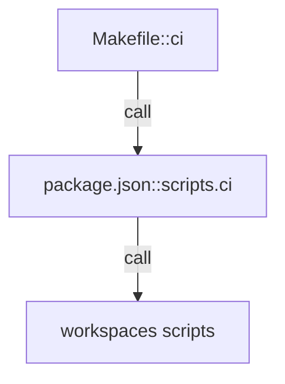

# future-diary

`make ci` を単一入口として `apps/*` と `packages/*` の検証を実行し、Cloudflare Workers/Pages 前提の開発フローを統一する。`package.json#workspaces` でモノレポ境界を固定し、実装責務は `apps/` と `packages/` に分離する。

- パス: `README.md`
- 状態: Implemented
- 種別（Profile）: package-root
- 関連:
  - See: `apps/README.md`
  - See: `packages/README.md`
  - See: `docs/project-structure.md`
- 注意:
  - 断定は根拠（Evidence）で裏付ける。

<details>
<summary>目次</summary>

- [役割](#役割)
- [スコープ](#スコープ)
- [ローカル開発](#ローカル開発)
- [ディレクトリ構成](#ディレクトリ構成)
- [公開インタフェース](#公開インタフェース)
- [契約と検証](#契約と検証)
- [設計ノート](#設計ノート)
- [品質](#品質)
- [内部](#内部)

</details>

## 役割

- ルート `package.json` で workspace と共通スクリプトを定義する。
- `Makefile` で開発/検証コマンドを統一する。
- 子ディレクトリの README への導線を提供する。

<details><summary>根拠（Evidence）</summary>

- [E1] `package.json:5` — workspace が `apps/*`, `packages/*` を対象化。
- [E2] `package.json:9` — ルート scripts が `ci`/`lint`/`test`/`typecheck`/`build` を提供。
- [E3] `Makefile:21` — `make install` が `bun install` を呼び出す。
- [E4] `Makefile:51` — `make ci` が `bun run ci` を呼ぶ。

- Edge Evidence Map（各エッジは “call + def” の 2 点セット）:
  - EP -> N1:
    - call: [E4] `Makefile:51` — `ci` target calls `bun run ci`
    - def: [E2] `package.json:21` — `ci` script is defined

</details>

## スコープ

- 対象（In scope）:
  - モノレポの実行入口（Makefile / package.json scripts）
  - ワークスペース構造の定義
- 対象外（Non-goals）:
  - API/Web/Jobs/各packageの詳細仕様
- 委譲（See）:
  - See: `apps/README.md`
  - See: `packages/README.md`
- 互換性:
  - 既定で後方互換より単純性を優先
- 依存方向:
  - 許可:
    - root -> workspace scripts
  - 禁止:
    - root README に実装詳細を持ち込む

<details><summary>根拠（Evidence）</summary>

- [E1] `docs/project-structure.md:16` — `apps/` 配下構成。
- [E2] `docs/project-structure.md:26` — `packages/` 配下構成。
</details>

## ローカル開発

- 依存インストール: `make install`
- 環境変数: `apps/api/.dev.vars.example`, `apps/web/.env.example`
- 起動: `make dev-api`, `make dev-web`
- DB migration: `make db-migrate`（local）, `make db-migrate-remote`（remote）
- 確認: `make ci`

<details><summary>根拠（Evidence）</summary>

- [E1] `Makefile:21` — install。
- [E2] `Makefile:24` — dev-api。
- [E3] `Makefile:27` — dev-web。
- [E4] `Makefile:51` — ci。
</details>

## ディレクトリ構成

```text
.
├── apps/                         # 実行アプリ / See: apps/README.md
├── packages/                     # 共有モジュール / See: packages/README.md
├── docs/                         # 設計/仕様ドキュメント
├── Makefile                      # 共通コマンド入口
├── package.json                  # workspace定義とscripts
└── README.md                     # この文書
```

## 公開インタフェース

### 提供するもの / 提供しないもの

- 提供:
  - `make *` と `bun run *` の実行入口
- 非提供:
  - 個別機能のビジネスロジック

### エントリポイント / エクスポート（SSOT）

| 公開シンボル | 種別   | 定義元                     | 目的                 | 根拠              |
| ------------ | ------ | -------------------------- | -------------------- | ----------------- |
| `ci`         | script | `package.json::scripts.ci` | 品質ゲート統合実行   | `package.json:21` |
| `install`    | make   | `Makefile::install`        | 依存インストール入口 | `Makefile:21`     |

### 使い方（必須）

```bash
make install
make ci
```

### 依存ルール

- 許可する import:
  - N/A（rootはライブラリ公開しない）
- 禁止する import:
  - root から実装コードを直接参照

<details><summary>根拠（Evidence）</summary>

- [E1] `package.json:9` — scripts SSOT。
- [E2] `Makefile:1` — Make target SSOT。
</details>

## 契約と検証

### 契約 SSOT

- config:
  - `package.json` scripts
  - `Makefile` targets

### 検証入口（CI / ローカル）

- [E1] `make ci` — lint/test/typecheck/build を実行。

### テスト（根拠として使う場合）

| テストファイル | コマンド  | 検証内容             | 主要 assertion | 根拠          |
| -------------- | --------- | -------------------- | -------------- | ------------- |
| N/A            | `make ci` | ルート統合品質ゲート | exit code 0    | `Makefile:51` |

<details><summary>根拠（Evidence）</summary>

- [E1] `package.json:21` — `ci` script。
- [E2] `Makefile:51` — `ci` target。
</details>

## 設計ノート

- データ形状:
  - scripts と targets の宣言型設定。
- 失敗セマンティクス:
  - 失敗時は `make` の非ゼロ終了コードで伝播。
- メインフロー:
  - `make ci` -> `bun run ci` -> workspace lint/test/typecheck/build。
- I/O 境界:
  - `make` / `bun` 実行が境界。
- トレードオフ:
  - ルートは orchestration のみを持つ。



<details><summary>根拠（Evidence）</summary>

- [E1] `Makefile:51` — `ci` target。
- [E2] `package.json:21` — `ci` script。
- [E3] `package.json:14` — `typecheck` script for workspaces。
</details>

## 品質

- テスト戦略:
  - Root は統合実行のみ。
- 主なリスクと対策（3〜7）:

| リスク                     | 対策（検証入口）                 | 根拠             |
| -------------------------- | -------------------------------- | ---------------- |
| scripts と Makefile の乖離 | `make ci` を単一入口に固定       | `Makefile:51`    |
| workspace 追加漏れ         | `package.json#workspaces` で管理 | `package.json:5` |

<details><summary>根拠（Evidence）</summary>

- [E1] `package.json:5` — workspace。
- [E2] `Makefile:51` — CI入口。
</details>

## 内部

<details>
<summary>品質（関数型プログラミング観点） / OPEN / ISSUE / SUMMARY</summary>

### 品質（関数型プログラミング観点）

| 項目         | 判定 | 理由                         | 根拠             |
| ------------ | ---- | ---------------------------- | ---------------- |
| 副作用の隔離 | YES  | rootはコマンド起動に責務限定 | `Makefile:21`    |
| 依存性注入   | N/A  | ライブラリではない           | `README.md:1`    |
| 契約指向     | YES  | scripts/targetsをSSOT化      | `package.json:9` |

### [OPEN]

- [OPEN][TODO] (MVP P0) 本番デプロイ（Workers/Pages/D1/Vectorize）手順と `infra/` の整備
  - 背景: MVP として配布するには、Cloudflare 側リソース作成とデプロイ手順が SSOT として必要。
  - 現状: API/Jobs は `wrangler.toml` があるが、Pages を含む統一 runbook/infra が未整備。
  - 作業分担（worktree/branch）:
    - `../future_diary.worktrees/prod-deploy-runbook`（`docs/prod-deploy-runbook`）
  - 受入条件:
    - `infra/` か `docs/` に、本番構築とデプロイの runbook が存在し、Secrets/環境変数の管理方法が明記される。
    - デプロイ後の smoke check（health + draft/save/confirm + web）が手順化される。
  - 根拠:
    - `AGENTS.md:135`
    - `apps/api/wrangler.toml:1`
    - `apps/api/README.md:120`
    - `apps/web/README.md:72`
    - `infra/wrangler/.gitkeep:1`
- [OPEN][TODO] (MVP P0) E2E スモークテストの追加（web -> api -> d1）
  - 背景: 要件の受け入れ基準は “統合動作” が中心で、E2E での退行検知が必要。
  - 現状: core/api の unit test はあるが、web を含む統合 smoke が無い。
  - 作業分担（worktree/branch）:
    - `../future_diary.worktrees/e2e-smoke`（`chore/e2e-smoke`）。認証導入後に追従更新が発生する想定。
  - 受入条件:
    - `make` で実行できる smoke があり、少なくとも draft -> save -> confirm -> list が検証できる。
  - 根拠:
    - `docs/requirements-ssot.md:245`
    - `Makefile:51`
    - `apps/api/src/index.test.ts:156`
- [OPEN][TODO] (MVP P1) 生成・埋め込みの非同期化（Workflows/Queues/DO lock）と再実行設計
  - 背景: 生成は失敗耐性（リトライ/多重起動/二重生成防止）を要件として持つ。
  - 現状: API 同期処理 + best-effort `waitUntil` に留まり、Workflows/Queues/DO lock が未導入。
  - 作業分担（worktree/branch）:
    - `../future_diary.worktrees/async-generation-orchestration`（`feat/async-generation-orchestration`）
  - 受入条件:
    - 生成/埋め込みが非同期ジョブで再実行可能になり、同一 user/day の重複実行が抑止される（ロック/状態）。
    - API は “作成済み/処理中/失敗/完了” の状態を返せる。
  - 根拠:
    - `AGENTS.md:55`
    - `AGENTS.md:66`
    - `AGENTS.md:72`
    - `apps/api/src/index.ts:99`
    - `apps/jobs/README.md:1`
- [OPEN][TODO] (MVP P1) 変更履歴（生成ドラフト/編集/確定）の保持
  - 背景: 要件として revision 保持が推奨されており、監査/品質改善/UX 向上に効く。
  - 現状: `diary_entries` のみで、revision のスナップショットが残らない。
  - 作業分担（worktree/branch）:
    - `../future_diary.worktrees/diary-revisions`（`feat/diary-revisions`）
  - 受入条件:
    - revision テーブルが追加され、生成/保存/確定時に履歴が追記される。
  - 根拠:
    - `docs/requirements-ssot.md:117`
    - `packages/db/src/migrations/0001_initial.sql:9`

### [ISSUE]

- 現時点で blocker はなし（MVP の課題は [OPEN][TODO] に集約）。

### [SUMMARY]

- root は orchestration と導線だけを保持し、実装詳細は子 README に委譲する。
- `feat/auth-identity` で bearer token session 認証 + CORS allowlist + データ削除（アカウント/日記）を実装した。

</details>
