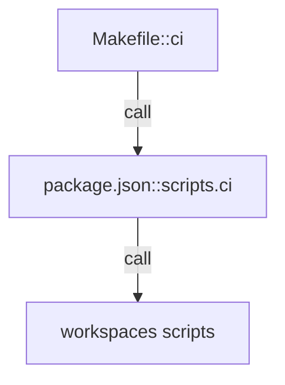

# future-diary

`make ci` を単一入口として `apps/*` と `packages/*` の検証を実行し、Cloudflare Workers/Pages 前提の開発フローを統一する。統合の最小確認として `make smoke` で web -> api -> SQLite(D1 schema) のスモークテストを実行する。`package.json#workspaces` でモノレポ境界を固定し、実装責務は `apps/` と `packages/` に分離する。

- パス: `README.md`
- 状態: Implemented
- 種別（Profile）: package-root
- 関連:
  - See: `apps/README.md`
  - See: `packages/README.md`
  - See: `infra/README.md`
  - See: `docs/project-structure.md`
- 注意:
  - 断定は根拠（Evidence）で裏付ける。

<details>
<summary>目次</summary>

- [役割](#役割)
- [スコープ](#スコープ)
- [ローカル開発](#ローカル開発)
- [ディレクトリ構成](#ディレクトリ構成)
- [公開インタフェース](#公開インタフェース)
- [契約と検証](#契約と検証)
- [設計ノート](#設計ノート)
- [品質](#品質)
- [内部](#内部)

</details>

## 役割

- ルート `package.json` で workspace と共通スクリプトを定義する。
- `Makefile` で開発/検証コマンドを統一する。
- 子ディレクトリの README への導線を提供する。

<details><summary>根拠（Evidence）</summary>

- [E1] `package.json:4` — workspace が `apps/*`, `packages/*` を対象化。
- [E2] `package.json:8` — ルート scripts が `ci`/`smoke`/`lint`/`test`/`typecheck`/`build` を提供。
- [E3] `Makefile:24` — `make install` が `bun install` を呼び出す。
- [E4] `Makefile:60` — `make ci` が `bun run ci` を呼ぶ。
- [E5] `Makefile:51` — `make smoke` が `bun run smoke` を呼ぶ。

- Edge Evidence Map（各エッジは “call + def” の 2 点セット）:
  - EP -> N1:
    - call: [E4] `Makefile:60` — `ci` target calls `bun run ci`
    - def: [E2] `package.json:22` — `ci` script is defined
  - EP -> N2:
    - call: [E5] `Makefile:51` — `smoke` target calls `bun run smoke`
    - def: [E2] `package.json:11` — `smoke` script is defined

</details>

## スコープ

- 対象（In scope）:
  - モノレポの実行入口（Makefile / package.json scripts）
  - ワークスペース構造の定義
- 対象外（Non-goals）:
  - API/Web/Jobs/各packageの詳細仕様
- 委譲（See）:
  - See: `apps/README.md`
  - See: `packages/README.md`
- 互換性:
  - 既定で後方互換より単純性を優先
- 依存方向:
  - 許可:
    - root -> workspace scripts
  - 禁止:
    - root README に実装詳細を持ち込む

<details><summary>根拠（Evidence）</summary>

- [E1] `docs/project-structure.md:17` — `apps/` 配下構成。
- [E2] `docs/project-structure.md:45` — `packages/` 配下構成。
</details>

## ローカル開発

- 依存インストール: `make install`
- 環境変数: `apps/api/.dev.vars.example`, `apps/web/.env.example`
- 起動: `make dev-api`, `make dev-web`
- DB migration: `make dev-api` 起動時に local D1 migration を自動適用（個別に実行する場合は `make db-migrate`）。remote は `make db-migrate-remote`。
- 確認: `make ci`

<details><summary>根拠（Evidence）</summary>

- [E1] `Makefile:23` — install。
- [E2] `Makefile:26` — dev-api。
- [E3] `Makefile:29` — dev-web。
- [E4] `Makefile:59` — ci。
- [E5] `apps/api/package.json:6` — dev 起動前に local D1 migrations apply。
</details>

## ディレクトリ構成

```text
.
├── apps/                         # 実行アプリ / See: apps/README.md
├── packages/                     # 共有モジュール / See: packages/README.md
├── infra/                        # Cloudflare設定/運用 / See: infra/README.md
├── docs/                         # 設計/仕様ドキュメント
├── Makefile                      # 共通コマンド入口
├── package.json                  # workspace定義とscripts
└── README.md                     # この文書
```

## 公開インタフェース

### 提供するもの / 提供しないもの

- 提供:
  - `make *` と `bun run *` の実行入口
- 非提供:
  - 個別機能のビジネスロジック

### エントリポイント / エクスポート（SSOT）

| 公開シンボル | 種別   | 定義元                     | 目的                 | 根拠              |
| ------------ | ------ | -------------------------- | -------------------- | ----------------- |
| `ci`         | script | `package.json::scripts.ci` | 品質ゲート統合実行   | `package.json:22` |
| `smoke`      | script | `package.json::scripts.smoke` | E2E smoke（web -> api -> d1） | `package.json:11` |
| `install`    | make   | `Makefile::install`        | 依存インストール入口 | `Makefile:23`     |
| `smoke`      | make   | `Makefile::smoke`          | E2E smoke 実行入口   | `Makefile:50`     |

### 使い方（必須）

```bash
make install
make ci
make smoke
```

### 依存ルール

- 許可する import:
  - N/A（rootはライブラリ公開しない）
- 禁止する import:
  - root から実装コードを直接参照

<details><summary>根拠（Evidence）</summary>

- [E1] `package.json:8` — scripts SSOT。
- [E2] `Makefile:1` — Make target SSOT。
</details>

## 契約と検証

### 契約 SSOT

- config:
  - `package.json` scripts
  - `Makefile` targets

### 検証入口（CI / ローカル）

- [E1] `make ci` — lint/test/typecheck/build を実行。
- [E2] `make smoke` — web -> api -> SQLite(D1 schema) の E2E smoke を実行。

### テスト（根拠として使う場合）

| テストファイル | コマンド  | 検証内容             | 主要 assertion | 根拠          |
| -------------- | --------- | -------------------- | -------------- | ------------- |
| N/A            | `make ci` | ルート統合品質ゲート | exit code 0    | `Makefile:59` |
| `apps/web/e2e-smoke.test.ts` | `make smoke` | E2E smoke（web -> api -> d1） | draft/save/confirm/list が成功 | `apps/web/e2e-smoke.test.ts:1` |

<details><summary>根拠（Evidence）</summary>

- [E1] `package.json:22` — `ci` script。
- [E2] `Makefile:59` — `ci` target。
- [E3] `package.json:11` — `smoke` script。
- [E4] `Makefile:50` — `smoke` target。
</details>

## 設計ノート

- データ形状:
  - scripts と targets の宣言型設定。
- 失敗セマンティクス:
  - 失敗時は `make` の非ゼロ終了コードで伝播。
- メインフロー:
  - `make ci` -> `bun run ci` -> workspace lint/test/typecheck/build。
- I/O 境界:
  - `make` / `bun` 実行が境界。
- トレードオフ:
  - ルートは orchestration のみを持つ。



<details><summary>根拠（Evidence）</summary>

- [E1] `Makefile:59` — `ci` target。
- [E2] `package.json:22` — `ci` script。
- [E3] `package.json:15` — `typecheck` script for workspaces。
</details>

## 品質

- テスト戦略:
  - Root は統合実行のみ。
- 主なリスクと対策（3〜7）:

| リスク                     | 対策（検証入口）                 | 根拠             |
| -------------------------- | -------------------------------- | ---------------- |
| scripts と Makefile の乖離 | `make ci` を単一入口に固定       | `Makefile:59`    |
| workspace 追加漏れ         | `package.json#workspaces` で管理 | `package.json:4` |

<details><summary>根拠（Evidence）</summary>

- [E1] `package.json:4` — workspace。
- [E2] `Makefile:59` — CI入口。
</details>

## 内部

<details>
<summary>品質（関数型プログラミング観点） / OPEN / ISSUE / SUMMARY</summary>

### 品質（関数型プログラミング観点）

| 項目         | 判定 | 理由                         | 根拠             |
| ------------ | ---- | ---------------------------- | ---------------- |
| 副作用の隔離 | YES  | rootはコマンド起動に責務限定 | `Makefile:24`    |
| 依存性注入   | N/A  | ライブラリではない           | `README.md:1`    |
| 契約指向     | YES  | scripts/targetsをSSOT化      | `package.json:8` |

### [OPEN]

- なし。

### [ISSUE]

- [ISSUE][P1] 本番デプロイ実行と post-deploy 検証（secrets/DB/Vectorize/Queues/DO + smoke）を runbook で固定する
  - See: `infra/prod-deploy-runbook.md`
- [ISSUE][P1] Vector reindex/backfill の orchestration（Cron/Queues/Workflows）を導入し、検索品質を安定させる
  - See: `apps/jobs/README.md`
  - See: `apps/api/README.md`
- [ISSUE][P1] 生成が「過去日記の要約」になりやすい問題を解消する（過去断片の扱いを再設計し、日次の下書き生成を “style/intent model 主導” に寄せる）
  - See: `apps/api/README.md`
  - See: `packages/core/README.md`
  - See: `docs/requirements-ssot.md`
- [ISSUE][P1] ユーザーモデル（style/intent/preferences）を構築し、生成に利用する（学習/更新/バージョニング/リセット）
  - See: `packages/core/README.md`
  - See: `packages/db/README.md`
  - See: `apps/api/README.md`
  - See: `docs/requirements-ssot.md`
- [ISSUE][P1] 生成品質: deterministic/LLM のプロンプト/整形/ガードレールを改善し、評価用データと確認手順を整備する（要約化の抑制も含む）
  - See: `packages/core/README.md`
  - See: `docs/requirements-ssot.md`
- [ISSUE][P2] Auth hardening: session 期限/失効/再発行（紛失時）や token の保存方式（localStorage依存の低減）を見直す
  - See: `apps/api/README.md`
  - See: `apps/web/README.md`
- [ISSUE][P3] 外部予定の取り込み（Google Calendar 等）: 連携/同意/スコープ設計と、予定を “断定ではなく入力補助” として下書きに反映する（任意機能）
  - See: `docs/requirements-ssot.md`
  - See: `apps/api/README.md`
- [ISSUE][P2] IaC（Terraform）で Workers/Pages/D1/Vectorize/Queues/DO のプロビジョニングを自動化する
  - See: `infra/README.md`
- [ISSUE][P1] Web のモバイル E2E（Playwright: WebKit/Chromium）と実機検証手順を整備し、主要フロー（ログイン・生成・編集・保存・確定・履歴）の回帰を継続検証できるようにする
  - See: `apps/web/README.md`
- [ISSUE][P1] Web の component 分割ルール（責務境界・命名・配置・状態管理の原則）を定義し、`App.tsx` 集中実装を段階的に分割する計画と受け入れ基準を整備する
  - See: `apps/web/README.md`
- [ISSUE][P2] Storybook を導入し、主要 UI 状態（editor/history/auth/profile/toast）を stories と interaction test で継続検証できるようにする
  - See: `apps/web/README.md`
  - See: `packages/ui/README.md`

### [SUMMARY]

- root は orchestration と導線だけを保持し、実装詳細は子 README に委譲する。
- `feat/auth-identity` で bearer token session 認証 + CORS allowlist + データ削除（アカウント/日記）を実装した。
- `feat/async-generation-orchestration` で Queues + DO lock による生成の非同期化と polling 契約を実装した。
- `docs/prod-deploy-runbook` で本番デプロイ runbook（Workers/Pages/D1/Vectorize）を `infra/prod-deploy-runbook.md` に集約した。
- web のサインイン導線を再設計し、初回 access key 発行後に必ず表示/コピーできるようにした。
- user model（style/intent/preferences）の取得/更新/初期化 API と、Profile 編集 UI を追加し、生成に反映できるようにした。
- 生成の透明性（used model / keywords / sourceFragmentIds）を API で永続化・返却し、web UI で表示できるようにした。
- 履歴 UI に月ナビ付きカレンダー表示と「さらに30件読み込む」ページングを追加し、過去日の閲覧導線を強化した。
- `0005_generation_transparency.sql` を追加し、`make db-migrate` / `make db-migrate-remote` 適用前提を明確化した。
- `make dev-api` 実行時に local D1 migrations を自動適用し、起動直後の `no such table` を防いだ。

</details>
