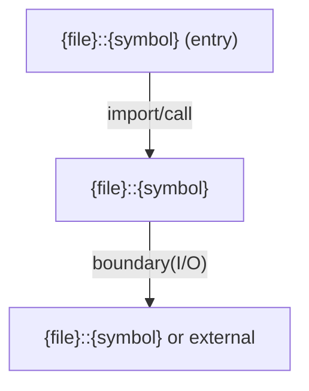

# {TITLE}

{提供価値 + 境界を 1〜3 文で。各文に具体識別子（symbol/type/key/command/schema/path）を最低 1 つ含める。禁止: “含まれる/列挙した/委譲する” だけのメタ説明。}

- パス: `{PATH}`
- 状態: {Implemented | Disabled | Stub | Not integrated}
- 種別（Profile）: {package-root | src-module | tests | contract | cli | config | assets-only | other}
- 関連:
  - See: `child/path/README.md`
  - See: `child/path2/README.md`
- 注意:
  - 推測は禁止。断定は根拠（Evidence）で裏付ける（根拠は各セクション末尾の折りたたみ内）。

<details>
<summary>目次</summary>

- [役割](#役割)
- [スコープ](#スコープ)
- [ローカル開発](#ローカル開発)
- [ディレクトリ構成](#ディレクトリ構成)
- [公開インタフェース](#公開インタフェース)
- [契約と検証](#契約と検証)
- [設計ノート](#設計ノート)
- [品質](#品質)
- [内部](#内部)

</details>

## 役割

- {役割（最大 5 行）}

<details><summary>根拠（Evidence）</summary>

- [E1] `{path}:{line}` — {根拠}

- Edge Evidence Map（各エッジは “call + def” の 2 点セット）:
  - EP -> N1:
    - call: [E?] `{callerFile}:{line}` — `{entrySymbol}` calls `{symbol}`
    - def: [E?] `{calleeFile}:{line}` — `function {symbol} ...`
  - N2 -> ERR ({failure_condition}):
    - call: [E?] `{callerFile}:{line}` — `{symbol}` branches to `{handlerSymbol}`
    - def: [E?] `{handlerFile}:{line}` — `function {handlerSymbol} ...`

</details>

## スコープ

- 対象（In scope）:
  - {直接責任を持つ対象}
- 対象外（Non-goals）:
  - {対象外（提供しないもの）}
- 委譲（See）:
  - See: `child/path/README.md`
- 互換性:
  - {互換性ポリシー}
- 依存方向:
  - 許可:
    - {許可}
  - 禁止:
    - {禁止}

<details><summary>根拠（Evidence）</summary>

- [E1] `{path}:{line}` — {冒頭サマリ/スコープの根拠（最低2点）}
</details>

## ローカル開発

- 依存インストール: `{command}`
- 環境変数: `{command}`
- 起動: `{command}`
- 確認: `{url | command}`

（該当しない場合は N/A + 理由）

<details><summary>根拠（Evidence）</summary>

- [E1] `{file}#{key}` / `{path}:{line}` — {根拠}
</details>

## ディレクトリ構成

各行コメントは「役割」を 1 フレーズで（種別名だけは禁止）。子 README がある dir は `See:` を付けて内部を展開しない。

```text
.
└── {PATH}/                        # 対象ルート
    ├── child/                     # {役割} / See: child/README.md
    └── README.md                  # この文書
```

## 公開インタフェース

### 提供するもの / 提供しないもの

- 提供:
  - {提供}
- 非提供:
  - {提供しない（Non-goals と整合）}

### エントリポイント / エクスポート（SSOT）

| 公開シンボル | 種別                | 定義元             | 目的        | 根拠            |
| ------------ | ------------------- | ------------------ | ----------- | --------------- |
| `{symbol}`   | function/type/const | `{file}::{symbol}` | {1フレーズ} | `{path}:{line}` |

### 使い方（必須）

```ts
import { <exportedFunction> } from "<package-name>";

const result = <exportedFunction>(/* args */);
```

### 依存ルール

- 許可する import:
  - {例: `./core/*` は OK}
- 禁止する import:
  - {例: `./infra/*` は NG}

<details><summary>根拠（Evidence）</summary>

- [E1] `{file}#exports` / `{path}:{line}` — {公開面の SSOT（package.json#exports / index / barrel 等）}
- [E1] `{path}:{line}` — {例と対応する実装/型/契約}
</details>

## 契約と検証

### 契約 SSOT

- Schema / OpenAPI / config / types:
  - {SSOT の所在}

### 検証入口（CI / ローカル）

- [E1] `{command}` — {何を検証するか}

### テスト（根拠として使う場合）

| テストファイル | コマンド    | 検証内容                 | 主要 assertion   | 根拠            |
| -------------- | ----------- | ------------------------ | ---------------- | --------------- |
| `{file}`       | `{command}` | {契約/不変条件/失敗分岐} | {主要 assertion} | `{path}:{line}` |

<details><summary>根拠（Evidence）</summary>

- [E1] `{path}:{line}` — {契約定義}
- [E1] `{file}#scripts` / `{path}:{line}` — {検証入口}
</details>

## 設計ノート

- データ形状:
  - {入出力}
- 失敗セマンティクス:
  - {失敗の表現}
- メインフロー:
  - {最大 5 bullet}
- I/O 境界:
  - {副作用境界}
- トレードオフ:
  - {制約・判断}

（図は必須：mermaid。最低 1 図。ノードは `file::symbol`（または module/file）に対応し、エッジは `import` / `call` / `boundary(I/O)` / `contract` のいずれかで意味付けする。括弧を含むラベルは `|"boundary(I/O)"|` のように引用符で囲む。図の各エッジは Evidence で裏付ける。）



<details><summary>根拠（Evidence）</summary>

- [E1] `{path}:{line}` — {根拠}

- Edge Evidence Map（各エッジは “call + def” の 2 点セット）:
  - EP -> N1:
    - call: [E?] `{callerFile}:{line}` — `{entrySymbol}` calls `{symbol}`
    - def: [E?] `{calleeFile}:{line}` — `function {symbol} ...`
  - N2 -> ERR ({failure_condition}):
    - call: [E?] `{callerFile}:{line}` — `{symbol}` branches to `{handlerSymbol}`
    - def: [E?] `{handlerFile}:{line}` — `function {handlerSymbol} ...`

</details>

## 品質

- テスト戦略:
  - Core / Boundary / Contract / E2E（必要最小）
- 主なリスクと対策（3〜7）:

| リスク | 対策（検証入口）  | 根拠            |
| ------ | ----------------- | --------------- |
| {risk} | {test/command/CI} | `{path}:{line}` |

<details><summary>根拠（Evidence）</summary>

- [E1] `{path}:{line}` — {品質ゲート/戦略/リスク根拠}
</details>

## 内部

<details>
<summary>品質（関数型プログラミング観点） / OPEN / ISSUE / SUMMARY</summary>

### 品質（関数型プログラミング観点）

各項目: `YES / NO / N/A（理由）` + 根拠。

| 項目                                                 | 判定         | 理由   | 根拠            |
| ---------------------------------------------------- | ------------ | ------ | --------------- |
| 参照透過性 (Referential transparency)                | {YES/NO/N/A} | {理由} | `{path}:{line}` |
| 純粋性 (Purity)                                      | {YES/NO/N/A} | {理由} | `{path}:{line}` |
| 不変性 (Immutability)                                | {YES/NO/N/A} | {理由} | `{path}:{line}` |
| 合成 (Composition)                                   | {YES/NO/N/A} | {理由} | `{path}:{line}` |
| 閉包 (Closure)                                       | {YES/NO/N/A} | {理由} | `{path}:{line}` |
| 副作用の隔離 (Side-effect isolation)                 | {YES/NO/N/A} | {理由} | `{path}:{line}` |
| データと計算の分離 (Separate data & computation)     | {YES/NO/N/A} | {理由} | `{path}:{line}` |
| 例外より型 (Types over exceptions)                   | {YES/NO/N/A} | {理由} | `{path}:{line}` |
| 全域性 (Totality)                                    | {YES/NO/N/A} | {理由} | `{path}:{line}` |
| 依存性注入 (Dependency injection)                    | {YES/NO/N/A} | {理由} | `{path}:{line}` |
| 法則性（抽象化する場合） (Lawfulness)                | {YES/NO/N/A} | {理由} | `{path}:{line}` |
| 推論優先設計 (Inference-first design)                | {YES/NO/N/A} | {理由} | `{path}:{line}` |
| 名前/型で意図を固定 (Intent fixed by names/types)    | {YES/NO/N/A} | {理由} | `{path}:{line}` |
| 根拠適合性 (Evidence fitness)                        | {YES/NO/N/A} | {理由} | `{path}:{line}` |
| 契約指向 (Contract orientation)                      | {YES/NO/N/A} | {理由} | `{path}:{line}` |
| 失敗セマンティクスの網羅 (Failure semantics covered) | {YES/NO/N/A} | {理由} | `{path}:{line}` |
| 決定性 (Determinism)                                 | {YES/NO/N/A} | {理由} | `{path}:{line}` |
| コスト効率 (Cost-effectiveness)                      | {YES/NO/N/A} | {理由} | `{path}:{line}` |
| 変更耐性 (Change resilience)                         | {YES/NO/N/A} | {理由} | `{path}:{line}` |
| 重複と欠落 (Duplication & gaps)                      | {YES/NO/N/A} | {理由} | `{path}:{line}` |

### [OPEN]

- [OPEN][TODO] {タイトル}
  - 背景: {なぜ必要か}
  - 現状: {現時点で何が不足しているか}
  - 受入条件:
    - {仕様・契約の条件1}
    - {仕様・契約の条件2}
  - 根拠:
    - `{path}:{line}`
- [OPEN][VERIFY] {タイトル}
  - 背景: {どの検証ギャップを埋めるか}
  - 最小追加検証:
    - Test: `{path/to/test}`
    - Command: `{command}`
    - Assertion: {主要 assertion}
  - 受入条件:
    - {失敗系/成功系の判定条件}
  - 根拠:
    - `{path}:{line}`
- [OPEN][EVIDENCE] {タイトル}
  - 背景: {根拠不足の理由}
  - 探索カバレッジ:
    - Pass A/Pass B + 当たった領域
    - 開いたファイル数 (>=5)
    - 検索クエリ数 (>=10)
  - 探索ログ:
    - query -> hits -> Open: ... -> next query
  - 受入条件:
    - 根拠が存在するはずの場所を特定できること
  - 根拠:
    - `{path}:{line}` または `Command: {command}`
- [OPEN][TAILOR] {タイトル}
  - 背景: {テンプレート標準からの調整理由}
  - 受入条件:
    - {省略/調整しても品質を満たす条件}
  - 根拠:
    - `{path}:{line}`

### [ISSUE]

- [ISSUE] {タイトル} P{0|1|2} — {違反 / 影響 / 修正方針 / 根拠}

### 変更履歴

- YYYY-MM-DD {変更内容}

### [SUMMARY]

- 主張:
- 状態: OK / 不一致 / 根拠なし
- 準拠: Full / Tailored / Non-compliant
- OPEN: TODO / VERIFY / EVIDENCE / TAILOR
- ISSUE: P0 / P1 / P2
- 探索カバレッジ（OPEN[EVIDENCE] がある場合）:
  - Searches / Files opened / Commands / Exhaustiveness gate

</details>
