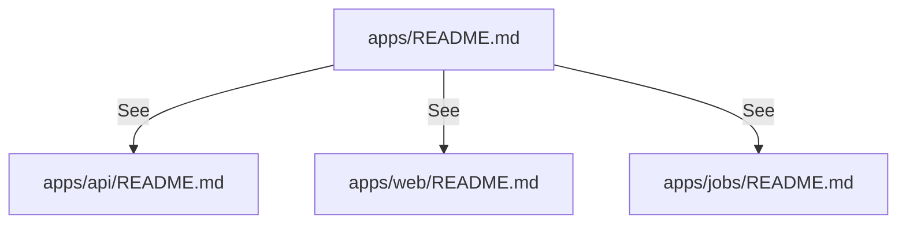

# apps

`apps/` は実行可能アプリ層を保持し、API (`apps/api`)、Web (`apps/web`)、Jobs (`apps/jobs`) の境界を分離する。

- パス: `apps/README.md`
- 状態: Implemented
- 種別（Profile）: package-root
- 関連:
  - See: `apps/api/README.md`
  - See: `apps/web/README.md`
  - See: `apps/jobs/README.md`
- 注意:
  - 詳細は子 README に委譲する。

<details>
<summary>目次</summary>

- [役割](#役割)
- [スコープ](#スコープ)
- [ローカル開発](#ローカル開発)
- [ディレクトリ構成](#ディレクトリ構成)
- [公開インタフェース](#公開インタフェース)
- [契約と検証](#契約と検証)
- [設計ノート](#設計ノート)
- [品質](#品質)
- [内部](#内部)

</details>

## 役割

- 実行層（API/Web/Jobs）の配置と導線を提供。

<details><summary>根拠（Evidence）</summary>

- [E1] `docs/project-structure.md:16` — `apps/` の子構成。
</details>

## スコープ

- 対象（In scope）:
  - 子アプリ群の一覧と導線
- 対象外（Non-goals）:
  - 各アプリの実装詳細
- 委譲（See）:
  - See: `apps/api/README.md`
  - See: `apps/web/README.md`
  - See: `apps/jobs/README.md`
- 互換性:
  - N/A
- 依存方向:
  - 許可:
    - parent -> child docs
  - 禁止:
    - parent に実装仕様を重複記載

<details><summary>根拠（Evidence）</summary>

- [E1] `docs/project-structure.md:17`
- [E2] `docs/project-structure.md:20`
- [E3] `docs/project-structure.md:24`
</details>

## ローカル開発

- 依存インストール: `make install`
- 環境変数: See child README
- 起動: `make dev-api`, `make dev-web`
- 確認: `make ci`

<details><summary>根拠（Evidence）</summary>

- [E1] `Makefile:24`
- [E2] `Makefile:27`
- [E3] `Makefile:51`
</details>

## ディレクトリ構成

```text
.
└── apps/                        # 実行アプリの親
    ├── api/                     # API Worker / See: api/README.md
    ├── web/                     # Web UI / See: web/README.md
    ├── jobs/                    # background jobs / See: jobs/README.md
    └── README.md                # この文書
```

## 公開インタフェース

### 提供するもの / 提供しないもの

- 提供:
  - 子アプリ層の境界整理
- 非提供:
  - アプリ固有API/画面仕様

### エントリポイント / エクスポート（SSOT）

| 公開シンボル | 種別 | 定義元 | 目的     | 根拠               |
| ------------ | ---- | ------ | -------- | ------------------ |
| N/A          | N/A  | N/A    | 導線のみ | `apps/README.md:1` |

### 使い方（必須）

```bash
make dev-api
make dev-web
```

### 依存ルール

- 許可する import:
  - N/A
- 禁止する import:
  - N/A

<details><summary>根拠（Evidence）</summary>

- [E1] `Makefile:24`
- [E2] `Makefile:27`
</details>

## 契約と検証

### 契約 SSOT

- 子 README が SSOT。

### 検証入口（CI / ローカル）

- [E1] `make ci`

### テスト（根拠として使う場合）

| テストファイル | コマンド  | 検証内容         | 主要 assertion | 根拠          |
| -------------- | --------- | ---------------- | -------------- | ------------- |
| N/A            | `make ci` | 子アプリ群の検証 | exit code 0    | `Makefile:51` |

<details><summary>根拠（Evidence）</summary>

- [E1] `Makefile:51`
</details>

## 設計ノート

- データ形状:
  - N/A
- 失敗セマンティクス:
  - N/A
- メインフロー:
  - 親は導線のみ。
- I/O 境界:
  - N/A
- トレードオフ:
  - 重複を避けて子 README に委譲。



<details><summary>根拠（Evidence）</summary>

- [E1] `docs/project-structure.md:16`
</details>

## 品質

- テスト戦略:
  - 親は子の品質ゲート参照。
- 主なリスクと対策（3〜7）:

| リスク         | 対策（検証入口）       | 根拠               |
| -------------- | ---------------------- | ------------------ |
| 親子で情報重複 | 詳細を子 README に限定 | `apps/README.md:8` |

<details><summary>根拠（Evidence）</summary>

- [E1] `apps/README.md:8`
</details>

## 内部

<details>
<summary>品質（関数型プログラミング観点） / OPEN / ISSUE / SUMMARY</summary>

### 品質（関数型プログラミング観点）

| 項目         | 判定 | 理由             | 根拠               |
| ------------ | ---- | ---------------- | ------------------ |
| 副作用の隔離 | N/A  | ドキュメントのみ | `apps/README.md:1` |
| 契約指向     | YES  | 参照先を明示     | `apps/README.md:8` |

### [OPEN]

- [OPEN][TODO] 子 README の継続更新
  - 背景: 実装更新時にドキュメント同期が必要
  - 現状: 初期版のみ
  - 受入条件:
    - 実装変更時に該当 README 更新
  - 根拠:
    - `AGENTS.md:164`

### [ISSUE]

- なし。

### [SUMMARY]

- `apps/` は導線に責務を限定。

</details>
