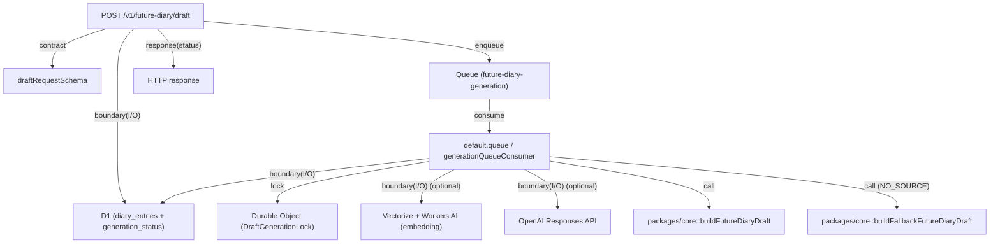

# apps/api

`apps/api/src/index.ts` は Hono Worker の HTTP 境界を実装し、`/health` と未来日記生成トリガ（`/v1/future-diary/draft`）および diary CRUD（`/v1/diary/*`）を提供する。生成/埋め込みは Queue consumer（`default.queue`）で非同期実行し、同一 user/day の重複実行は Durable Object lock で抑止する。

- パス: `apps/api/README.md`
- 状態: Implemented
- 種別（Profile）: src-module
- 関連:
  - See: `packages/core/README.md`
  - See: `packages/db/README.md`
  - See: `packages/vector/README.md`
- 注意:
  - `wrangler.toml` の `database_id` は Cloudflare 作成済み ID を設定済み。

<details>
<summary>目次</summary>

- [役割](#役割)
- [スコープ](#スコープ)
- [ローカル開発](#ローカル開発)
- [本番デプロイ](#本番デプロイ)
- [ディレクトリ構成](#ディレクトリ構成)
- [公開インタフェース](#公開インタフェース)
- [契約と検証](#契約と検証)
- [設計ノート](#設計ノート)
- [品質](#品質)
- [内部](#内部)

</details>

## 役割

- Worker の HTTP エントリを提供する。
- リクエスト JSON をバリデーションし、失敗を 400 で返す。
- 同一ユーザ同一日付の draft は D1（`diary_entries`）に保存し、`generation_status` で作成済み/処理中/失敗/完了を管理する。
- `POST /v1/future-diary/draft` は entry placeholder を作成し、(Queue binding があれば) 生成ジョブを enqueue して状態を返す（polling 前提）。Queue が無い/送信失敗の場合は同期生成へフォールバックする。
- Queue consumer（`default.queue`）が draft 生成と Vectorize upsert を非同期実行する。
- `OPENAI_API_KEY` が設定されている場合は外部LLMで draft 本文を生成する（失敗時は deterministic/fallback へフォールバック）。
- `AI` + `VECTOR_INDEX` binding が設定されている場合は、Workers AI embeddings + Vectorize による retrieval/upsert を行う（失敗時は D1 の直近日記へフォールバック）。
- 同一 user/day の重複実行は Durable Object lock で抑止する。
- 過去データが無い場合でも編集可能な fallback draft を返す。
- diary entry の取得/保存/確定/履歴取得 API を提供する（保存は `final_text`、確定は `status='confirmed'` を更新）。

<details><summary>根拠（Evidence）</summary>

- [E1] `apps/api/src/index.ts:189` — `GET /health` 定義。
- [E2] `apps/api/src/index.ts:197` — `POST /v1/auth/session` 定義。
- [E3] `apps/api/src/index.ts:314` — `POST /v1/future-diary/draft` 定義。
- [E4] `apps/api/src/index.ts:22` — `draftRequestSchema`（zod）。
- [E5] `apps/api/src/index.ts:362` — placeholder insert（polling用）。
- [E6] `apps/api/src/index.ts:386` — draft generation enqueue。
- [E7] `apps/api/src/index.ts:405` — 同期生成フォールバック。
- [E8] `apps/api/src/index.ts:867` — Queue consumer handler（`default.queue`）。
- [E9] `apps/api/src/generationQueueConsumer.ts:53` — `future_draft_generate` 処理。
- [E10] `apps/api/src/generationQueueConsumer.ts:87` — DO lock acquire。
- [E11] `apps/api/src/futureDiaryDraftGeneration.ts:131` — OpenAI call（任意）。
- [E12] `apps/api/src/openaiResponses.ts:59` — OpenAI Responses client。
- [E13] `apps/api/src/futureDiaryDraftGeneration.ts:181` — deterministic call。
- [E14] `packages/core/src/futureDiary.ts:20` — deterministic usecase。
- [E15] `packages/db/src/repository.ts:128` — placeholder insert query。
- [E16] `packages/db/src/migrations/0004_generation_status.sql:1` — `generation_status` / `generation_error` 追加。
- [E17] `apps/api/src/index.ts:485` — `POST /v1/diary/entry/get` 定義。
- [E18] `apps/api/src/index.ts:541` — `POST /v1/diary/entry/save` 定義。
- [E19] `apps/api/src/index.ts:629` — `POST /v1/diary/entry/confirm` 定義。
- [E20] `apps/api/src/index.ts:746` — `POST /v1/diary/entries/list` 定義。
- [E21] `apps/api/src/index.ts:795` — `POST /v1/diary/entry/delete` 定義。
- [E22] `apps/api/src/index.ts:835` — `POST /v1/user/delete` 定義。

- Edge Evidence Map（各エッジは “call + def” の 2 点セット）:
  - `POST /v1/future-diary/draft` -> `enqueueGenerationMessage`:
    - call: [E6] `apps/api/src/index.ts:386`
    - def: `apps/api/src/queueProducer.ts:7`
  - `default.queue` -> `processGenerationQueueBatch`:
    - call: [E8] `apps/api/src/index.ts:867`
    - def: `apps/api/src/generationQueueConsumer.ts:219`
  - `future_draft_generate` -> `acquireDraftGenerationLock`:
    - call: [E10] `apps/api/src/generationQueueConsumer.ts:87`
    - def: `apps/api/src/draftGenerationLock.ts:61`
  - `generateFutureDiaryDraft` -> `requestOpenAiStructuredOutputText`:
    - call: [E11] `apps/api/src/futureDiaryDraftGeneration.ts:131`
    - def: [E12] `apps/api/src/openaiResponses.ts:59`

</details>

## スコープ

- 対象（In scope）:
  - HTTP routing
  - 入力検証
  - レスポンス変換
  - bearer token session による user identity（`/v1/auth/*`）
  - D1 への draft 永続化（cache / 冪等）
  - diary entry CRUD（取得/保存/確定/履歴）
  - データ削除（アカウント削除/日記削除）
  - Vectorize retrieval/upsert（optional）
- 対象外（Non-goals）:
  - パスワード管理や外部IdP連携などのフル機能認証（MVPは bearer token session）
- 委譲（See）:
  - See: `packages/core/README.md`
- 互換性:
  - 既定で後方互換より単純性を優先
- 依存方向:
  - 許可:
    - `apps/api` -> `@future-diary/core`
    - `apps/api` -> `@future-diary/db`
  - 禁止:
    - UI ロジックを API に混在

<details><summary>根拠（Evidence）</summary>

- [E1] `apps/api/package.json:14` — `@future-diary/core` 依存。
- [E2] `apps/api/package.json:15` — `@future-diary/db` 依存。
- [E3] `apps/api/src/futureDiaryDraftGeneration.ts:1` — import（core）。
- [E4] `apps/api/src/index.ts:1` — import（db）。
- [E5] `apps/api/src/futureDiaryDraftGeneration.ts:131` — OpenAI call（任意）。
- [E6] `apps/api/src/futureDiaryDraftGeneration.ts:181` — deterministic usecase call。
- [E7] `apps/api/src/index.ts:351` — repository creation。
</details>

## ローカル開発

- 依存インストール: `make install`
- 環境変数: `cp apps/api/.dev.vars.example apps/api/.dev.vars`
- DB: `make dev-api` 起動時にローカル D1 migration を自動適用する（`auth_sessions` を含む）。個別に実行したい場合は `make db-migrate`。
- CORS: `CORS_ALLOW_ORIGINS` を設定すると allowlist を上書きできる（production は `*` を許可しない）。
- LLM: `.dev.vars` に `OPENAI_API_KEY` を設定すると外部LLM生成が有効になる（未設定時は deterministic）。
- retrieval: `.dev.vars` の `AI_EMBEDDING_MODEL` で embeddings model を選ぶ（Vectorize は local 未サポートのため、binding を `remote: true` にして検証するか fallback を許容する）。
- 起動: `make dev-api`
- 確認: `curl http://127.0.0.1:8787/health`

<details><summary>根拠（Evidence）</summary>

- [E1] `apps/api/package.json:6` — `wrangler dev`。
- [E2] `apps/api/.dev.vars.example:1` — `APP_ENV`。
- [E3] `apps/api/.dev.vars.example:2` — `OPENAI_API_KEY`。
</details>

## 本番デプロイ

`apps/api/wrangler.toml` は `workers_dev = true` のため、基本は `*.workers.dev` に publish する。

### Secret（Workers）

code が参照する Secret:

- `APP_ENV`（`/health` の `env` 表示に使用）
- `OPENAI_API_KEY`（外部LLMで draft 本文を生成する場合。未設定時は deterministic 生成へフォールバック）

```bash
bunx wrangler secret put APP_ENV --config apps/api/wrangler.toml
bunx wrangler secret put OPENAI_API_KEY --config apps/api/wrangler.toml
```

入力値:

- `APP_ENV`: `production`
- `OPENAI_API_KEY`: OpenAI の API Key

補足:

- `OPENAI_BASE_URL` と `OPENAI_MODEL` は `apps/api/wrangler.toml` の `[vars]` で設定する（必要なら上書き）。

### Deploy / Verify

```bash
bunx wrangler deploy --config apps/api/wrangler.toml
curl https://<wrangler出力のURL>/health
```

期待値:

- `ok: true`
- `env: "production"`

### workers.dev subdomain が未登録の場合

初回デプロイ時に `workers.dev subdomain` の登録が必要になる。`wrangler deploy` 実行時に案内されるので、指示に従って登録する。

<details><summary>根拠（Evidence）</summary>

- [E1] `apps/api/src/index.ts:213` — `APP_ENV` を読み `env` に載せる。
- [E2] `apps/api/wrangler.toml:4` — `workers_dev = true`。

</details>

## ディレクトリ構成

```text
.
└── apps/api/                    # API Worker
    ├── src/                     # 実装とテスト / See: src/README.md
    ├── wrangler.toml            # Worker binding config
    ├── package.json             # API scripts/deps
    └── README.md                # この文書
```

## 公開インタフェース

### 提供するもの / 提供しないもの

- 提供:
  - `GET /health`
  - `POST /v1/auth/session`
  - `GET /v1/auth/me`
  - `POST /v1/auth/logout`
  - `POST /v1/future-diary/draft`
  - `POST /v1/diary/entry/get`
  - `POST /v1/diary/entry/save`
  - `POST /v1/diary/entry/confirm`
  - `POST /v1/diary/entry/delete`
  - `POST /v1/diary/entries/list`
  - `POST /v1/user/delete`
- 非提供:
  - 外部IdP連携やパスワード管理などのフル機能認証

### エントリポイント / エクスポート（SSOT）

| 公開シンボル                  | 種別           | 定義元         | 目的             | 根拠                       |
| ----------------------------- | -------------- | -------------- | ---------------- | -------------------------- |
| `GET /health`                 | HTTP route     | `src/index.ts` | 稼働確認         | `apps/api/src/index.ts:189` |
| `POST /v1/auth/session`       | HTTP route     | `src/index.ts` | session 作成     | `apps/api/src/index.ts:197` |
| `GET /v1/auth/me`             | HTTP route     | `src/index.ts` | session 検証     | `apps/api/src/index.ts:250` |
| `POST /v1/auth/logout`        | HTTP route     | `src/index.ts` | session 破棄     | `apps/api/src/index.ts:292` |
| `POST /v1/future-diary/draft` | HTTP route     | `src/index.ts` | ドラフト生成/取得 | `apps/api/src/index.ts:314` |
| `POST /v1/diary/entry/get`    | HTTP route     | `src/index.ts` | diary取得        | `apps/api/src/index.ts:485` |
| `POST /v1/diary/entry/save`   | HTTP route     | `src/index.ts` | diary保存        | `apps/api/src/index.ts:541` |
| `POST /v1/diary/entry/confirm`| HTTP route     | `src/index.ts` | diary確定        | `apps/api/src/index.ts:629` |
| `POST /v1/diary/entry/delete` | HTTP route     | `src/index.ts` | diary削除        | `apps/api/src/index.ts:795` |
| `POST /v1/diary/entries/list` | HTTP route     | `src/index.ts` | 履歴取得         | `apps/api/src/index.ts:746` |
| `POST /v1/user/delete`        | HTTP route     | `src/index.ts` | user削除         | `apps/api/src/index.ts:835` |
| `DraftGenerationLock`         | Durable Object | `src/index.ts` | 同一 user/day 排他 | `apps/api/src/index.ts:864` |
| `default.fetch`               | Worker handler | `src/index.ts` | Cloudflare entry | `apps/api/src/index.ts:866` |
| `default.queue`               | Queue handler  | `src/index.ts` | generation/vectorize consumer | `apps/api/src/index.ts:867` |

### 使い方（必須）

```bash
curl -X POST http://127.0.0.1:8787/v1/auth/session \
  -H 'content-type: application/json' \
  -d '{"timezone":"Asia/Tokyo"}'
```

```bash
curl -X POST http://127.0.0.1:8787/v1/future-diary/draft \
  -H 'content-type: application/json' \
  -H "authorization: Bearer <accessToken>" \
  -d '{"date":"2026-02-07","timezone":"Asia/Tokyo"}'
```

```bash
curl -X POST http://127.0.0.1:8787/v1/diary/entry/get \
  -H 'content-type: application/json' \
  -H "authorization: Bearer <accessToken>" \
  -d '{"date":"2026-02-07"}'
```

```bash
curl -X POST http://127.0.0.1:8787/v1/diary/entry/save \
  -H 'content-type: application/json' \
  -H "authorization: Bearer <accessToken>" \
  -d '{"date":"2026-02-07","body":"編集後の本文"}'
```

```bash
curl -X POST http://127.0.0.1:8787/v1/diary/entry/confirm \
  -H 'content-type: application/json' \
  -H "authorization: Bearer <accessToken>" \
  -d '{"date":"2026-02-07"}'
```

```bash
curl -X POST http://127.0.0.1:8787/v1/diary/entry/delete \
  -H 'content-type: application/json' \
  -H "authorization: Bearer <accessToken>" \
  -d '{"date":"2026-02-07"}'
```

```bash
curl -X POST http://127.0.0.1:8787/v1/diary/entries/list \
  -H 'content-type: application/json' \
  -H "authorization: Bearer <accessToken>" \
  -d '{"onOrBeforeDate":"2026-02-07","limit":30}'
```

```bash
curl -X POST http://127.0.0.1:8787/v1/user/delete \
  -H "authorization: Bearer <accessToken>"
```

### 依存ルール

- 許可する import:
  - `@future-diary/core`
  - `@future-diary/db`
  - `hono`
  - `zod`
- 禁止する import:
  - `apps/web/*`

<details><summary>根拠（Evidence）</summary>

- [E1] `apps/api/src/index.ts:1`
- [E2] `apps/api/src/index.ts:8`
- [E3] `apps/api/src/index.ts:9`
- [E4] `apps/api/src/index.ts:10`
- [E5] `apps/api/src/index.ts:11`
</details>

## 契約と検証

### 契約 SSOT

- Schema:
  - `authSessionCreateRequestSchema` (`timezone`)
  - `draftRequestSchema` (`date`, `timezone`)
  - `diaryEntryGetRequestSchema` (`date`)
  - `diaryEntrySaveRequestSchema` (`date`, `body`)
  - `diaryEntryConfirmRequestSchema` (`date`)
  - `diaryEntryDeleteRequestSchema` (`date`)
  - `diaryEntryListRequestSchema` (`onOrBeforeDate`, `limit`)
- Runtime config:
  - `wrangler.toml`

### 検証入口（CI / ローカル）

- [E1] `bun --cwd apps/api run test`
- [E2] `bun --cwd apps/api run typecheck`

### テスト（根拠として使う場合）

| テストファイル               | コマンド                      | 検証内容              | 主要 assertion        | 根拠                            |
| ---------------------------- | ----------------------------- | --------------------- | --------------------- | ------------------------------- |
| `apps/api/src/index.test.ts` | `bun --cwd apps/api run test` | endpoints smoke test | status=200 | `apps/api/src/index.test.ts:266` |

<details><summary>根拠（Evidence）</summary>

- [E1] `apps/api/src/index.test.ts:257`
- [E2] `apps/api/src/index.test.ts:266`
- [E3] `apps/api/src/index.test.ts:309`
- [E4] `apps/api/package.json:9`
</details>

## 設計ノート

- データ形状:
  - auth: `Authorization: Bearer <accessToken>`
  - request: `{ date, timezone }`
  - response: `{ ok, draft, meta }`
  - diary CRUD: `{ date }` / `{ date, body }` を主に使用。
- 失敗セマンティクス:
  - validation error -> 400
  - missing binding / unexpected error -> 500
- メインフロー:
  - parse JSON -> zod validate -> upsert user -> entry placeholder を作成/取得 -> generation_status を見て (completed なら) 返す / (not completed なら) job enqueue -> 状態（作成済み/処理中/失敗/完了）を返す。
  - Queue consumer:
    - DO lock acquire -> generation_status=processing -> (optional) Vectorize retrieval -> (optional) OpenAI -> deterministic/fallback -> generated_text 永続化 + generation_status=completed -> Vectorize upsert enqueue。
- I/O 境界:
  - HTTP request/response。
  - D1 read/write。
  - Queue consumer / DO lock。
- トレードオフ:
  - Vectorize retrieval は optional（`AI` + `VECTOR_INDEX` binding がある場合のみ使用し、失敗時は D1 の直近日記へ fallback）。
  - `sourceFragmentIds` は永続化していない（cache hit の場合は `[]` を返す）。
  - local/test 等で Queue binding が無い場合は同期生成へフォールバックする。



<details><summary>根拠（Evidence）</summary>

- [E1] `apps/api/src/index.ts:314` — handler entry。
- [E2] `apps/api/src/index.ts:22` — contract schema。
- [E3] `apps/api/src/index.ts:362` — placeholder insert。
- [E4] `apps/api/src/index.ts:386` — enqueue draft job。
- [E5] `apps/api/src/index.ts:405` — sync fallback generation。
- [E6] `apps/api/src/index.ts:867` — queue handler。
- [E7] `apps/api/src/generationQueueConsumer.ts:53` — consumer entry。
- [E8] `apps/api/src/generationQueueConsumer.ts:87` — DO lock acquire。
- [E9] `apps/api/src/futureDiaryDraftGeneration.ts:131` — OpenAI call（optional）。
- [E10] `apps/api/src/futureDiaryDraftGeneration.ts:181` — deterministic/fallback call。
</details>

## 品質

- テスト戦略:
  - API smoke tests（境界）
  - core とは別に endpoint 検証
- 主なリスクと対策（3〜7）:

| リスク                   | 対策（検証入口）     | 根拠                       |
| ------------------------ | -------------------- | -------------------------- |
| invalid payload を通す   | zod validate + 400   | `apps/api/src/index.ts:318` |
| D1 binding 欠落          | 明示 500 error       | `apps/api/src/index.ts:331` |
| 二重生成/多重起動        | DO lock + `generation_status` | `apps/api/src/generationQueueConsumer.ts:87` |
| config 不備              | `wrangler.toml` 明示 | `apps/api/wrangler.toml:1` |

<details><summary>根拠（Evidence）</summary>

- [E1] `apps/api/src/index.ts:318`
- [E2] `apps/api/src/index.ts:331`
- [E3] `apps/api/src/generationQueueConsumer.ts:87`
- [E4] `apps/api/wrangler.toml:6`
</details>

## 内部

<details>
<summary>品質（関数型プログラミング観点） / OPEN / ISSUE / SUMMARY</summary>

### 品質（関数型プログラミング観点）

| 項目         | 判定 | 理由                        | 根拠                       |
| ------------ | ---- | --------------------------- | -------------------------- |
| 副作用の隔離 | YES  | HTTP + D1 + 外部LLM + Vectorize/Workers AI を境界で扱う | `apps/api/src/index.ts:314` |
| 例外より型   | PARTIAL | core結果は`ok`判定、DB/LLM例外は未変換 | `apps/api/src/generationQueueConsumer.ts:144` |
| 依存性注入   | NO   | port注入は未導入            | `apps/api/src/index.ts:351` |
| 契約指向     | YES  | zod schema を入口契約に利用 | `apps/api/src/index.ts:22`  |

### [OPEN]

- [OPEN] Vector reindex の orchestration（Cron/Queues/Workflows）導入
  - 現状: 既存データの backfill / reindex は `apps/jobs` の `POST /v1/vector/reindex` で段階実行できる（手動）。
  - 根拠:
    - `apps/jobs/src/index.ts:154`

- [OPEN] 外部予定の取り込み（Google Calendar 等）を将来導入する場合の boundary 設計（OAuth/token管理/同意/PII・ログ方針）
  - 背景: 予定を “断定ではなく入力補助” として下書きに反映したい。
  - 現状: 未対応。

### [ISSUE]

- [ISSUE] 下書き生成が「過去日記の要約/焼き直し」になりやすい P1 — 違反: “その日の下書き” より “過去断片の再掲” が強い / 影響: ユーザが期待する「その日の入口」にならない / 修正方針: (1) 過去断片の扱いを style 用/内容用に分離し、style/intent/preferences model 主導で生成する (2) モデルをユーザが確認・編集できる API/UI を追加 (3) 生成時にモデル/参照の内訳を返却して説明可能にする / 根拠: `apps/api/src/futureDiaryDraftGeneration.ts:40`, `apps/api/src/futureDiaryDraftGeneration.ts:66`, `packages/core/src/futureDiary.ts:12`, `packages/core/src/futureDiary.ts:51`

### [SUMMARY]

- API境界は draft 生成と D1 cache まで含めて成立している。
- diary CRUD（取得/保存/確定/履歴）は D1 の最小 update/list を追加して成立している。

</details>
