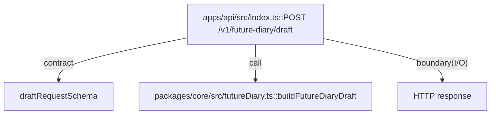

# apps/api

`apps/api/src/index.ts` は Hono Worker の HTTP 境界を実装し、`/health` と `/v1/future-diary/draft` を提供する。入力検証は `zod`、生成ロジックは `@future-diary/core::buildFutureDiaryDraft` に委譲する。

- パス: `apps/api/README.md`
- 状態: Implemented
- 種別（Profile）: src-module
- 関連:
  - See: `packages/core/README.md`
  - See: `packages/db/README.md`
  - See: `packages/vector/README.md`
- 注意:
  - `wrangler.toml` の `database_id` はダミー値。

<details>
<summary>目次</summary>

- [役割](#役割)
- [スコープ](#スコープ)
- [ローカル開発](#ローカル開発)
- [ディレクトリ構成](#ディレクトリ構成)
- [公開インタフェース](#公開インタフェース)
- [契約と検証](#契約と検証)
- [設計ノート](#設計ノート)
- [品質](#品質)
- [内部](#内部)

</details>

## 役割

- Worker の HTTP エントリを提供する。
- リクエスト JSON をバリデーションし、失敗を 400/422 で返す。
- future diary draft 生成を core usecase に委譲する。

<details><summary>根拠（Evidence）</summary>

- [E1] `apps/api/src/index.ts:17` — `GET /health` 定義。
- [E2] `apps/api/src/index.ts:25` — `POST /v1/future-diary/draft` 定義。
- [E3] `apps/api/src/index.ts:5` — `zod` schema。
- [E4] `apps/api/src/index.ts:42` — `buildFutureDiaryDraft` 呼び出し。

- Edge Evidence Map（各エッジは “call + def” の 2 点セット）:
  - `POST /v1/future-diary/draft` -> `buildFutureDiaryDraft`:
    - call: [E4] `apps/api/src/index.ts:42`
    - def: [E5] `packages/core/src/futureDiary.ts:19`

</details>

## スコープ

- 対象（In scope）:
  - HTTP routing
  - 入力検証
  - レスポンス変換
- 対象外（Non-goals）:
  - 永続化実装（将来 `@future-diary/db` 連携）
  - 本番向け認証
- 委譲（See）:
  - See: `packages/core/README.md`
- 互換性:
  - 既定で後方互換より単純性を優先
- 依存方向:
  - 許可:
    - `apps/api` -> `@future-diary/core`
  - 禁止:
    - UI ロジックを API に混在

<details><summary>根拠（Evidence）</summary>

- [E1] `apps/api/package.json:14` — `@future-diary/core` 依存。
- [E2] `apps/api/src/index.ts:1` — import。
- [E3] `apps/api/src/index.ts:42` — usecase call。
</details>

## ローカル開発

- 依存インストール: `make install`
- 環境変数: `cp apps/api/.dev.vars.example apps/api/.dev.vars`
- 起動: `make dev-api`
- 確認: `curl http://127.0.0.1:8787/health`

<details><summary>根拠（Evidence）</summary>

- [E1] `apps/api/package.json:6` — `wrangler dev`。
- [E2] `apps/api/.dev.vars.example:1` — `APP_ENV`。
</details>

## ディレクトリ構成

```text
.
└── apps/api/                    # API Worker
    ├── src/                     # 実装とテスト / See: src/README.md
    ├── wrangler.toml            # Worker binding config
    ├── package.json             # API scripts/deps
    └── README.md                # この文書
```

## 公開インタフェース

### 提供するもの / 提供しないもの

- 提供:
  - `GET /health`
  - `POST /v1/future-diary/draft`
- 非提供:
  - 認証API
  - diary CRUD

### エントリポイント / エクスポート（SSOT）

| 公開シンボル                  | 種別           | 定義元         | 目的             | 根拠                       |
| ----------------------------- | -------------- | -------------- | ---------------- | -------------------------- |
| `GET /health`                 | HTTP route     | `src/index.ts` | 稼働確認         | `apps/api/src/index.ts:17` |
| `POST /v1/future-diary/draft` | HTTP route     | `src/index.ts` | ドラフト生成     | `apps/api/src/index.ts:25` |
| `default.fetch`               | Worker handler | `src/index.ts` | Cloudflare entry | `apps/api/src/index.ts:87` |

### 使い方（必須）

```bash
curl -X POST http://127.0.0.1:8787/v1/future-diary/draft \
  -H 'content-type: application/json' \
  -d '{"userId":"u1","date":"2026-02-07","timezone":"Asia/Tokyo"}'
```

### 依存ルール

- 許可する import:
  - `@future-diary/core`
  - `hono`
  - `zod`
- 禁止する import:
  - `apps/web/*`

<details><summary>根拠（Evidence）</summary>

- [E1] `apps/api/src/index.ts:1`
- [E2] `apps/api/src/index.ts:2`
- [E3] `apps/api/src/index.ts:3`
</details>

## 契約と検証

### 契約 SSOT

- Schema:
  - `draftRequestSchema` (`userId`, `date`, `timezone`)
- Runtime config:
  - `wrangler.toml`

### 検証入口（CI / ローカル）

- [E1] `bun --cwd apps/api run test`
- [E2] `bun --cwd apps/api run typecheck`

### テスト（根拠として使う場合）

| テストファイル               | コマンド                      | 検証内容              | 主要 assertion        | 根拠                            |
| ---------------------------- | ----------------------------- | --------------------- | --------------------- | ------------------------------- |
| `apps/api/src/index.test.ts` | `bun --cwd apps/api run test` | health/draft endpoint | status=200, title一致 | `apps/api/src/index.test.ts:29` |

<details><summary>根拠（Evidence）</summary>

- [E1] `apps/api/src/index.test.ts:5`
- [E2] `apps/api/src/index.test.ts:14`
- [E3] `apps/api/package.json:9`
</details>

## 設計ノート

- データ形状:
  - request: `{ userId, date, timezone }`
  - response: `{ ok, draft, meta }`
- 失敗セマンティクス:
  - validation error -> 400
  - usecase error -> 422
- メインフロー:
  - parse JSON -> zod validate -> core call -> HTTP response。
- I/O 境界:
  - HTTP request/response。
- トレードオフ:
  - DB連携を未実装にして API 境界と core 連携を先に固定。



<details><summary>根拠（Evidence）</summary>

- [E1] `apps/api/src/index.ts:25`
- [E2] `apps/api/src/index.ts:5`
- [E3] `apps/api/src/index.ts:42`
- [E4] `apps/api/src/index.ts:76`
</details>

## 品質

- テスト戦略:
  - API smoke tests（境界）
  - core とは別に endpoint 検証
- 主なリスクと対策（3〜7）:

| リスク                   | 対策（検証入口）     | 根拠                       |
| ------------------------ | -------------------- | -------------------------- |
| invalid payload を通す   | zod validate + 400   | `apps/api/src/index.ts:27` |
| core error を 200 で返す | 422 branch           | `apps/api/src/index.ts:66` |
| config 不備              | `wrangler.toml` 明示 | `apps/api/wrangler.toml:1` |

<details><summary>根拠（Evidence）</summary>

- [E1] `apps/api/src/index.ts:29`
- [E2] `apps/api/src/index.ts:66`
- [E3] `apps/api/wrangler.toml:6`
</details>

## 内部

<details>
<summary>品質（関数型プログラミング観点） / OPEN / ISSUE / SUMMARY</summary>

### 品質（関数型プログラミング観点）

| 項目         | 判定 | 理由                        | 根拠                       |
| ------------ | ---- | --------------------------- | -------------------------- |
| 副作用の隔離 | YES  | HTTP境界でI/Oを処理         | `apps/api/src/index.ts:25` |
| 例外より型   | YES  | usecase結果を`ok`判定       | `apps/api/src/index.ts:66` |
| 依存性注入   | NO   | port注入は未導入            | `apps/api/src/index.ts:42` |
| 契約指向     | YES  | zod schema を入口契約に利用 | `apps/api/src/index.ts:5`  |

### [OPEN]

- [OPEN][TODO] D1/Vectorize の実接続
  - 背景: 現在は固定 fragment 生成。
  - 現状: stub データ。
  - 受入条件:
    - repository/vector port を使う。
  - 根拠:
    - `apps/api/src/index.ts:45`
- [OPEN][TODO] `wrangler.toml` の本番DB ID設定
  - 背景: ダミーID。
  - 現状: `00000000-0000-0000-0000-000000000000`
  - 受入条件:
    - 実IDへ置換。
  - 根拠:
    - `apps/api/wrangler.toml:9`

### [ISSUE]

- なし。

### [SUMMARY]

- API境界は最小構成で動作し、core usecase連携は成立済み。

</details>
