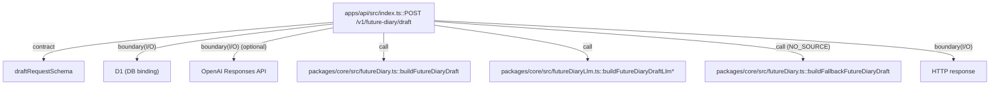

# apps/api

`apps/api/src/index.ts` は Hono Worker の HTTP 境界を実装し、`/health` と `/v1/future-diary/draft` を提供する。入力検証は `zod`、生成ロジックは `@future-diary/core::buildFutureDiaryDraft` に委譲する。

- パス: `apps/api/README.md`
- 状態: Implemented
- 種別（Profile）: src-module
- 関連:
  - See: `packages/core/README.md`
  - See: `packages/db/README.md`
  - See: `packages/vector/README.md`
- 注意:
  - `wrangler.toml` の `database_id` は Cloudflare 作成済み ID を設定済み。

<details>
<summary>目次</summary>

- [役割](#役割)
- [スコープ](#スコープ)
- [ローカル開発](#ローカル開発)
- [本番デプロイ](#本番デプロイ)
- [ディレクトリ構成](#ディレクトリ構成)
- [公開インタフェース](#公開インタフェース)
- [契約と検証](#契約と検証)
- [設計ノート](#設計ノート)
- [品質](#品質)
- [内部](#内部)

</details>

## 役割

- Worker の HTTP エントリを提供する。
- リクエスト JSON をバリデーションし、失敗を 400 で返す。
- 同一ユーザ同一日付の future diary draft は D1 に保存し、再呼び出し時は保存済みを返す（冪等）。
- `OPENAI_API_KEY` が設定されている場合は外部LLMで draft 本文を生成する（失敗時は deterministic 生成へフォールバック）。
- 過去データが無い場合でも編集可能な fallback draft を返す。

<details><summary>根拠（Evidence）</summary>

- [E1] `apps/api/src/index.ts:48` — `GET /health` 定義。
- [E2] `apps/api/src/index.ts:56` — `POST /v1/future-diary/draft` 定義。
- [E3] `apps/api/src/index.ts:13` — `zod` schema。
- [E4] `apps/api/src/index.ts:96` — 既存 draft の D1 read（cache）。
- [E5] `apps/api/src/index.ts:144` — OpenAI Responses API 呼び出し。
- [E6] `apps/api/src/index.ts:180` — `buildFutureDiaryDraft` 呼び出し（deterministic）。
- [E7] `apps/api/src/index.ts:205` — draft の D1 insert（`createDraftIfMissing`）。
- [E8] `apps/api/src/openaiResponses.ts:59` — OpenAI Responses client。
- [E9] `packages/core/src/futureDiary.ts:20` — deterministic usecase。
- [E10] `packages/db/src/repository.ts:55` — insert-if-missing。

- Edge Evidence Map（各エッジは “call + def” の 2 点セット）:
  - `POST /v1/future-diary/draft` -> `requestOpenAiStructuredOutputText`:
    - call: [E5] `apps/api/src/index.ts:144`
    - def: [E8] `apps/api/src/openaiResponses.ts:59`
  - `POST /v1/future-diary/draft` -> `buildFutureDiaryDraft`:
    - call: [E6] `apps/api/src/index.ts:180`
    - def: [E9] `packages/core/src/futureDiary.ts:20`
  - `POST /v1/future-diary/draft` -> `createDraftIfMissing`:
    - call: [E7] `apps/api/src/index.ts:205`
    - def: [E10] `packages/db/src/repository.ts:55`

</details>

## スコープ

- 対象（In scope）:
  - HTTP routing
  - 入力検証
  - レスポンス変換
  - D1 への draft 永続化（cache / 冪等）
- 対象外（Non-goals）:
  - 本番向け認証
  - diary CRUD（確定/編集/履歴）API
  - Vectorize による RAG 検索（埋め込み生成を含む）
- 委譲（See）:
  - See: `packages/core/README.md`
- 互換性:
  - 既定で後方互換より単純性を優先
- 依存方向:
  - 許可:
    - `apps/api` -> `@future-diary/core`
    - `apps/api` -> `@future-diary/db`
  - 禁止:
    - UI ロジックを API に混在

<details><summary>根拠（Evidence）</summary>

- [E1] `apps/api/package.json:14` — `@future-diary/core` 依存。
- [E2] `apps/api/package.json:15` — `@future-diary/db` 依存。
- [E3] `apps/api/src/index.ts:1` — import（core）。
- [E4] `apps/api/src/index.ts:8` — import（db）。
- [E5] `apps/api/src/index.ts:144` — OpenAI call（任意）。
- [E6] `apps/api/src/index.ts:180` — deterministic usecase call。
- [E7] `apps/api/src/index.ts:91` — repository creation。
</details>

## ローカル開発

- 依存インストール: `make install`
- 環境変数: `cp apps/api/.dev.vars.example apps/api/.dev.vars`
- LLM: `.dev.vars` に `OPENAI_API_KEY` を設定すると外部LLM生成が有効になる（未設定時は deterministic）。
- 起動: `make dev-api`
- 確認: `curl http://127.0.0.1:8787/health`

<details><summary>根拠（Evidence）</summary>

- [E1] `apps/api/package.json:6` — `wrangler dev`。
- [E2] `apps/api/.dev.vars.example:1` — `APP_ENV`。
- [E3] `apps/api/.dev.vars.example:2` — `OPENAI_API_KEY`。
</details>

## 本番デプロイ

`apps/api/wrangler.toml` は `workers_dev = true` のため、基本は `*.workers.dev` に publish する。

### Secret（Workers）

code が参照する Secret:

- `APP_ENV`（`/health` の `env` 表示に使用）
- `OPENAI_API_KEY`（外部LLMで draft 本文を生成する場合。未設定時は deterministic 生成へフォールバック）

```bash
bunx wrangler secret put APP_ENV --config apps/api/wrangler.toml
bunx wrangler secret put OPENAI_API_KEY --config apps/api/wrangler.toml
```

入力値:

- `APP_ENV`: `production`
- `OPENAI_API_KEY`: OpenAI の API Key

補足:

- `OPENAI_BASE_URL` と `OPENAI_MODEL` は `apps/api/wrangler.toml` の `[vars]` で設定する（必要なら上書き）。

### Deploy / Verify

```bash
bunx wrangler deploy --config apps/api/wrangler.toml
curl https://<wrangler出力のURL>/health
```

期待値:

- `ok: true`
- `env: "production"`

### workers.dev subdomain が未登録の場合

初回デプロイ時に `workers.dev subdomain` の登録が必要になる。`wrangler deploy` 実行時に案内されるので、指示に従って登録する。

<details><summary>根拠（Evidence）</summary>

- [E1] `apps/api/src/index.ts:51` — `APP_ENV` を読み `env` に載せる。
- [E2] `apps/api/wrangler.toml:4` — `workers_dev = true`。

</details>

## ディレクトリ構成

```text
.
└── apps/api/                    # API Worker
    ├── src/                     # 実装とテスト / See: src/README.md
    ├── wrangler.toml            # Worker binding config
    ├── package.json             # API scripts/deps
    └── README.md                # この文書
```

## 公開インタフェース

### 提供するもの / 提供しないもの

- 提供:
  - `GET /health`
  - `POST /v1/future-diary/draft`
- 非提供:
  - 認証API
  - diary CRUD

### エントリポイント / エクスポート（SSOT）

| 公開シンボル                  | 種別           | 定義元         | 目的             | 根拠                       |
| ----------------------------- | -------------- | -------------- | ---------------- | -------------------------- |
| `GET /health`                 | HTTP route     | `src/index.ts` | 稼働確認         | `apps/api/src/index.ts:48` |
| `POST /v1/future-diary/draft` | HTTP route     | `src/index.ts` | ドラフト生成/取得 | `apps/api/src/index.ts:56` |
| `default.fetch`               | Worker handler | `src/index.ts` | Cloudflare entry | `apps/api/src/index.ts:248` |

### 使い方（必須）

```bash
curl -X POST http://127.0.0.1:8787/v1/future-diary/draft \
  -H 'content-type: application/json' \
  -d '{"userId":"u1","date":"2026-02-07","timezone":"Asia/Tokyo"}'
```

### 依存ルール

- 許可する import:
  - `@future-diary/core`
  - `@future-diary/db`
  - `hono`
  - `zod`
- 禁止する import:
  - `apps/web/*`

<details><summary>根拠（Evidence）</summary>

- [E1] `apps/api/src/index.ts:1`
- [E2] `apps/api/src/index.ts:8`
- [E3] `apps/api/src/index.ts:9`
- [E4] `apps/api/src/index.ts:10`
- [E5] `apps/api/src/index.ts:11`
</details>

## 契約と検証

### 契約 SSOT

- Schema:
  - `draftRequestSchema` (`userId`, `date`, `timezone`)
- Runtime config:
  - `wrangler.toml`

### 検証入口（CI / ローカル）

- [E1] `bun --cwd apps/api run test`
- [E2] `bun --cwd apps/api run typecheck`

### テスト（根拠として使う場合）

| テストファイル               | コマンド                      | 検証内容              | 主要 assertion        | 根拠                            |
| ---------------------------- | ----------------------------- | --------------------- | --------------------- | ------------------------------- |
| `apps/api/src/index.test.ts` | `bun --cwd apps/api run test` | health/draft endpoint | status=200, cache/LLM | `apps/api/src/index.test.ts:226` |

<details><summary>根拠（Evidence）</summary>

- [E1] `apps/api/src/index.test.ts:111`
- [E2] `apps/api/src/index.test.ts:120`
- [E3] `apps/api/src/index.test.ts:161`
- [E4] `apps/api/package.json:9`
</details>

## 設計ノート

- データ形状:
  - request: `{ userId, date, timezone }`
  - response: `{ ok, draft, meta }`
- 失敗セマンティクス:
  - validation error -> 400
  - missing binding / unexpected error -> 500
- メインフロー:
  - parse JSON -> zod validate -> upsert user -> cache hit なら返す -> source を D1 から取得 -> (OPENAI_API_KEY があれば) OpenAI で生成 -> (失敗/未設定なら) core deterministic -> NO_SOURCE は fallback -> insert if missing -> read -> response。
- I/O 境界:
  - HTTP request/response。
  - D1 read/write。
- トレードオフ:
  - Vectorize は未統合（retrieval は D1 の過去日記を使用）。
  - `sourceFragmentIds` は永続化していない（cache hit の場合は `[]` を返す）。



<details><summary>根拠（Evidence）</summary>

- [E1] `apps/api/src/index.ts:56` — handler entry。
- [E2] `apps/api/src/index.ts:13` — contract schema。
- [E3] `apps/api/src/index.ts:96` — cache read。
- [E4] `apps/api/src/index.ts:115` — source fetch（D1）。
- [E5] `apps/api/src/index.ts:144` — OpenAI call（optional）。
- [E6] `apps/api/src/index.ts:180` — deterministic call。
- [E7] `apps/api/src/index.ts:192` — fallback call。
- [E8] `apps/api/src/index.ts:205` — insert if missing。
- [E9] `apps/api/src/index.ts:228` — response。
</details>

## 品質

- テスト戦略:
  - API smoke tests（境界）
  - core とは別に endpoint 検証
- 主なリスクと対策（3〜7）:

| リスク                   | 対策（検証入口）     | 根拠                       |
| ------------------------ | -------------------- | -------------------------- |
| invalid payload を通す   | zod validate + 400   | `apps/api/src/index.ts:60` |
| D1 binding 欠落          | 明示 500 error       | `apps/api/src/index.ts:73` |
| 二重生成/上書き          | insert if missing + cache read | `apps/api/src/index.ts:205` |
| config 不備              | `wrangler.toml` 明示 | `apps/api/wrangler.toml:1` |

<details><summary>根拠（Evidence）</summary>

- [E1] `apps/api/src/index.ts:60`
- [E2] `apps/api/src/index.ts:73`
- [E3] `apps/api/src/index.ts:205`
- [E4] `apps/api/wrangler.toml:6`
</details>

## 内部

<details>
<summary>品質（関数型プログラミング観点） / OPEN / ISSUE / SUMMARY</summary>

### 品質（関数型プログラミング観点）

| 項目         | 判定 | 理由                        | 根拠                       |
| ------------ | ---- | --------------------------- | -------------------------- |
| 副作用の隔離 | YES  | HTTP + D1 + 外部LLM を境界で扱う | `apps/api/src/index.ts:56` |
| 例外より型   | PARTIAL | core結果は`ok`判定、DB/LLM例外は未変換 | `apps/api/src/index.ts:187` |
| 依存性注入   | NO   | port注入は未導入            | `apps/api/src/index.ts:91` |
| 契約指向     | YES  | zod schema を入口契約に利用 | `apps/api/src/index.ts:13`  |

### [OPEN]

- [OPEN][TODO] Vectorize を用いた retrieval へ置換
  - 背景: RAG 前提の検索境界を入れる。
  - 現状: D1 の過去日記を単純に source として使用。
  - 受入条件:
    - embedding 作成 + Vectorize query の導入（jobs含む）。
  - 根拠:
    - `apps/api/src/index.ts:115`
    - `apps/api/wrangler.toml:16`

### [ISSUE]

- なし。

### [SUMMARY]

- API境界は draft 生成と D1 cache まで含めて成立している。

</details>
