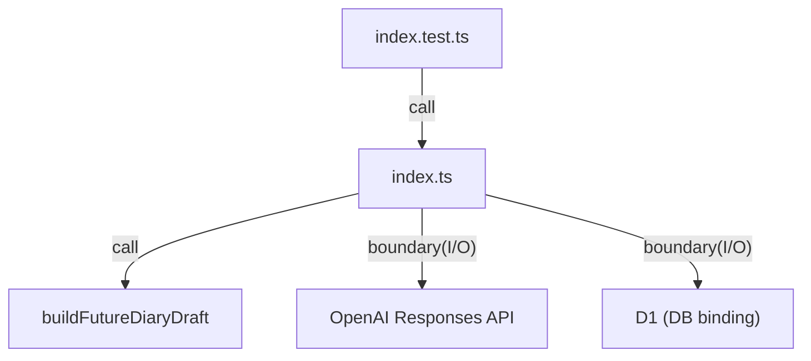

# apps/api/src

`apps/api/src` は Worker API の実装本体を保持し、HTTP route 定義 (`index.ts`)、外部LLM境界（`openaiResponses.ts`）と境界テスト (`index.test.ts`) を管理する。

- パス: `apps/api/src/README.md`
- 状態: Implemented
- 種別（Profile）: src-module
- 関連:
  - See: `../README.md`
- 注意:
  - 仕様は `apps/api/README.md` を正とする。

<details><summary>目次</summary>

- [役割](#役割)
- [スコープ](#スコープ)
- [ローカル開発](#ローカル開発)
- [ディレクトリ構成](#ディレクトリ構成)
- [公開インタフェース](#公開インタフェース)
- [契約と検証](#契約と検証)
- [設計ノート](#設計ノート)
- [品質](#品質)
- [内部](#内部)

</details>

## 役割

- route 定義と API テストの同居。

<details><summary>根拠（Evidence）</summary>

- [E1] `apps/api/src/index.ts:75`
- [E2] `apps/api/src/index.test.ts:156`
</details>

## スコープ

- 対象（In scope）:
  - `index.ts`, `openaiResponses.ts`, `index.test.ts`
- 対象外（Non-goals）:
  - wrangler config
- 委譲（See）:
  - See: `../README.md`
- 互換性:
  - N/A
- 依存方向:
  - 許可:
    - src -> core
    - src -> db
  - 禁止:
    - src -> web/jobs

<details><summary>根拠（Evidence）</summary>

- [E1] `apps/api/src/index.ts:1`
</details>

## ローカル開発

- 依存インストール: `make install`
- 環境変数: `../.dev.vars.example`
- 起動: `make dev-api`
- 確認: `bun --cwd apps/api run test`

<details><summary>根拠（Evidence）</summary>

- [E1] `apps/api/package.json:9`
</details>

## ディレクトリ構成

```text
.
└── apps/api/src/
    ├── index.ts                 # route実装
    ├── openaiResponses.ts        # OpenAI Responses client（外部LLM境界）
    ├── index.test.ts            # APIテスト
    └── README.md                # この文書
```

## 公開インタフェース

### 提供するもの / 提供しないもの

- 提供:
  - `app` / `default.fetch`
- 非提供:
  - DB接続初期化

### エントリポイント / エクスポート（SSOT）

| 公開シンボル    | 種別         | 定義元     | 目的                 | 根拠                       |
| --------------- | ------------ | ---------- | -------------------- | -------------------------- |
| `app`           | const        | `index.ts` | testable Hono app    | `apps/api/src/index.ts:46` |
| `default.fetch` | object field | `index.ts` | Worker fetch handler | `apps/api/src/index.ts:489` |

### 使い方（必須）

```ts
import { app } from "./index";

const response = await app.request("/health");
```

### 依存ルール

- 許可する import:
  - `@future-diary/core`, `@future-diary/db`, `hono`, `zod`
- 禁止する import:
  - `apps/web/*`

<details><summary>根拠（Evidence）</summary>

- [E1] `apps/api/src/index.ts:1`
- [E2] `apps/api/src/index.ts:8`
- [E3] `apps/api/src/index.ts:9`
- [E4] `apps/api/src/index.ts:10`
- [E5] `apps/api/src/index.ts:11`
</details>

## 契約と検証

### 契約 SSOT

- `draftRequestSchema`
- `diaryEntryGetRequestSchema`
- `diaryEntrySaveRequestSchema`
- `diaryEntryConfirmRequestSchema`
- `diaryEntryListRequestSchema`

### 検証入口（CI / ローカル）

- [E1] `bun --cwd apps/api run test`

### テスト（根拠として使う場合）

| テストファイル  | コマンド                      | 検証内容              | 主要 assertion | 根拠                            |
| --------------- | ----------------------------- | --------------------- | -------------- | ------------------------------- |
| `index.test.ts` | `bun --cwd apps/api run test` | endpoints smoke test  | status=200     | `apps/api/src/index.test.ts:156` |

<details><summary>根拠（Evidence）</summary>

- [E1] `apps/api/src/index.test.ts:157`
- [E2] `apps/api/src/index.test.ts:166`
</details>

## 設計ノート

- データ形状:
  - request JSON -> validated object
- 失敗セマンティクス:
  - 400/500
- メインフロー:
  - parse/validate -> D1 cache read -> source fetch -> (OPENAI_API_KEYがあれば) OpenAI生成 -> (失敗/未設定なら) deterministic/fallback -> insert if missing -> return。
- I/O 境界:
  - HTTP + D1 + 外部LLM
- トレードオフ:
  - 最小実装優先。



<details><summary>根拠（Evidence）</summary>

- [E1] `apps/api/src/index.ts:75`
- [E2] `apps/api/src/index.ts:115`
- [E3] `apps/api/src/index.ts:134`
- [E4] `apps/api/src/index.ts:164`
- [E5] `apps/api/src/index.ts:214`
- [E6] `apps/api/src/index.test.ts:156`
</details>

## 品質

- テスト戦略:
  - endpointごとの smoke test。
- 主なリスクと対策（3〜7）:

| リスク    | 対策（検証入口） | 根拠                           |
| --------- | ---------------- | ------------------------------ |
| route回帰 | `index.test.ts`  | `apps/api/src/index.test.ts:156` |

<details><summary>根拠（Evidence）</summary>

- [E1] `apps/api/src/index.test.ts:156`
</details>

## 内部

<details><summary>品質（関数型プログラミング観点） / OPEN / ISSUE / SUMMARY</summary>

### 品質（関数型プログラミング観点）

| 項目         | 判定 | 理由           | 根拠                       |
| ------------ | ---- | -------------- | -------------------------- |
| 副作用の隔離 | YES  | HTTP + D1 + 外部LLM 境界に限定 | `apps/api/src/index.ts:75` |

### [OPEN]

- [OPEN][TODO] Vectorize retrieval 接続
  - 背景: RAG 検索に置換したい
  - 現状: D1 の過去日記を source に使用
  - 受入条件:
    - embedding 作成 + Vectorize query の導入（jobs含む）
  - 根拠:
    - `apps/api/src/index.ts:134`

### [ISSUE]

- なし。

### [SUMMARY]

- src 層は route と test を保持。

</details>
