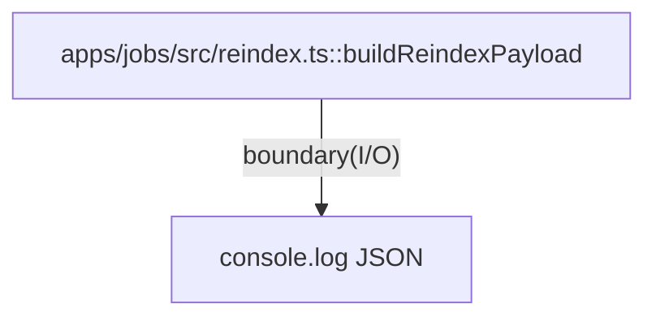

# apps/jobs

`apps/jobs/src/reindex.ts` は vector reindex 実行用のジョブ入口を保持し、手動/定期トリガの payload 生成責務を持つ。

- パス: `apps/jobs/README.md`
- 状態: Implemented
- 種別（Profile）: src-module
- 関連:
  - See: `packages/vector/README.md`
- 注意:
  - 現時点では local 実行の最小実装。

<details>
<summary>目次</summary>

- [役割](#役割)
- [スコープ](#スコープ)
- [ローカル開発](#ローカル開発)
- [ディレクトリ構成](#ディレクトリ構成)
- [公開インタフェース](#公開インタフェース)
- [契約と検証](#契約と検証)
- [設計ノート](#設計ノート)
- [品質](#品質)
- [内部](#内部)

</details>

## 役割

- vector index 再構築用 payload を生成する。
- job 実行結果を標準出力へ出す。

<details><summary>根拠（Evidence）</summary>

- [E1] `apps/jobs/src/reindex.ts:7` — payload builder。
- [E2] `apps/jobs/src/reindex.ts:15` — stdout 出力。
</details>

## スコープ

- 対象（In scope）:
  - reindex payload 生成
- 対象外（Non-goals）:
  - 実際の Vectorize API 呼び出し
- 委譲（See）:
  - See: `packages/vector/README.md`
- 互換性:
  - N/A
- 依存方向:
  - 許可:
    - jobs -> packages/vector
  - 禁止:
    - jobs -> web/api source

<details><summary>根拠（Evidence）</summary>

- [E1] `apps/jobs/package.json:13`
</details>

## ローカル開発

- 依存インストール: `make install`
- 環境変数: N/A
- 起動: `make vector-reindex`
- 確認: 標準出力JSON

<details><summary>根拠（Evidence）</summary>

- [E1] `apps/jobs/package.json:6`
- [E2] `Makefile:33`
</details>

## ディレクトリ構成

```text
.
└── apps/jobs/
    ├── src/                     # job実装 / See: src/README.md
    ├── wrangler.toml            # Worker config
    ├── package.json             # scripts/deps
    └── README.md                # この文書
```

## 公開インタフェース

### 提供するもの / 提供しないもの

- 提供:
  - `buildReindexPayload(reason)`
- 非提供:
  - Queue/Workflow orchestration

### エントリポイント / エクスポート（SSOT）

| 公開シンボル          | 種別     | 定義元           | 目的        | 根拠                         |
| --------------------- | -------- | ---------------- | ----------- | ---------------------------- |
| `buildReindexPayload` | function | `src/reindex.ts` | payload生成 | `apps/jobs/src/reindex.ts:7` |

### 使い方（必須）

```bash
bun --cwd apps/jobs run vector:reindex
```

### 依存ルール

- 許可する import:
  - `@future-diary/vector`
- 禁止する import:
  - app間直接参照

<details><summary>根拠（Evidence）</summary>

- [E1] `apps/jobs/package.json:12`
</details>

## 契約と検証

### 契約 SSOT

- `ReindexPayload` interface。

### 検証入口（CI / ローカル）

- [E1] `bun --cwd apps/jobs run typecheck`
- [E2] `bun --cwd apps/jobs run build`

### テスト（根拠として使う場合）

| テストファイル | コマンド                                 | 検証内容         | 主要 assertion | 根拠                          |
| -------------- | ---------------------------------------- | ---------------- | -------------- | ----------------------------- |
| N/A            | `bun --cwd apps/jobs run vector:reindex` | payload JSON生成 | ok=true        | `apps/jobs/src/reindex.ts:15` |

<details><summary>根拠（Evidence）</summary>

- [E1] `apps/jobs/src/reindex.ts:1`
</details>

## 設計ノート

- データ形状:
  - `{ indexName, triggeredAt, reason }`
- 失敗セマンティクス:
  - 例外は未ハンドル（今後改善対象）
- メインフロー:
  - build payload -> console.log。
- I/O 境界:
  - stdout。
- トレードオフ:
  - 最小ジョブを先に固定。



<details><summary>根拠（Evidence）</summary>

- [E1] `apps/jobs/src/reindex.ts:7`
- [E2] `apps/jobs/src/reindex.ts:15`
</details>

## 品質

- テスト戦略:
  - typecheck/build 実行。
- 主なリスクと対策（3〜7）:

| リスク           | 対策（検証入口）      | 根拠                         |
| ---------------- | --------------------- | ---------------------------- |
| payload形式崩れ  | interfaceで固定       | `apps/jobs/src/reindex.ts:1` |
| 本番ジョブ化漏れ | wrangler configを保持 | `apps/jobs/wrangler.toml:1`  |

<details><summary>根拠（Evidence）</summary>

- [E1] `apps/jobs/src/reindex.ts:1`
- [E2] `apps/jobs/wrangler.toml:1`
</details>

## 内部

<details>
<summary>品質（関数型プログラミング観点） / OPEN / ISSUE / SUMMARY</summary>

### 品質（関数型プログラミング観点）

| 項目         | 判定    | 理由                            | 根拠                          |
| ------------ | ------- | ------------------------------- | ----------------------------- |
| 純粋性       | PARTIAL | payload生成は純粋、出力は副作用 | `apps/jobs/src/reindex.ts:7`  |
| 副作用の隔離 | YES     | I/Oを `console.log` に限定      | `apps/jobs/src/reindex.ts:15` |

### [OPEN]

- [OPEN][TODO] Vectorize 実API実装
  - 背景: 現在は payload 出力のみ。
  - 現状: stub
  - 受入条件:
    - vector index更新処理を追加。
  - 根拠:
    - `apps/jobs/src/reindex.ts:15`

### [ISSUE]

- なし。

### [SUMMARY]

- jobs は reindex payload を生成する最小境界。

</details>
