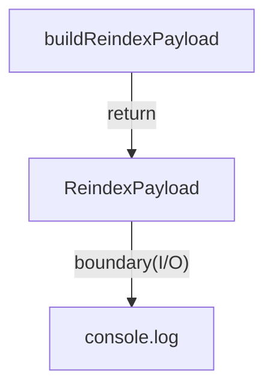

# apps/jobs/src

`apps/jobs/src` は background ジョブの実装コードを保持し、現在は `reindex.ts` の payload 生成を提供する。

- パス: `apps/jobs/src/README.md`
- 状態: Implemented
- 種別（Profile）: src-module
- 関連:
  - See: `../README.md`
- 注意:
  - 実Vectorize更新は未実装。

<details><summary>目次</summary>

- [役割](#役割)
- [スコープ](#スコープ)
- [ローカル開発](#ローカル開発)
- [ディレクトリ構成](#ディレクトリ構成)
- [公開インタフェース](#公開インタフェース)
- [契約と検証](#契約と検証)
- [設計ノート](#設計ノート)
- [品質](#品質)
- [内部](#内部)

</details>

## 役割

- reindex payload 生成。

<details><summary>根拠（Evidence）</summary>

- [E1] `apps/jobs/src/reindex.ts:7`
</details>

## スコープ

- 対象（In scope）:
  - `reindex.ts`
- 対象外（Non-goals）:
  - Queue連携
- 委譲（See）:
  - See: `../README.md`
- 互換性:
  - N/A
- 依存方向:
  - 許可:
    - src local only
  - 禁止:
    - app cross-import

<details><summary>根拠（Evidence）</summary>

- [E1] `apps/jobs/src/reindex.ts:1`
</details>

## ローカル開発

- 依存インストール: `make install`
- 環境変数: N/A
- 起動: `make vector-reindex`
- 確認: stdout JSON

<details><summary>根拠（Evidence）</summary>

- [E1] `apps/jobs/package.json:6`
</details>

## ディレクトリ構成

```text
.
└── apps/jobs/src/
    ├── reindex.ts               # payload builder
    └── README.md                # この文書
```

## 公開インタフェース

### 提供するもの / 提供しないもの

- 提供:
  - `buildReindexPayload`
- 非提供:
  - Worker entry wrapper

### エントリポイント / エクスポート（SSOT）

| 公開シンボル          | 種別     | 定義元       | 目的        | 根拠                         |
| --------------------- | -------- | ------------ | ----------- | ---------------------------- |
| `buildReindexPayload` | function | `reindex.ts` | payload生成 | `apps/jobs/src/reindex.ts:7` |

### 使い方（必須）

```ts
import { buildReindexPayload } from "./reindex";
```

### 依存ルール

- 許可する import:
  - local file only
- 禁止する import:
  - external app source

<details><summary>根拠（Evidence）</summary>

- [E1] `apps/jobs/src/reindex.ts:17`
</details>

## 契約と検証

### 契約 SSOT

- `ReindexPayload`

### 検証入口（CI / ローカル）

- [E1] `bun --cwd apps/jobs run typecheck`

### テスト（根拠として使う場合）

| テストファイル | コマンド                                 | 検証内容     | 主要 assertion | 根拠                          |
| -------------- | ---------------------------------------- | ------------ | -------------- | ----------------------------- |
| N/A            | `bun --cwd apps/jobs run vector:reindex` | payload 生成 | ok=true        | `apps/jobs/src/reindex.ts:15` |

<details><summary>根拠（Evidence）</summary>

- [E1] `apps/jobs/src/reindex.ts:1`
</details>

## 設計ノート

- データ形状:
  - `ReindexPayload`
- 失敗セマンティクス:
  - 例外未変換
- メインフロー:
  - create payload -> log。
- I/O 境界:
  - console
- トレードオフ:
  - 初期最小。



<details><summary>根拠（Evidence）</summary>

- [E1] `apps/jobs/src/reindex.ts:7`
- [E2] `apps/jobs/src/reindex.ts:15`
</details>

## 品質

- テスト戦略:
  - typecheck/build。
- 主なリスクと対策（3〜7）:

| リスク           | 対策（検証入口） | 根拠                         |
| ---------------- | ---------------- | ---------------------------- |
| payload 仕様崩れ | interface定義    | `apps/jobs/src/reindex.ts:1` |

<details><summary>根拠（Evidence）</summary>

- [E1] `apps/jobs/src/reindex.ts:1`
</details>

## 内部

<details><summary>品質（関数型プログラミング観点） / OPEN / ISSUE / SUMMARY</summary>

### 品質（関数型プログラミング観点）

| 項目         | 判定 | 理由            | 根拠                         |
| ------------ | ---- | --------------- | ---------------------------- |
| 副作用の隔離 | YES  | log以外は純関数 | `apps/jobs/src/reindex.ts:7` |

### [OPEN]

- [OPEN][TODO] 実 reindex job化
  - 背景: 現在は payload のみ
  - 現状: stub
  - 受入条件:
    - Vectorize API 呼び出し追加
  - 根拠:
    - `apps/jobs/src/reindex.ts:15`

### [ISSUE]

- なし。

### [SUMMARY]

- src は reindex の最小ロジックを保持。

</details>
