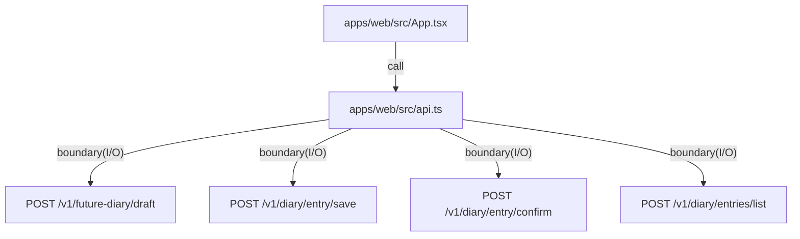

# apps/web

`apps/web/src/App.tsx` は 未来日記の下書き生成（当日初回の自動生成）/編集/保存/確定/履歴閲覧 UI（カレンダー表示/ページング含む）を提供し、`apps/api` の HTTP API と疎結合に通信する。通信境界は `apps/web/src/api.ts`、スタイルは `apps/web/src/app.css` に集約する。

- パス: `apps/web/README.md`
- 状態: Implemented
- 種別（Profile）: src-module
- 関連:
  - See: `apps/api/README.md`
  - See: `packages/ui/README.md`
- 注意:
  - accessToken/timezone は localStorage に保存する（accessToken は秘密情報）。
  - 初回発行時は accessToken を modal 表示し、copy/reveal で保存を促す。

<details>
<summary>目次</summary>

- [役割](#役割)
- [スコープ](#スコープ)
- [ローカル開発](#ローカル開発)
- [ディレクトリ構成](#ディレクトリ構成)
- [公開インタフェース](#公開インタフェース)
- [契約と検証](#契約と検証)
- [設計ノート](#設計ノート)
- [品質](#品質)
- [内部](#内部)

</details>

## 役割

- Vite/React の SPA エントリを提供。
- 当日初回の「未来日記（下書き）」を生成して編集できる UI を提供。
- 保存/確定/履歴閲覧を API 経由で操作する。
- 履歴は月ナビ付きカレンダー + ページング（さらに30件）で過去日導線を提供する。
- Profile（user model: style/intent/preferences）を取得/編集し、生成に反映する。

<details><summary>根拠（Evidence）</summary>

- [E1] `apps/web/src/main.tsx:12` — React root mount。
- [E2] `apps/web/src/App.tsx:807` — 当日初回の draft auto load。
- [E3] `apps/web/src/App.tsx:428` — draft API call。
- [E4] `apps/web/src/App.tsx:521` — save API call。
- [E5] `apps/web/src/App.tsx:568` — confirm API call。
- [E6] `apps/web/src/App.tsx:390` — history list API call。
- [E7] `apps/web/src/App.tsx:1197` — Profile（user model）編集 UI。
</details>

## スコープ

- 対象（In scope）:
  - 未来日記（下書き）の生成/編集/保存/確定 UI
  - 履歴閲覧 UI
  - API base URL 切替
- 対象外（Non-goals）:
  - 外部IdP連携やフル機能認証（MVPは accessToken で識別）
  - リッチテキスト編集
- 委譲（See）:
  - See: `apps/api/README.md`
- 互換性:
  - N/A
- 依存方向:
  - 許可:
    - web -> api HTTP
  - 禁止:
    - web -> api source import

<details><summary>根拠（Evidence）</summary>

- [E1] `apps/web/src/App.tsx:1002` — draft 操作 UI。
- [E2] `apps/web/src/App.tsx:1081` — editor UI。
- [E3] `apps/web/src/App.tsx:1135` — history UI。
- [E4] `apps/web/src/api.ts:147` — draft client。
</details>

## ローカル開発

- 依存インストール: `make install`
- 環境変数: `cp apps/web/.env.example apps/web/.env.local`
- 起動: `make dev-web`
- 確認: `open http://127.0.0.1:5173`

<details><summary>根拠（Evidence）</summary>

- [E1] `apps/web/package.json:6` — `vite dev`。
- [E2] `apps/web/.env.example:1` — API base URL。
</details>

## ディレクトリ構成

```text
.
└── apps/web/
    ├── e2e-smoke.test.ts         # E2E smoke（web -> api -> d1）
    ├── src/                     # UI実装 / See: src/README.md
    ├── vite.config.ts           # Vite config
    ├── index.html               # HTML entry
    └── README.md                # この文書
```

## 公開インタフェース

### 提供するもの / 提供しないもの

- 提供:
  - 未来日記（下書き）の生成/編集/保存/確定 UI
  - 履歴閲覧 UI
- 非提供:
  - 外部IdP連携などのフル機能認証 UI

### エントリポイント / エクスポート（SSOT）

| 公開シンボル  | 種別      | 定義元        | 目的           | 根拠                     |
| ------------- | --------- | ------------- | -------------- | ------------------------ |
| `App`                 | component | `src/App.tsx` | UI root | `apps/web/src/App.tsx:179` |
| `fetchFutureDiaryDraft` | function  | `src/api.ts`  | draft 取得/生成 | `apps/web/src/api.ts:147` |
| `createAuthSession`     | function  | `src/api.ts`  | session 作成 | `apps/web/src/api.ts:162` |
| `fetchAuthMe`           | function  | `src/api.ts`  | session 検証 | `apps/web/src/api.ts:173` |
| `fetchUserModel`        | function  | `src/api.ts`  | user model 取得 | `apps/web/src/api.ts:195` |
| `updateUserModel`       | function  | `src/api.ts`  | user model 更新 | `apps/web/src/api.ts:203` |
| `resetUserModel`        | function  | `src/api.ts`  | user model 初期化 | `apps/web/src/api.ts:211` |
| `logout`                | function  | `src/api.ts`  | session 破棄 | `apps/web/src/api.ts:214` |
| `saveDiaryEntry`        | function  | `src/api.ts`  | diary 保存 | `apps/web/src/api.ts:232` |
| `confirmDiaryEntry`     | function  | `src/api.ts`  | diary 確定 | `apps/web/src/api.ts:241` |
| `listDiaryEntries`      | function  | `src/api.ts`  | 履歴取得 | `apps/web/src/api.ts:253` |
| `deleteDiaryEntry`      | function  | `src/api.ts`  | diary 削除 | `apps/web/src/api.ts:264` |
| `deleteUser`            | function  | `src/api.ts`  | user 削除 | `apps/web/src/api.ts:267` |

### 使い方（必須）

```bash
VITE_API_BASE_URL=http://127.0.0.1:8787 make dev-web
```

### 依存ルール

- 許可する import:
  - `react`, `react-dom`
  - local client helper
- 禁止する import:
  - `apps/api/src/*`

<details><summary>根拠（Evidence）</summary>

- [E1] `apps/web/src/App.tsx:1`
- [E2] `apps/web/src/App.tsx:2`
</details>

## 契約と検証

### 契約 SSOT

- API response 型:
  - `FutureDiaryDraftResponse`
  - `AuthSessionCreateResponse`
  - `AuthMeResponse`
  - `UserModelGetResponse`
  - `UserModelUpdateResponse`
  - `UserModelResetResponse`
  - `DiaryEntrySaveResponse`
  - `DiaryEntryConfirmResponse`
  - `DiaryEntriesListResponse`
  - `DiaryEntryDeleteResponse`
- `.env` の `VITE_API_BASE_URL`。

### 検証入口（CI / ローカル）

- [E1] `bun --cwd apps/web run typecheck`
- [E2] `bun --cwd apps/web run build`
- [E3] `bun --cwd apps/web run smoke`

### テスト（根拠として使う場合）

| テストファイル | コマンド                       | 検証内容       | 主要 assertion | 根拠                      |
| -------------- | ------------------------------ | -------------- | -------------- | ------------------------- |
| `apps/web/e2e-smoke.test.ts` | `bun --cwd apps/web run smoke` | E2E smoke（web -> api -> d1） | draft/save/confirm/list が成功 | `apps/web/e2e-smoke.test.ts:1` |
| N/A            | `bun --cwd apps/web run build` | UI bundle 成立 | build success  | `apps/web/package.json:9` |

<details><summary>根拠（Evidence）</summary>

- [E1] `apps/web/src/api.ts:1`
- [E2] `apps/web/.env.example:1`
- [E3] `apps/web/package.json:7` — smoke script。
- [E4] `apps/web/e2e-smoke.test.ts:1` — smoke flow（draft/save/confirm/list）。
</details>

## 設計ノート

- データ形状:
  - draft:
    - auth: `Authorization: Bearer <accessToken>`
    - request: `{ date, timezone }`
    - response: `{ ok, draft, meta }`（`meta.generationStatus` が `completed` になるまで polling）
    - draft transparency: `draft.sourceFragmentIds`, `draft.keywords`, `meta.generation.userModel`
  - save:
    - request: `{ date, body }`
  - confirm:
    - request: `{ date }`
  - delete:
    - request: `{ date }`
  - list:
    - request: `{ onOrBeforeDate, limit }`
    - usage: 初回読み込み（最新30件） + 旧日付ページング（`onOrBeforeDate` をカーソルとして継続取得）
- 失敗セマンティクス:
  - fetch失敗時に toast を error 表示（status + API payload 整形）。
- メインフロー:
  - 初回: session 作成 -> access key modal -> 当日 draft 生成/読み込み。
  - (accessToken/timezone が揃っていれば) mount -> 当日 draft 生成/読み込み -> generationStatus を polling -> editor 表示。
  - edit -> save -> confirm。
  - list -> history 表示。
- I/O 境界:
  - browser fetch（`api.ts`）。
  - localStorage（accessToken/timezone）。
- トレードオフ:
  - accessToken を localStorage に保持する（XSS リスクは残る）。



<details><summary>根拠（Evidence）</summary>

- [E1] `apps/web/src/App.tsx:807` — mount時の自動生成。
- [E2] `apps/web/src/api.ts:65` — JSON POST boundary。
- [E3] `apps/web/src/api.ts:147` — draft client。
- [E4] `apps/web/src/api.ts:232` — save client。
- [E5] `apps/web/src/api.ts:241` — confirm client。
- [E6] `apps/web/src/api.ts:253` — list client。
- [E7] `apps/web/src/App.tsx:951` — access key modal（発行直後の表示/コピー導線）。
</details>

## 品質

- テスト戦略:
  - build/typecheck を SSOT とし、統合の退行検知は `make smoke`（`apps/web/e2e-smoke.test.ts`）で web API client -> api -> SQLite(D1 schema) の最小フローを検証する。
- 主なリスクと対策（3〜7）:

| リスク            | 対策（検証入口）          | 根拠                      |
| ----------------- | ------------------------- | ------------------------- |
| API未起動/到達不能 | 例外を toast へ表示 | `apps/web/src/App.tsx:497` |
| timezone 入力不正 | Intl 例外を握り潰して local date へfallback | `apps/web/src/App.tsx:61` |
| 操作ミスで未保存が残る | unsaved/saved をUIに表示 | `apps/web/src/App.tsx:1106` |

<details><summary>根拠（Evidence）</summary>

- [E1] `apps/web/src/api.ts:84` — 非200で例外化。
- [E2] `apps/web/src/App.tsx:497` — 例外を toast 表示。
- [E3] `Makefile:50` — `make smoke` target。
- [E4] `apps/web/e2e-smoke.test.ts:1` — E2E smoke。
</details>

## 内部

<details>
<summary>品質（関数型プログラミング観点） / OPEN / ISSUE / SUMMARY</summary>

### 品質（関数型プログラミング観点）

| 項目         | 判定 | 理由                          | 根拠                      |
| ------------ | ---- | ----------------------------- | ------------------------- |
| 副作用の隔離 | YES  | fetch/localStorage を境界へ分離 | `apps/web/src/api.ts:65` |
| 不変性       | YES  | state更新は新値セットのみ     | `apps/web/src/App.tsx:1237` |
| 例外より型   | NO   | 非200を例外として扱う         | `apps/web/src/api.ts:84`  |

### [OPEN]

- なし。

### [ISSUE]

- [ISSUE][P1] モバイル向けレイアウト最適化（320-430px）: `layout` / `appHeader` / `controls` / `actions` / `sidebar` の優先度を再設計し、1画面内で主要操作（生成・保存・確定）に到達しやすくする
  - See: `apps/web/src/App.tsx`
  - See: `apps/web/src/app.css`
- [ISSUE][P1] タッチ操作の可用性を改善する: カレンダー日付セルと主要ボタンのタップ領域を 44px 以上に揃え、hover 依存の操作感を touch/keyboard 操作でも同等にする
  - See: `apps/web/src/App.tsx`
  - See: `apps/web/src/app.css`
- [ISSUE][P1] モバイル viewport 対応を強化する: `100vh` 依存の高さ計算を見直し、iOS Safari の dynamic toolbar / safe-area / キーボード表示時でも履歴と編集欄が隠れないようにする
  - See: `apps/web/src/app.css`
- [ISSUE][P1] モバイル E2E を追加する: Playwright (WebKit/Chromium) のスマホ viewport で、ログイン -> 下書き生成 -> 編集保存 -> 確定 -> 履歴再読込 を自動検証する
  - See: `apps/web/e2e-smoke.test.ts`
- [ISSUE][P1] component 分割ルールを定義する: `App.tsx` の責務を `auth` / `editor` / `history` / `account` の feature 単位へ分離し、`components/` と `hooks/` の配置規約・命名規約・state 境界（local/server/global）を README で SSOT 化する
  - See: `apps/web/src/App.tsx`
  - See: `apps/web/src/README.md`
- [ISSUE][P2] Storybook を導入する: Vite builder で `apps/web` と `packages/ui` の UI state を stories 化し、interaction test（保存中/エラー/空データ/長文）を CI で実行する
  - See: `apps/web/package.json`
  - See: `packages/ui/README.md`
- [ISSUE][P2] 低速・不安定回線向けの UX を整備する: 保存/確定の再試行導線、処理状態の可視化、編集中テキスト消失を防ぐ最小オフライン耐性（local draft）を追加する
  - See: `apps/web/src/App.tsx`
  - See: `apps/web/src/api.ts`

### [SUMMARY]

- Web は 未来日記（下書き）の生成/編集/保存/確定/履歴閲覧 の UI と、Profile（user model）編集 UI を提供する。
- 生成の透明性として、used model / keywords / source fragments を editor 下部に表示できる。
- 履歴 UI は月ナビ付きカレンダーとページング（30件単位の追加読み込み）を提供する。

</details>
