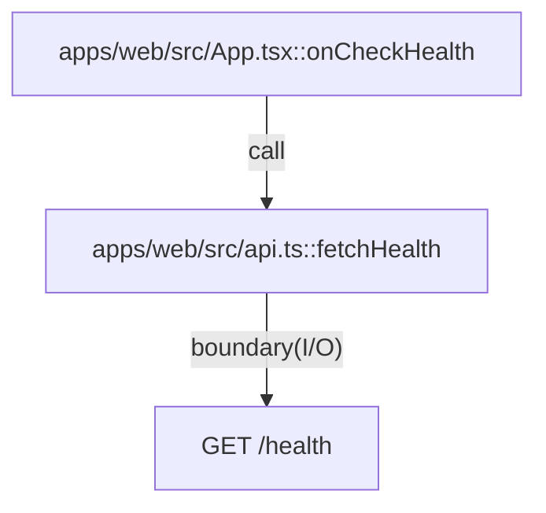

# apps/web

`apps/web/src/App.tsx` は API health 確認 UI を提供し、`fetchHealth` を通して `apps/api` と疎結合に通信する。Vite + React の最小構成で開発サーバーと build を実行する。

- パス: `apps/web/README.md`
- 状態: Implemented
- 種別（Profile）: src-module
- 関連:
  - See: `apps/api/README.md`
  - See: `packages/ui/README.md`
- 注意:
  - 現在は最小画面のみ（future diary編集UIは未実装）。

<details>
<summary>目次</summary>

- [役割](#役割)
- [スコープ](#スコープ)
- [ローカル開発](#ローカル開発)
- [ディレクトリ構成](#ディレクトリ構成)
- [公開インタフェース](#公開インタフェース)
- [契約と検証](#契約と検証)
- [設計ノート](#設計ノート)
- [品質](#品質)
- [内部](#内部)

</details>

## 役割

- Vite/React の SPA エントリを提供。
- API `/health` 呼び出しで接続確認する。

<details><summary>根拠（Evidence）</summary>

- [E1] `apps/web/src/main.tsx:11` — React root mount。
- [E2] `apps/web/src/App.tsx:11` — health call。
- [E3] `apps/web/src/api.ts:7` — fetch client。
</details>

## スコープ

- 対象（In scope）:
  - health check UI
  - API base URL 切替
- 対象外（Non-goals）:
  - diary CRUD UI
  - 認証UI
- 委譲（See）:
  - See: `apps/api/README.md`
- 互換性:
  - N/A
- 依存方向:
  - 許可:
    - web -> api HTTP
  - 禁止:
    - web -> api source import

<details><summary>根拠（Evidence）</summary>

- [E1] `apps/web/src/App.tsx:4`
- [E2] `apps/web/src/api.ts:8`
</details>

## ローカル開発

- 依存インストール: `make install`
- 環境変数: `cp apps/web/.env.example apps/web/.env.local`
- 起動: `make dev-web`
- 確認: `open http://127.0.0.1:5173`

<details><summary>根拠（Evidence）</summary>

- [E1] `apps/web/package.json:6` — `vite dev`。
- [E2] `apps/web/.env.example:1` — API base URL。
</details>

## ディレクトリ構成

```text
.
└── apps/web/
    ├── src/                     # UI実装 / See: src/README.md
    ├── vite.config.ts           # Vite config
    ├── index.html               # HTML entry
    └── README.md                # この文書
```

## 公開インタフェース

### 提供するもの / 提供しないもの

- 提供:
  - API health check UI
- 非提供:
  - diary edit UX

### エントリポイント / エクスポート（SSOT）

| 公開シンボル  | 種別      | 定義元        | 目的           | 根拠                     |
| ------------- | --------- | ------------- | -------------- | ------------------------ |
| `App`         | component | `src/App.tsx` | UI root        | `apps/web/src/App.tsx:6` |
| `fetchHealth` | function  | `src/api.ts`  | API health取得 | `apps/web/src/api.ts:7`  |

### 使い方（必須）

```bash
VITE_API_BASE_URL=http://127.0.0.1:8787 make dev-web
```

### 依存ルール

- 許可する import:
  - `react`, `react-dom`
  - local client helper
- 禁止する import:
  - `apps/api/src/*`

<details><summary>根拠（Evidence）</summary>

- [E1] `apps/web/src/App.tsx:1`
- [E2] `apps/web/src/App.tsx:2`
</details>

## 契約と検証

### 契約 SSOT

- `HealthResponse` interface。
- `.env` の `VITE_API_BASE_URL`。

### 検証入口（CI / ローカル）

- [E1] `bun --cwd apps/web run typecheck`
- [E2] `bun --cwd apps/web run build`

### テスト（根拠として使う場合）

| テストファイル | コマンド                       | 検証内容       | 主要 assertion | 根拠                      |
| -------------- | ------------------------------ | -------------- | -------------- | ------------------------- |
| N/A            | `bun --cwd apps/web run build` | UI bundle 成立 | build success  | `apps/web/package.json:8` |

<details><summary>根拠（Evidence）</summary>

- [E1] `apps/web/src/api.ts:1`
- [E2] `apps/web/.env.example:1`
</details>

## 設計ノート

- データ形状:
  - `HealthResponse` `{ ok, env, service }`
- 失敗セマンティクス:
  - fetch失敗時に message state を error 表示。
- メインフロー:
  - button click -> `fetchHealth` -> setMessage。
- I/O 境界:
  - browser fetch。
- トレードオフ:
  - UIは最小化し、API接続確認を優先。



<details><summary>根拠（Evidence）</summary>

- [E1] `apps/web/src/App.tsx:9`
- [E2] `apps/web/src/api.ts:8`
</details>

## 品質

- テスト戦略:
  - build/typecheck と API 健全性確認。
- 主なリスクと対策（3〜7）:

| リスク            | 対策（検証入口）          | 根拠                      |
| ----------------- | ------------------------- | ------------------------- |
| API未起動で誤作動 | 例外を message へ表示     | `apps/web/src/App.tsx:13` |
| 応答型ずれ        | `HealthResponse` 型で固定 | `apps/web/src/api.ts:1`   |

<details><summary>根拠（Evidence）</summary>

- [E1] `apps/web/src/App.tsx:15`
- [E2] `apps/web/src/api.ts:14`
</details>

## 内部

<details>
<summary>品質（関数型プログラミング観点） / OPEN / ISSUE / SUMMARY</summary>

### 品質（関数型プログラミング観点）

| 項目         | 判定 | 理由                          | 根拠                      |
| ------------ | ---- | ----------------------------- | ------------------------- |
| 副作用の隔離 | YES  | fetch副作用を `api.ts` に集約 | `apps/web/src/api.ts:7`   |
| 不変性       | YES  | state更新は新値セットのみ     | `apps/web/src/App.tsx:12` |
| 例外より型   | NO   | fetch失敗は例外catch運用      | `apps/web/src/App.tsx:13` |

### [OPEN]

- [OPEN][TODO] 未来日記編集UI実装
  - 背景: 現在は health check のみ。
  - 現状: MVP未達。
  - 受入条件:
    - draft表示/編集/確定操作を追加。
  - 根拠:
    - `apps/web/src/App.tsx:22`

### [ISSUE]

- なし。

### [SUMMARY]

- Web は API 接続確認可能な最小UIを提供。

</details>
