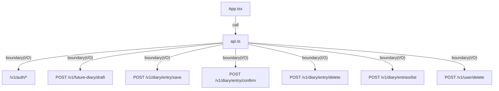

# apps/web/src

`apps/web/src` は 未来日記 UI の実装を保持し、`main.tsx` で起動、`App.tsx` で生成/編集/保存/確定/履歴閲覧を操作し、`api.ts` で通信境界、`app.css` でスタイルを提供する。

- パス: `apps/web/src/README.md`
- 状態: Implemented
- 種別（Profile）: src-module
- 関連:
  - See: `../README.md`
- 注意:
  - accessToken/timezone は localStorage に保存する（accessToken は秘密情報）。
  - 初回発行時は accessToken を modal 表示し、copy/reveal で保存を促す。

<details><summary>目次</summary>

- [役割](#役割)
- [スコープ](#スコープ)
- [ローカル開発](#ローカル開発)
- [ディレクトリ構成](#ディレクトリ構成)
- [公開インタフェース](#公開インタフェース)
- [契約と検証](#契約と検証)
- [設計ノート](#設計ノート)
- [品質](#品質)
- [内部](#内部)

</details>

## 役割

- UI root + diary editor + API client の実装。

<details><summary>根拠（Evidence）</summary>

- [E1] `apps/web/src/main.tsx:12` — mount。
- [E2] `apps/web/src/App.tsx:807` — draft auto load。
- [E3] `apps/web/src/api.ts:65` — fetch boundary。
</details>

## スコープ

- 対象（In scope）:
  - 未来日記（下書き）の生成/編集/保存/確定 UI
  - 履歴閲覧 UI
  - 通信境界（fetch client）
  - スタイル（`app.css`）
- 対象外（Non-goals）:
  - 外部IdP連携などのフル機能認証 UI
- 委譲（See）:
  - See: `../README.md`
- 互換性:
  - N/A
- 依存方向:
  - 許可:
    - src内 import
  - 禁止:
    - api source import

<details><summary>根拠（Evidence）</summary>

- [E1] `apps/web/src/App.tsx:179`
- [E2] `apps/web/src/api.ts:147`
- [E3] `apps/web/src/app.css:71`
</details>

## ローカル開発

- 依存インストール: `make install`
- 環境変数: `../.env.example`
- 起動: `make dev-web`
- 確認: browser rendering

<details><summary>根拠（Evidence）</summary>

- [E1] `apps/web/package.json:6`
</details>

## ディレクトリ構成

```text
.
└── apps/web/src/
    ├── main.tsx                 # bootstrap
    ├── App.tsx                  # view
    ├── api.ts                   # fetch client
    ├── app.css                  # styling
    └── README.md                # この文書
```

## 公開インタフェース

### 提供するもの / 提供しないもの

- 提供:
  - `App`
  - diary API client（`fetchFutureDiaryDraft` / `saveDiaryEntry` / `confirmDiaryEntry` / `listDiaryEntries` / `deleteDiaryEntry`）
  - user model client（`fetchUserModel` / `updateUserModel` / `resetUserModel`）
  - auth client（`createAuthSession` / `fetchAuthMe` / `logout` / `deleteUser`）
- 非提供:
  - shared UI primitives

### エントリポイント / エクスポート（SSOT）

| 公開シンボル  | 種別      | 定義元    | 目的           | 根拠                     |
| ------------- | --------- | --------- | -------------- | ------------------------ |
| `App`                 | component | `App.tsx` | UI root | `apps/web/src/App.tsx:179` |
| `fetchFutureDiaryDraft` | function  | `api.ts`  | draft 取得/生成 | `apps/web/src/api.ts:147` |
| `createAuthSession`     | function  | `api.ts`  | session 作成 | `apps/web/src/api.ts:162` |
| `fetchAuthMe`           | function  | `api.ts`  | session 検証 | `apps/web/src/api.ts:173` |
| `fetchUserModel`        | function  | `api.ts`  | user model 取得 | `apps/web/src/api.ts:195` |
| `updateUserModel`       | function  | `api.ts`  | user model 更新 | `apps/web/src/api.ts:203` |
| `resetUserModel`        | function  | `api.ts`  | user model 初期化 | `apps/web/src/api.ts:211` |
| `logout`                | function  | `api.ts`  | session 破棄 | `apps/web/src/api.ts:214` |
| `saveDiaryEntry`        | function  | `api.ts`  | diary 保存 | `apps/web/src/api.ts:232` |
| `confirmDiaryEntry`     | function  | `api.ts`  | diary 確定 | `apps/web/src/api.ts:241` |
| `listDiaryEntries`      | function  | `api.ts`  | 履歴取得 | `apps/web/src/api.ts:253` |
| `deleteDiaryEntry`      | function  | `api.ts`  | diary 削除 | `apps/web/src/api.ts:264` |
| `deleteUser`            | function  | `api.ts`  | user 削除 | `apps/web/src/api.ts:267` |

### 使い方（必須）

```ts
import { App } from "./App";
```

### 依存ルール

- 許可する import:
  - `react`, `./api`
- 禁止する import:
  - `apps/api/src/*`

<details><summary>根拠（Evidence）</summary>

- [E1] `apps/web/src/App.tsx:1`
- [E2] `apps/web/src/App.tsx:2`
</details>

## 契約と検証

### 契約 SSOT

- API response 型:
  - `FutureDiaryDraftResponse`
  - `AuthSessionCreateResponse`
  - `AuthMeResponse`
  - `UserModelGetResponse`
  - `UserModelUpdateResponse`
  - `UserModelResetResponse`
  - `DiaryEntrySaveResponse`
  - `DiaryEntryConfirmResponse`
  - `DiaryEntriesListResponse`
  - `DiaryEntryDeleteResponse`

### 検証入口（CI / ローカル）

- [E1] `bun --cwd apps/web run typecheck`
- [E2] `bun --cwd apps/web run build`

### テスト（根拠として使う場合）

| テストファイル | コマンド                       | 検証内容   | 主要 assertion | 根拠                      |
| -------------- | ------------------------------ | ---------- | -------------- | ------------------------- |
| N/A            | `bun --cwd apps/web run build` | bundle成立 | build success  | `apps/web/package.json:8` |

<details><summary>根拠（Evidence）</summary>

- [E1] `apps/web/src/api.ts:1`
</details>

## 設計ノート

- データ形状:
  - draft:
    - auth: `Authorization: Bearer <accessToken>`
    - request: `{ date, timezone }`
    - response: `{ ok, draft, meta }`（`meta.generationStatus` が `completed` になるまで polling）
  - save:
    - request: `{ date, body }`
  - confirm:
    - request: `{ date }`
  - delete:
    - request: `{ date }`
  - list:
    - request: `{ onOrBeforeDate, limit }`
- 失敗セマンティクス:
  - 非200は例外として扱い、UI は toast に表示する。
- メインフロー:
  - 初回: session 作成 -> access key modal -> 当日 draft 生成トリガ。
  - mount -> 当日 draft 生成トリガ -> generationStatus を polling -> editor 表示。
  - edit -> save -> confirm。
  - list -> history 表示。
- I/O 境界:
  - `fetch`（`api.ts`）
  - localStorage（`App.tsx`）
- トレードオフ:
  - accessToken を localStorage に保持する（XSS リスクは残る）。



<details><summary>根拠（Evidence）</summary>

- [E1] `apps/web/src/App.tsx:807` — auto load。
- [E2] `apps/web/src/api.ts:65` — JSON POST boundary。
- [E3] `apps/web/src/App.tsx:951` — access key modal（発行直後の表示/コピー導線）。
</details>

## 品質

- テスト戦略:
  - build/typecheck。
- 主なリスクと対策（3〜7）:

| リスク            | 対策（検証入口） | 根拠                      |
| ----------------- | ---------------- | ------------------------- |
| API未起動/到達不能 | 例外を toast へ表示 | `apps/web/src/App.tsx:497` |
| timezone 入力不正 | Intl 例外を握り潰して local date へfallback | `apps/web/src/App.tsx:61` |
| 操作ミスで未保存が残る | unsaved/saved をUIに表示 | `apps/web/src/App.tsx:1106` |

<details><summary>根拠（Evidence）</summary>

- [E1] `apps/web/src/api.ts:84`
</details>

## 内部

<details><summary>品質（関数型プログラミング観点） / OPEN / ISSUE / SUMMARY</summary>

### 品質（関数型プログラミング観点）

| 項目         | 判定 | 理由                   | 根拠                    |
| ------------ | ---- | ---------------------- | ----------------------- |
| 副作用の隔離 | YES  | fetch/localStorage を境界へ分離 | `apps/web/src/api.ts:65` |

### [OPEN]

- なし。

### [ISSUE]

- なし。

### [SUMMARY]

- src は 未来日記 UI（生成/編集/保存/確定/履歴）の実装を保持する。

</details>
