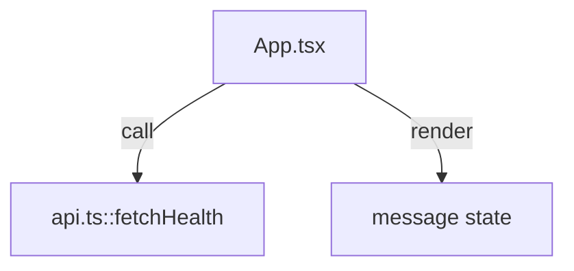

# apps/web/src

`apps/web/src` は React 画面の最小実装を保持し、`main.tsx` で起動、`App.tsx` で操作、`api.ts` で通信境界を提供する。

- パス: `apps/web/src/README.md`
- 状態: Implemented
- 種別（Profile）: src-module
- 関連:
  - See: `../README.md`
- 注意:
  - diary編集UIは未実装。

<details><summary>目次</summary>

- [役割](#役割)
- [スコープ](#スコープ)
- [ローカル開発](#ローカル開発)
- [ディレクトリ構成](#ディレクトリ構成)
- [公開インタフェース](#公開インタフェース)
- [契約と検証](#契約と検証)
- [設計ノート](#設計ノート)
- [品質](#品質)
- [内部](#内部)

</details>

## 役割

- UI root + API client の実装。

<details><summary>根拠（Evidence）</summary>

- [E1] `apps/web/src/main.tsx:11`
- [E2] `apps/web/src/App.tsx:9`
- [E3] `apps/web/src/api.ts:7`
</details>

## スコープ

- 対象（In scope）:
  - health確認UI
- 対象外（Non-goals）:
  - diary編集
- 委譲（See）:
  - See: `../README.md`
- 互換性:
  - N/A
- 依存方向:
  - 許可:
    - src内 import
  - 禁止:
    - api source import

<details><summary>根拠（Evidence）</summary>

- [E1] `apps/web/src/App.tsx:2`
</details>

## ローカル開発

- 依存インストール: `make install`
- 環境変数: `../.env.example`
- 起動: `make dev-web`
- 確認: browser rendering

<details><summary>根拠（Evidence）</summary>

- [E1] `apps/web/package.json:6`
</details>

## ディレクトリ構成

```text
.
└── apps/web/src/
    ├── main.tsx                 # bootstrap
    ├── App.tsx                  # view
    ├── api.ts                   # fetch client
    └── README.md                # この文書
```

## 公開インタフェース

### 提供するもの / 提供しないもの

- 提供:
  - `App`, `fetchHealth`
- 非提供:
  - shared UI primitives

### エントリポイント / エクスポート（SSOT）

| 公開シンボル  | 種別      | 定義元    | 目的           | 根拠                     |
| ------------- | --------- | --------- | -------------- | ------------------------ |
| `App`         | component | `App.tsx` | UI root        | `apps/web/src/App.tsx:6` |
| `fetchHealth` | function  | `api.ts`  | API health取得 | `apps/web/src/api.ts:7`  |

### 使い方（必須）

```ts
import { App } from "./App";
```

### 依存ルール

- 許可する import:
  - `react`, `./api`
- 禁止する import:
  - `apps/api/src/*`

<details><summary>根拠（Evidence）</summary>

- [E1] `apps/web/src/App.tsx:1`
- [E2] `apps/web/src/App.tsx:2`
</details>

## 契約と検証

### 契約 SSOT

- `HealthResponse`

### 検証入口（CI / ローカル）

- [E1] `bun --cwd apps/web run typecheck`
- [E2] `bun --cwd apps/web run build`

### テスト（根拠として使う場合）

| テストファイル | コマンド                       | 検証内容   | 主要 assertion | 根拠                      |
| -------------- | ------------------------------ | ---------- | -------------- | ------------------------- |
| N/A            | `bun --cwd apps/web run build` | bundle成立 | build success  | `apps/web/package.json:8` |

<details><summary>根拠（Evidence）</summary>

- [E1] `apps/web/src/api.ts:1`
</details>

## 設計ノート

- データ形状:
  - `HealthResponse`
- 失敗セマンティクス:
  - fetch error message
- メインフロー:
  - click -> fetch -> state。
- I/O 境界:
  - `fetch`
- トレードオフ:
  - 簡素化。



<details><summary>根拠（Evidence）</summary>

- [E1] `apps/web/src/App.tsx:11`
- [E2] `apps/web/src/App.tsx:12`
</details>

## 品質

- テスト戦略:
  - build/typecheck。
- 主なリスクと対策（3〜7）:

| リスク       | 対策（検証入口） | 根拠                      |
| ------------ | ---------------- | ------------------------- |
| 通信失敗時UX | error表示        | `apps/web/src/App.tsx:15` |

<details><summary>根拠（Evidence）</summary>

- [E1] `apps/web/src/App.tsx:15`
</details>

## 内部

<details><summary>品質（関数型プログラミング観点） / OPEN / ISSUE / SUMMARY</summary>

### 品質（関数型プログラミング観点）

| 項目         | 判定 | 理由                   | 根拠                    |
| ------------ | ---- | ---------------------- | ----------------------- |
| 副作用の隔離 | YES  | 通信を `api.ts` に分離 | `apps/web/src/api.ts:7` |

### [OPEN]

- [OPEN][TODO] diary UI 実装
  - 背景: health check のみ
  - 現状: 画面不足
  - 受入条件:
    - 編集/確定UI追加
  - 根拠:
    - `apps/web/src/App.tsx:22`

### [ISSUE]

- なし。

### [SUMMARY]

- src は最小の接続確認UI。

</details>
