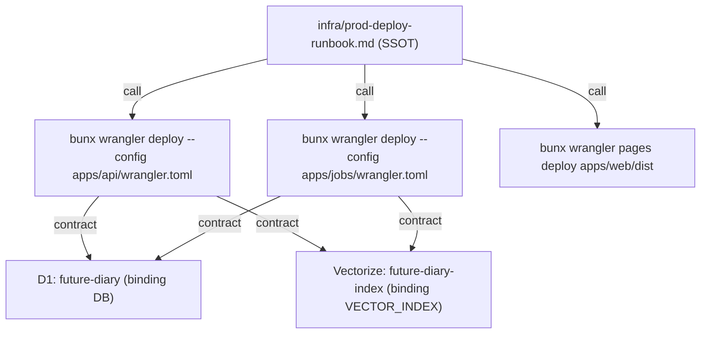

# infra

`infra/` は Cloudflare（Workers/Pages/D1/Vectorize）向けの運用ドキュメントを保持し、MVP の本番構築とデプロイ手順の SSOT を `infra/prod-deploy-runbook.md` に集約する。実際の `wrangler.toml` は `apps/api/wrangler.toml` と `apps/jobs/wrangler.toml` を参照する。

- パス: `infra/README.md`
- 状態: Implemented
- 種別（Profile）: config
- 関連:
  - See: `infra/prod-deploy-runbook.md`
  - See: `apps/api/wrangler.toml`
  - See: `apps/jobs/wrangler.toml`

<details>
<summary>目次</summary>

- [役割](#役割)
- [スコープ](#スコープ)
- [ローカル開発](#ローカル開発)
- [ディレクトリ構成](#ディレクトリ構成)
- [公開インタフェース](#公開インタフェース)
- [契約と検証](#契約と検証)
- [設計ノート](#設計ノート)
- [品質](#品質)
- [内部](#内部)

</details>

## 役割

- 本番相当（MVP）の構築・デプロイ・smoke check の手順を SSOT 化する。

<details><summary>根拠（Evidence）</summary>

- [E1] `infra/prod-deploy-runbook.md:1` — 本番構築とデプロイ手順。
</details>

## スコープ

- 対象（In scope）:
  - Cloudflare resources（Workers/Pages/D1/Vectorize）の構築手順
  - Secrets/環境変数の管理手順
  - デプロイ後の smoke check 手順
- 対象外（Non-goals）:
  - Terraform 等による完全自動化
  - Secrets のリポジトリ内保管
- 委譲（See）:
  - See: `infra/prod-deploy-runbook.md`
  - See: `apps/api/wrangler.toml`
  - See: `apps/jobs/wrangler.toml`
- 互換性:
  - N/A（運用手順は最新を SSOT とする）
- 依存方向:
  - 許可:
    - infra docs -> apps config 参照
  - 禁止:
    - infra docs に app 実装の重複仕様を持ち込む

<details><summary>根拠（Evidence）</summary>

- [E1] `apps/api/wrangler.toml:1` — API Worker の config。
- [E2] `apps/jobs/wrangler.toml:1` — Jobs Worker の config。
</details>

## ローカル開発

- N/A（ドキュメントのみ）。

<details><summary>根拠（Evidence）</summary>

- [E1] `infra/README.md:1`
</details>

## ディレクトリ構成

```text
.
└── infra/
    ├── wrangler/                # 予約（将来: env別 config を分離する場合）
    ├── prod-deploy-runbook.md   # 本番構築/デプロイ runbook（SSOT）
    └── README.md                # この文書
```

## 公開インタフェース

### 提供するもの / 提供しないもの

- 提供:
  - 本番構築/デプロイの手順（runbook）
- 非提供:
  - 自動プロビジョニング

### エントリポイント / エクスポート（SSOT）

| 公開シンボル | 種別     | 定義元                      | 目的            | 根拠                      |
| ------------ | -------- | --------------------------- | --------------- | ------------------------- |
| Runbook      | doc      | `infra/prod-deploy-runbook.md` | 本番手順のSSOT | `infra/prod-deploy-runbook.md:1` |

### 使い方（必須）

See: `infra/prod-deploy-runbook.md`

<details><summary>根拠（Evidence）</summary>

- [E1] `infra/prod-deploy-runbook.md:1`
</details>

## 契約と検証

- 検証入口（CI / ローカル）:
  - [E1] `make ci` — lint/test/typecheck/build の統合実行。
- 手順検証:
  - runbook の smoke check をデプロイ直後に実施する。

<details><summary>根拠（Evidence）</summary>

- [E1] `Makefile:51` — `ci` target。
- [E2] `infra/prod-deploy-runbook.md:142` — smoke check 手順。
</details>

## 設計ノート



<details><summary>根拠（Evidence）</summary>

- [E1] `infra/prod-deploy-runbook.md:118` — API/Jobs/Web deploy コマンド。
- [E2] `apps/api/wrangler.toml:1` — API Worker 名と binding。
- [E3] `apps/jobs/wrangler.toml:1` — Jobs Worker 名と binding。
</details>

## 品質

| リスク         | 対策（検証入口）           | 根拠                         |
| -------------- | -------------------------- | ---------------------------- |
| 手順と実装の乖離 | runbook で参照する SSOT を config/route に寄せ、smoke check を必須化 | `infra/prod-deploy-runbook.md:142` |

<details><summary>根拠（Evidence）</summary>

- [E1] `infra/prod-deploy-runbook.md:142`
</details>

## 内部

<details>
<summary>品質（関数型プログラミング観点） / OPEN / ISSUE / SUMMARY</summary>

### 品質（関数型プログラミング観点）

| 項目         | 判定 | 理由                       | 根拠                  |
| ------------ | ---- | -------------------------- | --------------------- |
| 副作用の隔離 | YES  | 手順は `wrangler` 実行へ局所化 | `infra/prod-deploy-runbook.md:1` |

### [OPEN]

- [OPEN] IaC（Terraform）でのプロビジョニング自動化

### [ISSUE]

- なし。

### [SUMMARY]

- `infra/` は runbook を SSOT とし、実 config は `apps/*/wrangler.toml` に委譲する。

</details>
