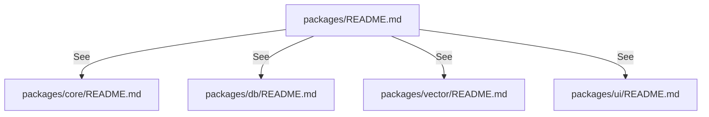

# packages

`packages/` は機能横断で再利用するモジュール層を保持し、`core/db/vector/ui` を分離してアプリ層から利用する。

- パス: `packages/README.md`
- 状態: Implemented
- 種別（Profile）: package-root
- 関連:
  - See: `packages/core/README.md`
  - See: `packages/db/README.md`
  - See: `packages/vector/README.md`
  - See: `packages/ui/README.md`
- 注意:
  - 親 README は導線のみ。

<details>
<summary>目次</summary>

- [役割](#役割)
- [スコープ](#スコープ)
- [ローカル開発](#ローカル開発)
- [ディレクトリ構成](#ディレクトリ構成)
- [公開インタフェース](#公開インタフェース)
- [契約と検証](#契約と検証)
- [設計ノート](#設計ノート)
- [品質](#品質)
- [内部](#内部)

</details>

## 役割

- 再利用モジュールへの導線を提供する。

<details><summary>根拠（Evidence）</summary>

- [E1] `docs/project-structure.md:45` — `packages/` 配下。
</details>

## スコープ

- 対象（In scope）:
  - 子モジュール一覧
- 対象外（Non-goals）:
  - 個別モジュール実装詳細
- 委譲（See）:
  - See: `packages/core/README.md`
  - See: `packages/db/README.md`
  - See: `packages/vector/README.md`
  - See: `packages/ui/README.md`
- 互換性:
  - N/A
- 依存方向:
  - 許可:
    - apps -> packages
  - 禁止:
    - 親 README に詳細実装重複

<details><summary>根拠（Evidence）</summary>

- [E1] `tsconfig.base.json:8` — workspace alias。
</details>

## ローカル開発

- 依存インストール: `make install`
- 環境変数: N/A
- 起動: N/A
- 確認: `make ci`

<details><summary>根拠（Evidence）</summary>

- [E1] `Makefile:23`
- [E2] `Makefile:59`
</details>

## ディレクトリ構成

```text
.
└── packages/                    # 共有モジュールの親
    ├── core/                    # ドメインロジック / See: core/README.md
    ├── db/                      # D1境界 / See: db/README.md
    ├── vector/                  # Vectorize境界 / See: vector/README.md
    ├── ui/                      # UIヘルパー / See: ui/README.md
    └── README.md                # この文書
```

## 公開インタフェース

### 提供するもの / 提供しないもの

- 提供:
  - 子モジュール導線
- 非提供:
  - runtime entrypoint

### エントリポイント / エクスポート（SSOT）

| 公開シンボル | 種別 | 定義元 | 目的     | 根拠                   |
| ------------ | ---- | ------ | -------- | ---------------------- |
| N/A          | N/A  | N/A    | 導線のみ | `packages/README.md:1` |

### 使い方（必須）

```bash
make ci
```

### 依存ルール

- 許可する import:
  - apps から `@future-diary/*`
- 禁止する import:
  - apps 間の直接 import

<details><summary>根拠（Evidence）</summary>

- [E1] `tsconfig.base.json:9` — `@future-diary/core`
- [E2] `tsconfig.base.json:10` — `@future-diary/db`
- [E3] `tsconfig.base.json:11` — `@future-diary/vector`
- [E4] `tsconfig.base.json:12` — `@future-diary/ui`
</details>

## 契約と検証

### 契約 SSOT

- 子モジュール README。

### 検証入口（CI / ローカル）

- [E1] `make ci`

### テスト（根拠として使う場合）

| テストファイル                          | コマンド    | 検証内容     | 主要 assertion | 根拠                                      |
| --------------------------------------- | ----------- | ------------ | -------------- | ----------------------------------------- |
| `packages/core/src/futureDiary.test.ts` | `make test` | core usecase | Result shape   | `packages/core/src/futureDiary.test.ts:4` |

<details><summary>根拠（Evidence）</summary>

- [E1] `packages/core/src/futureDiary.test.ts:4`
</details>

## 設計ノート

- データ形状:
  - N/A（親は導線のみ）
- 失敗セマンティクス:
  - N/A
- メインフロー:
  - See child README。
- I/O 境界:
  - N/A
- トレードオフ:
  - 詳細を子へ委譲して重複削減。



<details><summary>根拠（Evidence）</summary>

- [E1] `docs/project-structure.md:47`
- [E2] `docs/project-structure.md:57`
- [E3] `docs/project-structure.md:67`
- [E4] `docs/project-structure.md:75`
</details>

## 品質

- テスト戦略:
  - 親は子モジュールの品質ゲート結果を参照。
- 主なリスクと対策（3〜7）:

| リスク   | 対策（検証入口）   | 根拠                   |
| -------- | ------------------ | ---------------------- |
| 情報重複 | 子 README に一本化 | `packages/README.md:8` |

<details><summary>根拠（Evidence）</summary>

- [E1] `packages/README.md:8`
</details>

## 内部

<details>
<summary>品質（関数型プログラミング観点） / OPEN / ISSUE / SUMMARY</summary>

### 品質（関数型プログラミング観点）

| 項目       | 判定 | 理由                 | 根拠                   |
| ---------- | ---- | -------------------- | ---------------------- |
| 参照透過性 | N/A  | ドキュメント         | `packages/README.md:1` |
| 契約指向   | YES  | 子 README へ責務分離 | `packages/README.md:8` |

### [OPEN]

- [OPEN][TODO] 子 README の実装追従
  - 背景: 変更時の同期が必要
  - 現状: 初期版
  - 受入条件:
    - 実装更新と同時に README 更新
  - 根拠:
    - `AGENTS.md:164`

### [ISSUE]

- なし。

### [SUMMARY]

- `packages/` は導線に限定。

</details>
