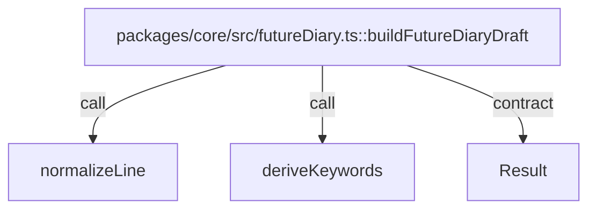

# packages/core

`packages/core/src/futureDiary.ts` は未来日記ドラフト生成の純粋関数を提供し、入力データから `Result<FutureDiaryDraft, GenerateFutureDiaryError>` を返す。`packages/core/src/futureDiaryLlm.ts` は外部LLM向けのプロンプト組み立て（pure）と structured output 用 JSON schema を提供する。I/O や外部依存を持たず functional core を維持する。

- パス: `packages/core/README.md`
- 状態: Implemented
- 種別（Profile）: src-module
- 関連:
  - See: `packages/db/README.md`
  - See: `packages/vector/README.md`
- 注意:
  - 副作用は導入していない。

<details>
<summary>目次</summary>

- [役割](#役割)
- [スコープ](#スコープ)
- [ローカル開発](#ローカル開発)
- [ディレクトリ構成](#ディレクトリ構成)
- [公開インタフェース](#公開インタフェース)
- [契約と検証](#契約と検証)
- [設計ノート](#設計ノート)
- [品質](#品質)
- [内部](#内部)

</details>

## 役割

- ドメイン型（`types.ts`）を定義する。
- ドラフト生成usecase（`buildFutureDiaryDraft`）を提供する。
- 外部LLM向け prompt と schema（`buildFutureDiaryDraftLlm*`, `futureDiaryDraftBodyJsonSchema`）を提供する。
- ユーザーモデル（style/intent/preferences）のデフォルトと parse/serialize（pure）を提供する。
- 期待失敗を `Result` の `ok=false` で返す。

<details><summary>根拠（Evidence）</summary>

- [E1] `packages/core/src/types.ts:5` — `Result` 型。
- [E2] `packages/core/src/futureDiary.ts:98` — usecase 定義。
- [E3] `packages/core/src/futureDiary.ts:105` — invalid style error。
- [E4] `packages/core/src/futureDiary.ts:120` — no source error。
- [E5] `packages/core/src/futureDiaryLlm.ts:20` — system prompt。
- [E6] `packages/core/src/futureDiaryLlm.ts:35` — user prompt。
- [E7] `packages/core/src/futureDiaryLlm.ts:7` — structured output schema。
- [E8] `packages/core/src/userModel.ts:22` — `defaultUserModel`。
- [E9] `packages/core/src/userModel.ts:164` — `parseUserModelJson`。

- Edge Evidence Map（各エッジは “call + def” の 2 点セット）:
  - `buildFutureDiaryDraft` -> `deriveKeywords`:
    - call: `packages/core/src/futureDiary.ts:134`
    - def: `packages/core/src/futureDiary.ts:81`

</details>

## スコープ

- 対象（In scope）:
  - diary domain types
  - draft generation
- 対象外（Non-goals）:
  - DB アクセス
  - HTTP レスポンス構築
- 委譲（See）:
  - See: `packages/db/README.md`
  - See: `apps/api/README.md`
- 互換性:
  - 既定で複雑な後方互換は維持しない
- 依存方向:
  - 許可:
    - pure function 同士
  - 禁止:
    - I/O API への直接依存

<details><summary>根拠（Evidence）</summary>

- [E1] `packages/core/src/futureDiary.ts:1` — types import only。
- [E2] `packages/core/src/futureDiary.ts:144` — data return。
</details>

## ローカル開発

- 依存インストール: `make install`
- 環境変数: N/A
- 起動: N/A
- 確認: `bun --cwd packages/core run test`

<details><summary>根拠（Evidence）</summary>

- [E1] `packages/core/package.json:9` — test script。
- [E2] `packages/core/package.json:7` — typecheck script。
</details>

## ディレクトリ構成

```text
.
└── packages/core/
    ├── src/                     # 実装とテスト / See: src/README.md
    └── README.md                # この文書
```

## 公開インタフェース

### 提供するもの / 提供しないもの

- 提供:
  - `buildFutureDiaryDraft`
  - `buildFallbackFutureDiaryDraft`
  - `buildFutureDiaryDraftLlmSystemPrompt`
  - `buildFutureDiaryDraftLlmUserPrompt`
  - `futureDiaryDraftBodyJsonSchema`
  - `defaultUserModel`
  - `parseUserModelJson`
  - `parseUserModelInput`
  - `serializeUserModelJson`
  - domain type definitions
- 非提供:
  - persistence/networking

### エントリポイント / エクスポート（SSOT）

| 公開シンボル            | 種別      | 定義元               | 目的        | 根拠                                  |
| ----------------------- | --------- | -------------------- | ----------- | ------------------------------------- |
| `buildFutureDiaryDraft` | function  | `src/futureDiary.ts` | draft生成   | `packages/core/src/futureDiary.ts:98` |
| `buildFallbackFutureDiaryDraft` | function | `src/futureDiary.ts` | source無しのfallback | `packages/core/src/futureDiary.ts:153` |
| `buildFutureDiaryDraftLlmSystemPrompt` | function | `src/futureDiaryLlm.ts` | LLM system prompt | `packages/core/src/futureDiaryLlm.ts:20` |
| `buildFutureDiaryDraftLlmUserPrompt` | function | `src/futureDiaryLlm.ts` | LLM user prompt | `packages/core/src/futureDiaryLlm.ts:35` |
| `futureDiaryDraftBodyJsonSchema` | const | `src/futureDiaryLlm.ts` | structured output schema | `packages/core/src/futureDiaryLlm.ts:7` |
| `defaultUserModel`      | const     | `src/userModel.ts`   | user model default | `packages/core/src/userModel.ts:22` |
| `parseUserModelJson`    | function  | `src/userModel.ts`   | preferences_json parse | `packages/core/src/userModel.ts:164` |
| `DraftGenerationStatus` | type      | `src/types.ts`       | 生成状態    | `packages/core/src/types.ts:3`        |
| `Result`                | type      | `src/types.ts`       | 失敗表現    | `packages/core/src/types.ts:5`        |
| `DiaryEntry`            | interface | `src/types.ts`       | diaryモデル | `packages/core/src/types.ts:43`       |

### 使い方（必須）

```ts
import { buildFutureDiaryDraft } from "@future-diary/core";

const result = buildFutureDiaryDraft({
  date: "2026-02-07",
  userTimezone: "Asia/Tokyo",
  draftIntent: "落ち着いて始める",
  preferences: { avoidCopyingFromFragments: true },
  recentFragments: [{ id: "f1", date: "2026-02-06", relevance: 0.9, text: "朝に散歩した。" }],
  styleHints: { openingPhrases: [], closingPhrases: [], maxParagraphs: 2 },
});
```

### 依存ルール

- 許可する import:
  - `./types`
- 禁止する import:
  - DB/HTTP ライブラリ

<details><summary>根拠（Evidence）</summary>

- [E1] `packages/core/src/index.ts:1`
- [E2] `packages/core/src/index.ts:2`
- [E3] `packages/core/src/futureDiary.ts:1`
</details>

## 契約と検証

### 契約 SSOT

- `GenerateFutureDiaryInput`
- `FutureDiaryDraft`
- `GenerateFutureDiaryError`

### 検証入口（CI / ローカル）

- [E1] `bun --cwd packages/core run test`
- [E2] `bun --cwd packages/core run typecheck`

### テスト（根拠として使う場合）

| テストファイル                          | コマンド                           | 検証内容           | 主要 assertion               | 根拠                                       |
| --------------------------------------- | ---------------------------------- | ------------------ | ---------------------------- | ------------------------------------------ |
| `packages/core/src/futureDiary.test.ts` | `bun --cwd packages/core run test` | success/error 分岐 | sourceFragmentIds, NO_SOURCE | `packages/core/src/futureDiary.test.ts:24` |

<details><summary>根拠（Evidence）</summary>

- [E1] `packages/core/src/futureDiary.test.ts:5`
- [E2] `packages/core/src/futureDiary.test.ts:28`
</details>

## 設計ノート

- データ形状:
  - input: `GenerateFutureDiaryInput`
  - output: `Result<FutureDiaryDraft, GenerateFutureDiaryError>`
- 失敗セマンティクス:
  - `INVALID_STYLE_HINTS`, `NO_SOURCE`
- メインフロー:
  - validate -> rank fragments -> assemble paragraphs -> return。
- I/O 境界:
  - なし（pure）。
- トレードオフ:
  - 生成精度より deterministic な下書き生成を優先。



<details><summary>根拠（Evidence）</summary>

- [E1] `packages/core/src/futureDiary.ts:10`
- [E2] `packages/core/src/futureDiary.ts:81`
- [E3] `packages/core/src/futureDiary.ts:98`
</details>

## 品質

- テスト戦略:
  - usecase単体テストで成功/失敗を検証。
- 主なリスクと対策（3〜7）:

| リスク           | 対策（検証入口）             | 根拠                                  |
| ---------------- | ---------------------------- | ------------------------------------- |
| 空入力で壊れる   | `NO_SOURCE` を返す           | `packages/core/src/futureDiary.ts:120` |
| styleHints誤設定 | `INVALID_STYLE_HINTS` を返す | `packages/core/src/futureDiary.ts:105` |
| 非決定的出力     | sort + slice で決定化        | `packages/core/src/futureDiary.ts:113` |

<details><summary>根拠（Evidence）</summary>

- [E1] `packages/core/src/futureDiary.ts:120`
- [E2] `packages/core/src/futureDiary.test.ts:30`
</details>

## 内部

<details>
<summary>品質（関数型プログラミング観点） / OPEN / ISSUE / SUMMARY</summary>

### 品質（関数型プログラミング観点）

| 項目       | 判定 | 理由                     | 根拠                                  |
| ---------- | ---- | ------------------------ | ------------------------------------- |
| 参照透過性 | YES  | 同一入力で同一出力       | `packages/core/src/futureDiary.ts:98` |
| 純粋性     | YES  | 外部I/Oなし              | `packages/core/src/futureDiary.ts:1`  |
| 不変性     | YES  | `[...]` でコピーして操作 | `packages/core/src/futureDiary.ts:83` |
| 例外より型 | YES  | `Result` で失敗を表現    | `packages/core/src/types.ts:5`        |
| 決定性     | YES  | relevance順にソート      | `packages/core/src/futureDiary.ts:113` |

### [OPEN]

- [OPEN][TODO] 生成アルゴリズム（要約化の抑制）: 過去断片の再掲に寄り過ぎないように、style/intent/preferences model 主導で日次の下書きを生成する
  - 背景: 下書きが「過去日記の要約/焼き直し」に寄ると、ユーザが期待する「その日の入口」にならない。
  - 現状: user model（intent/styleHints）+ 過去断片のキーワード抽出 + placeholder scaffold を組み立てる。
  - 受入条件:
    - style/intent/preferences model を入力として生成できる（モデルはユーザが確認/編集可能）。
    - 過去断片の用途を style 用/内容用に分離し、内容断片は “引用” ではなく “発想の補助” として扱う（要約/再掲を抑制）。
    - 評価用データ/確認手順を用意し、回帰を検知できる。
  - 根拠:
    - `packages/core/src/userModel.ts:22`
    - `packages/core/src/futureDiary.ts:81`
    - `packages/core/src/futureDiaryLlm.ts:20`

### [ISSUE]

- なし。

### [SUMMARY]

- core は副作用ゼロで usecase と型契約を提供する。

</details>
