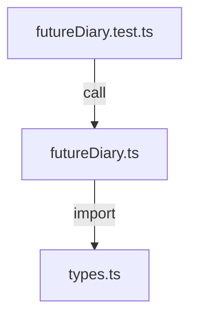

# packages/core/src

`packages/core/src` は domain types と未来日記生成 usecase の実装本体を保持する。

- パス: `packages/core/src/README.md`
- 状態: Implemented
- 種別（Profile）: src-module
- 関連:
  - See: `../README.md`
- 注意:
  - 副作用を持たない実装に限定。

<details><summary>目次</summary>

- [役割](#役割)
- [スコープ](#スコープ)
- [ローカル開発](#ローカル開発)
- [ディレクトリ構成](#ディレクトリ構成)
- [公開インタフェース](#公開インタフェース)
- [契約と検証](#契約と検証)
- [設計ノート](#設計ノート)
- [品質](#品質)
- [内部](#内部)

</details>

## 役割

- core の純粋関数と型定義を集約。

<details><summary>根拠（Evidence）</summary>

- [E1] `packages/core/src/futureDiary.ts:19`
- [E2] `packages/core/src/types.ts:1`
</details>

## スコープ

- 対象（In scope）:
  - `futureDiary.ts`, `types.ts`, `index.ts`
- 対象外（Non-goals）:
  - DB/HTTP
- 委譲（See）:
  - See: `../README.md`
- 互換性:
  - N/A
- 依存方向:
  - 許可:
    - local types
  - 禁止:
    - infrastructure imports

<details><summary>根拠（Evidence）</summary>

- [E1] `packages/core/src/futureDiary.ts:1`
</details>

## ローカル開発

- 依存インストール: `make install`
- 環境変数: N/A
- 起動: N/A
- 確認: `bun --cwd packages/core run test`

<details><summary>根拠（Evidence）</summary>

- [E1] `packages/core/package.json:9`
</details>

## ディレクトリ構成

```text
.
└── packages/core/src/
    ├── types.ts                 # domain type contracts
    ├── futureDiary.ts           # usecase implementation
    ├── futureDiary.test.ts      # usecase tests
    ├── index.ts                 # exports
    └── README.md                # この文書
```

## 公開インタフェース

### 提供するもの / 提供しないもの

- 提供:
  - `buildFutureDiaryDraft`
  - `Result` など型
- 非提供:
  - IO API

### エントリポイント / エクスポート（SSOT）

| 公開シンボル            | 種別     | 定義元           | 目的      | 根拠                                  |
| ----------------------- | -------- | ---------------- | --------- | ------------------------------------- |
| `buildFutureDiaryDraft` | function | `futureDiary.ts` | draft生成 | `packages/core/src/futureDiary.ts:19` |

### 使い方（必須）

```ts
import { buildFutureDiaryDraft } from "./futureDiary";
```

### 依存ルール

- 許可する import:
  - `./types`
- 禁止する import:
  - external runtime dependency

<details><summary>根拠（Evidence）</summary>

- [E1] `packages/core/src/futureDiary.ts:7`
</details>

## 契約と検証

### 契約 SSOT

- `types.ts`

### 検証入口（CI / ローカル）

- [E1] `bun --cwd packages/core run test`

### テスト（根拠として使う場合）

| テストファイル        | コマンド                           | 検証内容      | 主要 assertion  | 根拠                                       |
| --------------------- | ---------------------------------- | ------------- | --------------- | ------------------------------------------ |
| `futureDiary.test.ts` | `bun --cwd packages/core run test` | success/error | expected result | `packages/core/src/futureDiary.test.ts:40` |

<details><summary>根拠（Evidence）</summary>

- [E1] `packages/core/src/futureDiary.test.ts:5`
</details>

## 設計ノート

- データ形状:
  - input -> result
- 失敗セマンティクス:
  - Result union
- メインフロー:
  - validate/sort/compose。
- I/O 境界:
  - なし
- トレードオフ:
  - 単純実装。



<details><summary>根拠（Evidence）</summary>

- [E1] `packages/core/src/futureDiary.ts:1`
- [E2] `packages/core/src/futureDiary.test.ts:2`
</details>

## 品質

- テスト戦略:
  - unit test。
- 主なリスクと対策（3〜7）:

| リスク         | 対策（検証入口） | 根拠                                       |
| -------------- | ---------------- | ------------------------------------------ |
| エラー分岐漏れ | error test 追加  | `packages/core/src/futureDiary.test.ts:28` |

<details><summary>根拠（Evidence）</summary>

- [E1] `packages/core/src/futureDiary.test.ts:28`
</details>

## 内部

<details><summary>品質（関数型プログラミング観点） / OPEN / ISSUE / SUMMARY</summary>

### 品質（関数型プログラミング観点）

| 項目   | 判定 | 理由              | 根拠                                  |
| ------ | ---- | ----------------- | ------------------------------------- |
| 純粋性 | YES  | external I/O なし | `packages/core/src/futureDiary.ts:19` |

### [OPEN]

- [OPEN][TODO] algorithm拡張
  - 背景: 現在は単純整形
  - 現状: paragraph変換のみ
  - 受入条件:
    - style features追加
  - 根拠:
    - `packages/core/src/futureDiary.ts:11`

### [ISSUE]

- なし。

### [SUMMARY]

- src は pure な domain/usecase を提供。

</details>
