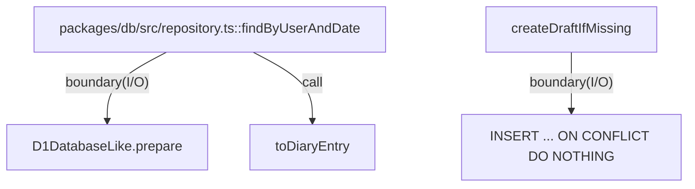

# packages/db

`packages/db/src/repository.ts` は D1 境界として `DiaryRepository` / `UserRepository` を提供し、`packages/core::DiaryEntry` への変換と user/draft の read/write クエリを担当する。スキーマ契約は `src/migrations/0001_initial.sql` と `src/schema.ts` が SSOT。

- パス: `packages/db/README.md`
- 状態: Implemented
- 種別（Profile）: contract
- 関連:
  - See: `packages/core/README.md`
- 注意:
  - 現在は D1 の最小抽象のみ。

<details>
<summary>目次</summary>

- [役割](#役割)
- [スコープ](#スコープ)
- [ローカル開発](#ローカル開発)
- [ディレクトリ構成](#ディレクトリ構成)
- [公開インタフェース](#公開インタフェース)
- [契約と検証](#契約と検証)
- [設計ノート](#設計ノート)
- [品質](#品質)
- [内部](#内部)

</details>

## 役割

- D1 row <-> domain entry の変換を行う。
- `findByUserAndDate` / `listRecentByUserBeforeDate` / `listRecentByUserOnOrBeforeDate` を提供する。
- `createDraftIfMissing` / `updateFinalText` / `confirmEntry` を提供する。
- `upsertUser` を提供する（`diary_entries.user_id` の FK を満たすため）。
- migration SQL で `users` / `diary_entries` を定義する。

<details><summary>根拠（Evidence）</summary>

- [E1] `packages/db/src/repository.ts:15` — `toDiaryEntry`。
- [E2] `packages/db/src/repository.ts:26` — `DiaryRepository` interface。
- [E3] `packages/db/src/repository.ts:73` — `createDraftIfMissing`。
- [E4] `packages/db/src/repository.ts:86` — `updateFinalText`。
- [E5] `packages/db/src/repository.ts:100` — `confirmEntry`。
- [E6] `packages/db/src/repository.ts:131` — `upsertUser`（`createUserRepository`）。
- [E7] `packages/db/src/migrations/0001_initial.sql:9` — `diary_entries` table。
- [E8] `packages/db/src/repository.ts:44` — `toDiaryEntry` call。

- Edge Evidence Map（各エッジは “call + def” の 2 点セット）:
  - `findByUserAndDate` -> `toDiaryEntry`:
    - call: [E8] `packages/db/src/repository.ts:44`
    - def: [E1] `packages/db/src/repository.ts:15`

</details>

## スコープ

- 対象（In scope）:
  - D1 query 実行
  - schema/migration 管理
- 対象外（Non-goals）:
  - API route 実装
  - transaction orchestration
- 委譲（See）:
  - See: `apps/api/README.md`
- 互換性:
  - migration で明示的に管理
- 依存方向:
  - 許可:
    - db -> core types
  - 禁止:
    - db -> app code

<details><summary>根拠（Evidence）</summary>

- [E1] `packages/db/src/repository.ts:1`
- [E2] `packages/db/package.json:9`
</details>

## ローカル開発

- 依存インストール: `make install`
- 環境変数: `wrangler` の local D1 設定
- 起動: N/A
- 確認: `make db-migrate`, `make db-migrate-remote`

<details><summary>根拠（Evidence）</summary>

- [E1] `packages/db/package.json:9`
- [E2] `packages/db/package.json:10`
- [E3] `Makefile:30`
</details>

## ディレクトリ構成

```text
.
└── packages/db/
    ├── src/                             # DB実装 / See: src/README.md
    └── README.md                        # この文書
```

## 公開インタフェース

### 提供するもの / 提供しないもの

- 提供:
  - `createDiaryRepository`
  - `createUserRepository`
  - `DiaryRow` / `UserRow`
- 非提供:
  - DB connection lifecycle

### エントリポイント / エクスポート（SSOT）

| 公開シンボル            | 種別      | 定義元              | 目的              | 根拠                                            |
| ----------------------- | --------- | ------------------- | ----------------- | ----------------------------------------------- |
| `createDiaryRepository` | function  | `src/repository.ts` | D1 repository生成 | `packages/db/src/repository.ts:35`              |
| `createUserRepository`  | function  | `src/repository.ts` | D1 user upsert    | `packages/db/src/repository.ts:130`              |
| `DiaryRow`              | interface | `src/schema.ts`     | row契約           | `packages/db/src/schema.ts:4`                   |
| `0001_initial.sql`      | migration | `src/migrations`    | schema初期化      | `packages/db/src/migrations/0001_initial.sql:1` |

### 使い方（必須）

```ts
import { createDiaryRepository, createUserRepository } from "@future-diary/db";

const userRepo = createUserRepository(db);
await userRepo.upsertUser({ id: "u1", timezone: "Asia/Tokyo" });

const diaryRepo = createDiaryRepository(db);
const entry = await diaryRepo.findByUserAndDate("u1", "2026-02-07");
```

### 依存ルール

- 許可する import:
  - `@future-diary/core` の型
- 禁止する import:
  - `apps/*`

<details><summary>根拠（Evidence）</summary>

- [E1] `packages/db/src/repository.ts:1`
- [E2] `packages/db/src/repository.ts:2`
</details>

## 契約と検証

### 契約 SSOT

- `src/schema.ts`
- `src/migrations/0001_initial.sql`

### 検証入口（CI / ローカル）

- [E1] `bun --cwd packages/db run typecheck`
- [E2] `bun run --cwd packages/db migrate`
- [E3] `bun run --cwd packages/db migrate-remote`

### テスト（根拠として使う場合）

| テストファイル | コマンド                                   | 検証内容             | 主要 assertion   | 根拠                          |
| -------------- | ------------------------------------------ | -------------------- | ---------------- | ----------------------------- |
| N/A            | `bun run --cwd packages/db migrate-remote` | remote migration適用 | SQL syntax valid | `packages/db/package.json:10` |

<details><summary>根拠（Evidence）</summary>

- [E1] `packages/db/src/schema.ts:1`
- [E2] `packages/db/src/migrations/0001_initial.sql:13`
</details>

## 設計ノート

- データ形状:
  - `DiaryRow` と `DiaryEntry` の相互変換。
- 失敗セマンティクス:
  - DB層エラーは例外伝播（将来 Result 変換余地あり）。
- メインフロー:
  - prepare -> bind -> first/run。
- I/O 境界:
  - D1 statement execution。
- トレードオフ:
  - 最小抽象で D1 依存を局所化。



<details><summary>根拠（Evidence）</summary>

- [E1] `packages/db/src/repository.ts:38`
- [E2] `packages/db/src/repository.ts:44`
- [E3] `packages/db/src/repository.ts:73`
</details>

## 品質

- テスト戦略:
  - 型チェック + migration 実行検証。
- 主なリスクと対策（3〜7）:

| リスク           | 対策（検証入口）                 | 根拠                                             |
| ---------------- | -------------------------------- | ------------------------------------------------ |
| schema差異       | migrationをSSOT化                | `packages/db/src/migrations/0001_initial.sql:1`  |
| domain変換不整合 | `toDiaryEntry` 単一点変換        | `packages/db/src/repository.ts:15`               |
| 重複生成         | `UNIQUE(user_id, date)` + `createDraftIfMissing` | `packages/db/src/migrations/0001_initial.sql:19` |

<details><summary>根拠（Evidence）</summary>

- [E1] `packages/db/src/repository.ts:15`
- [E2] `packages/db/src/repository.ts:73`
- [E3] `packages/db/src/migrations/0001_initial.sql:19`
</details>

## 内部

<details>
<summary>品質（関数型プログラミング観点） / OPEN / ISSUE / SUMMARY</summary>

### 品質（関数型プログラミング観点）

| 項目               | 判定 | 理由                                  | 根拠                               |
| ------------------ | ---- | ------------------------------------- | ---------------------------------- |
| 副作用の隔離       | YES  | D1呼び出しを repository に限定        | `packages/db/src/repository.ts:35` |
| データと計算の分離 | YES  | `schema.ts` と `repository.ts` を分離 | `packages/db/src/schema.ts:1`      |
| 例外より型         | NO   | DB例外をそのまま伝播                  | `packages/db/src/repository.ts:36` |

### [OPEN]

- [OPEN][TODO] DB error の Result化
  - 背景: core 方針との整合。
  - 現状: exception pass-through。
  - 受入条件:
    - 境界で例外をドメインエラーへ変換。
  - 根拠:
    - `packages/db/src/repository.ts:36`

### [ISSUE]

- なし。

### [SUMMARY]

- DB境界は query と schema を局所化している。

</details>
