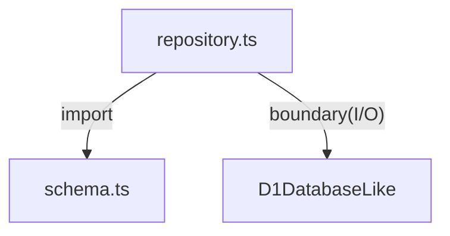

# packages/db/src

`packages/db/src` は D1 schema 契約と repository 実装を保持し、`core` 型との変換を担当する。

- パス: `packages/db/src/README.md`
- 状態: Implemented
- 種別（Profile）: contract
- 関連:
  - See: `../README.md`
  - See: `migrations/README.md`
- 注意:
  - migration は `migrations/` を正とする。

<details><summary>目次</summary>

- [役割](#役割)
- [スコープ](#スコープ)
- [ローカル開発](#ローカル開発)
- [ディレクトリ構成](#ディレクトリ構成)
- [公開インタフェース](#公開インタフェース)
- [契約と検証](#契約と検証)
- [設計ノート](#設計ノート)
- [品質](#品質)
- [内部](#内部)

</details>

## 役割

- row contract + repository。

<details><summary>根拠（Evidence）</summary>

- [E1] `packages/db/src/schema.ts:4`
- [E2] `packages/db/src/repository.ts:25`
</details>

## スコープ

- 対象（In scope）:
  - `schema.ts`, `repository.ts`, `index.ts`
- 対象外（Non-goals）:
  - wrangler 設定
- 委譲（See）:
  - See: `../README.md`
- 互換性:
  - migrationで管理
- 依存方向:
  - 許可:
    - db -> core type
  - 禁止:
    - db -> app

<details><summary>根拠（Evidence）</summary>

- [E1] `packages/db/src/repository.ts:1`
</details>

## ローカル開発

- 依存インストール: `make install`
- 環境変数: N/A
- 起動: N/A
- 確認: `make db-migrate`

<details><summary>根拠（Evidence）</summary>

- [E1] `packages/db/package.json:9`
</details>

## ディレクトリ構成

```text
.
└── packages/db/src/
    ├── schema.ts                # row contracts
    ├── repository.ts            # query boundary
    ├── migrations/              # schema SQL / See: migrations/README.md
    ├── index.ts                 # exports
    └── README.md                # この文書
```

## 公開インタフェース

### 提供するもの / 提供しないもの

- 提供:
  - `createDiaryRepository`
  - schema interfaces
- 非提供:
  - DB lifecycle

### エントリポイント / エクスポート（SSOT）

| 公開シンボル            | 種別     | 定義元          | 目的   | 根拠                               |
| ----------------------- | -------- | --------------- | ------ | ---------------------------------- |
| `createDiaryRepository` | function | `repository.ts` | D1操作 | `packages/db/src/repository.ts:30` |

### 使い方（必須）

```ts
import { createDiaryRepository } from "./repository";
```

### 依存ルール

- 許可する import:
  - core type
- 禁止する import:
  - external app source

<details><summary>根拠（Evidence）</summary>

- [E1] `packages/db/src/repository.ts:1`
</details>

## 契約と検証

### 契約 SSOT

- `schema.ts` + `migrations/*.sql`

### 検証入口（CI / ローカル）

- [E1] `bun --cwd packages/db run typecheck`

### テスト（根拠として使う場合）

| テストファイル | コマンド                            | 検証内容   | 主要 assertion | 根拠                         |
| -------------- | ----------------------------------- | ---------- | -------------- | ---------------------------- |
| N/A            | `bun --cwd packages/db run migrate` | schema適用 | SQL valid      | `packages/db/package.json:9` |

<details><summary>根拠（Evidence）</summary>

- [E1] `packages/db/src/schema.ts:1`
</details>

## 設計ノート

- データ形状:
  - Row/Domain mapping
- 失敗セマンティクス:
  - query exception passthrough
- メインフロー:
  - prepare/bind/first/run
- I/O 境界:
  - D1 statement
- トレードオフ:
  - シンプル境界。



<details><summary>根拠（Evidence）</summary>

- [E1] `packages/db/src/repository.ts:2`
- [E2] `packages/db/src/repository.ts:10`
</details>

## 品質

- テスト戦略:
  - typecheck + migration apply。
- 主なリスクと対策（3〜7）:

| リスク        | 対策（検証入口）          | 根拠                          |
| ------------- | ------------------------- | ----------------------------- |
| row契約不整合 | schema interface をSSOT化 | `packages/db/src/schema.ts:4` |

<details><summary>根拠（Evidence）</summary>

- [E1] `packages/db/src/schema.ts:4`
</details>

## 内部

<details><summary>品質（関数型プログラミング観点） / OPEN / ISSUE / SUMMARY</summary>

### 品質（関数型プログラミング観点）

| 項目         | 判定 | 理由             | 根拠                               |
| ------------ | ---- | ---------------- | ---------------------------------- |
| 副作用の隔離 | YES  | repositoryへ限定 | `packages/db/src/repository.ts:30` |

### [OPEN]

- [OPEN][TODO] error型変換
  - 背景: 現在は例外依存
  - 現状: passthrough
  - 受入条件:
    - Result変換
  - 根拠:
    - `packages/db/src/repository.ts:32`

### [ISSUE]

- なし。

### [SUMMARY]

- src は D1 境界と schema 契約を保持。

</details>
