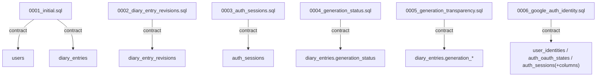

# packages/db/src/migrations

`packages/db/src/migrations` は D1 スキーマ変更の SQL 契約を管理する。

- パス: `packages/db/src/migrations/README.md`
- 状態: Implemented
- 種別（Profile）: contract
- 関連:
  - See: `../README.md`
- 注意:
  - migration は順序適用される前提。

<details><summary>目次</summary>

- [役割](#役割)
- [スコープ](#スコープ)
- [ローカル開発](#ローカル開発)
- [ディレクトリ構成](#ディレクトリ構成)
- [公開インタフェース](#公開インタフェース)
- [契約と検証](#契約と検証)
- [設計ノート](#設計ノート)
- [品質](#品質)
- [内部](#内部)

</details>

## 役割

- D1 スキーマ変更（テーブル/インデックス）の migration SQL を提供。

<details><summary>根拠（Evidence）</summary>

- [E1] `packages/db/src/migrations/0001_initial.sql:1`
- [E2] `packages/db/src/migrations/0002_diary_entry_revisions.sql:1`
- [E3] `packages/db/src/migrations/0003_auth_sessions.sql:1`
- [E4] `packages/db/src/migrations/0004_generation_status.sql:1`
- [E5] `packages/db/src/migrations/0005_generation_transparency.sql:1`
- [E6] `packages/db/src/migrations/0006_google_auth_identity.sql:1`
</details>

## スコープ

- 対象（In scope）:
  - `0001_initial.sql`
  - `0002_diary_entry_revisions.sql`
  - `0003_auth_sessions.sql`
  - `0004_generation_status.sql`
  - `0005_generation_transparency.sql`
  - `0006_google_auth_identity.sql`
- 対象外（Non-goals）:
  - query layer
- 委譲（See）:
  - See: `../README.md`
- 互換性:
  - migration番号で管理
- 依存方向:
  - 許可:
    - SQL only
  - 禁止:
    - app logic混在

<details><summary>根拠（Evidence）</summary>

- [E1] `packages/db/src/migrations/0001_initial.sql:13`
</details>

## ローカル開発

- 依存インストール: `make install`
- 環境変数: wrangler local D1
- 起動: N/A
- 確認: `make db-migrate`, `make db-migrate-remote`

<details><summary>根拠（Evidence）</summary>

- [E1] `packages/db/package.json:9`
</details>

## ディレクトリ構成

```text
.
└── packages/db/src/migrations/
    ├── 0001_initial.sql         # 初期スキーマ
    ├── 0002_diary_entry_revisions.sql # diary entry revision snapshots
    ├── 0003_auth_sessions.sql   # auth session（bearer token）スキーマ
    ├── 0004_generation_status.sql # generation status/error columns
    ├── 0005_generation_transparency.sql # generation transparency columns
    ├── 0006_google_auth_identity.sql # Google auth identity + session拡張
    └── README.md                # この文書
```

## 公開インタフェース

### 提供するもの / 提供しないもの

- 提供:
  - migration SQL
- 非提供:
  - data migration script

### エントリポイント / エクスポート（SSOT）

| 公開シンボル       | 種別         | 定義元             | 目的         | 根拠                                            |
| ------------------ | ------------ | ------------------ | ------------ | ----------------------------------------------- |
| `0001_initial.sql` | SQL contract | `0001_initial.sql` | schema初期化 | `packages/db/src/migrations/0001_initial.sql:1` |
| `0002_diary_entry_revisions.sql` | SQL contract | `0002_diary_entry_revisions.sql` | revision 追加 | `packages/db/src/migrations/0002_diary_entry_revisions.sql:1` |
| `0003_auth_sessions.sql` | SQL contract | `0003_auth_sessions.sql` | auth session 追加 | `packages/db/src/migrations/0003_auth_sessions.sql:1` |
| `0004_generation_status.sql` | SQL contract | `0004_generation_status.sql` | generation status 追加 | `packages/db/src/migrations/0004_generation_status.sql:1` |
| `0005_generation_transparency.sql` | SQL contract | `0005_generation_transparency.sql` | generation transparency 追加 | `packages/db/src/migrations/0005_generation_transparency.sql:1` |
| `0006_google_auth_identity.sql` | SQL contract | `0006_google_auth_identity.sql` | Google OAuth identity/session 拡張 | `packages/db/src/migrations/0006_google_auth_identity.sql:1` |

### 使い方（必須）

```bash
bun run --cwd packages/db migrate
bun run --cwd packages/db migrate-remote
```

### 依存ルール

- 許可する import:
  - N/A
- 禁止する import:
  - N/A

<details><summary>根拠（Evidence）</summary>

- [E1] `packages/db/package.json:9`
- [E2] `packages/db/package.json:10`
</details>

## 契約と検証

### 契約 SSOT

- `0001_initial.sql`
- `0002_diary_entry_revisions.sql`
- `0003_auth_sessions.sql`
- `0004_generation_status.sql`
- `0005_generation_transparency.sql`
- `0006_google_auth_identity.sql`

### 検証入口（CI / ローカル）

- [E1] `bun run --cwd packages/db migrate`
- [E2] `bun run --cwd packages/db migrate-remote`

### テスト（根拠として使う場合）

| テストファイル | コマンド                                   | 検証内容 | 主要 assertion | 根拠                          |
| -------------- | ------------------------------------------ | -------- | -------------- | ----------------------------- |
| N/A            | `bun run --cwd packages/db migrate-remote` | SQL適用  | apply success  | `packages/db/package.json:10` |

<details><summary>根拠（Evidence）</summary>

- [E1] `packages/db/src/migrations/0001_initial.sql:19`
</details>

## 設計ノート

- データ形状:
  - users, diary_entries, diary_entry_revisions, auth_sessions table
  - diary_entries に generation transparency columns（source / user_model_json / source_fragment_ids_json / keywords_json）
- 失敗セマンティクス:
  - SQL errorで失敗
- メインフロー:
  - apply migration
- I/O 境界:
  - D1 execute
- トレードオフ:
  - 最小テーブルから開始。



<details><summary>根拠（Evidence）</summary>

- [E1] `packages/db/src/migrations/0001_initial.sql:1`
- [E2] `packages/db/src/migrations/0001_initial.sql:9`
- [E3] `packages/db/src/migrations/0002_diary_entry_revisions.sql:1`
- [E4] `packages/db/src/migrations/0003_auth_sessions.sql:1`
- [E5] `packages/db/src/migrations/0004_generation_status.sql:1`
- [E6] `packages/db/src/migrations/0005_generation_transparency.sql:1`
- [E7] `packages/db/src/migrations/0006_google_auth_identity.sql:1`
</details>

## 品質

- テスト戦略:
  - migration apply。
- 主なリスクと対策（3〜7）:

| リスク     | 対策（検証入口）             | 根拠                                             |
| ---------- | ---------------------------- | ------------------------------------------------ |
| 重複日付行 | `UNIQUE(user_id, date)` 制約 | `packages/db/src/migrations/0001_initial.sql:19` |

<details><summary>根拠（Evidence）</summary>

- [E1] `packages/db/src/migrations/0001_initial.sql:19`
</details>

## 内部

<details><summary>品質（関数型プログラミング観点） / OPEN / ISSUE / SUMMARY</summary>

### 品質（関数型プログラミング観点）

| 項目     | 判定 | 理由          | 根拠                                             |
| -------- | ---- | ------------- | ------------------------------------------------ |
| 契約指向 | YES  | SQLで制約明示 | `packages/db/src/migrations/0001_initial.sql:13` |

### [OPEN]

- [OPEN][TODO] 追加 migration 設計
  - 背景: 今後の diary仕様拡張
  - 現状: 初期版 + revision + auth_sessions + generation status + generation transparency + Google auth identity 拡張まで
  - 受入条件:
    - 変更ごとに番号付き migration 追加
  - 根拠:
    - `packages/db/src/migrations/0001_initial.sql:1`

### [ISSUE]

- なし。

### [SUMMARY]

- migration ディレクトリは schema 契約のSSOT。

</details>
