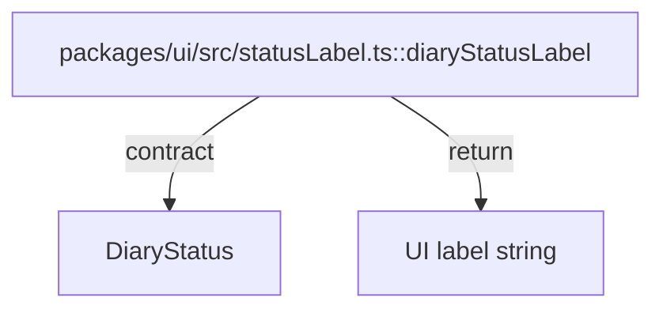

# packages/ui

`packages/ui/src/statusLabel.ts` は `DiaryStatus` から表示ラベルへの変換を提供する UI 補助モジュールで、不正状態を `never` で排除する。

- パス: `packages/ui/README.md`
- 状態: Implemented
- 種別（Profile）: src-module
- 関連:
  - See: `packages/core/README.md`
- 注意:
  - 現在は status label のみ。

<details>
<summary>目次</summary>

- [役割](#役割)
- [スコープ](#スコープ)
- [ローカル開発](#ローカル開発)
- [ディレクトリ構成](#ディレクトリ構成)
- [公開インタフェース](#公開インタフェース)
- [契約と検証](#契約と検証)
- [設計ノート](#設計ノート)
- [品質](#品質)
- [内部](#内部)

</details>

## 役割

- `draft/confirmed` を UI 表示ラベルへ変換する。

<details><summary>根拠（Evidence）</summary>

- [E1] `packages/ui/src/statusLabel.ts:3` — `diaryStatusLabel`。
- [E2] `packages/ui/src/statusLabel.ts:10` — exhaustive check。
</details>

## スコープ

- 対象（In scope）:
  - status label mapping
- 対象外（Non-goals）:
  - component rendering
- 委譲（See）:
  - See: `apps/web/README.md`
- 互換性:
  - N/A
- 依存方向:
  - 許可:
    - ui -> core type
  - 禁止:
    - ui -> app source

<details><summary>根拠（Evidence）</summary>

- [E1] `packages/ui/src/statusLabel.ts:1`
</details>

## ローカル開発

- 依存インストール: `make install`
- 環境変数: N/A
- 起動: N/A
- 確認: `bun --cwd packages/ui run typecheck`

<details><summary>根拠（Evidence）</summary>

- [E1] `packages/ui/package.json:7`
</details>

## ディレクトリ構成

```text
.
└── packages/ui/
    ├── src/                     # UI helper 実装 / See: src/README.md
    └── README.md                # この文書
```

## 公開インタフェース

### 提供するもの / 提供しないもの

- 提供:
  - `diaryStatusLabel`
- 非提供:
  - UI framework components

### エントリポイント / エクスポート（SSOT）

| 公開シンボル       | 種別     | 定義元               | 目的           | 根拠                               |
| ------------------ | -------- | -------------------- | -------------- | ---------------------------------- |
| `diaryStatusLabel` | function | `src/statusLabel.ts` | 状態ラベル変換 | `packages/ui/src/statusLabel.ts:3` |

### 使い方（必須）

```ts
import { diaryStatusLabel } from "@future-diary/ui";

const label = diaryStatusLabel("draft");
```

### 依存ルール

- 許可する import:
  - `@future-diary/core` の型
- 禁止する import:
  - `react` など UI framework 依存

<details><summary>根拠（Evidence）</summary>

- [E1] `packages/ui/src/statusLabel.ts:1`
</details>

## 契約と検証

### 契約 SSOT

- `DiaryStatus` の union 型。

### 検証入口（CI / ローカル）

- [E1] `bun --cwd packages/ui run typecheck`
- [E2] `bun --cwd packages/ui run build`

### テスト（根拠として使う場合）

| テストファイル | コマンド                              | 検証内容          | 主要 assertion  | 根拠                                |
| -------------- | ------------------------------------- | ----------------- | --------------- | ----------------------------------- |
| N/A            | `bun --cwd packages/ui run typecheck` | exhaustive switch | compile success | `packages/ui/src/statusLabel.ts:10` |

<details><summary>根拠（Evidence）</summary>

- [E1] `packages/core/src/types.ts:1`
</details>

## 設計ノート

- データ形状:
  - input: `DiaryStatus`
  - output: `string`
- 失敗セマンティクス:
  - 不正分岐は `never` で compile-time 検出。
- メインフロー:
  - switch で値変換。
- I/O 境界:
  - なし（pure）。
- トレードオフ:
  - 小粒関数として責務を限定。



<details><summary>根拠（Evidence）</summary>

- [E1] `packages/ui/src/statusLabel.ts:3`
- [E2] `packages/ui/src/statusLabel.ts:6`
- [E3] `packages/ui/src/statusLabel.ts:8`
</details>

## 品質

- テスト戦略:
  - 型チェックで exhaustive 性を担保。
- 主なリスクと対策（3〜7）:

| リスク               | 対策（検証入口）         | 根拠                                |
| -------------------- | ------------------------ | ----------------------------------- |
| status追加時の未対応 | `never` exhaustive check | `packages/ui/src/statusLabel.ts:10` |

<details><summary>根拠（Evidence）</summary>

- [E1] `packages/ui/src/statusLabel.ts:10`
</details>

## 内部

<details>
<summary>品質（関数型プログラミング観点） / OPEN / ISSUE / SUMMARY</summary>

### 品質（関数型プログラミング観点）

| 項目         | 判定 | 理由                 | 根拠                               |
| ------------ | ---- | -------------------- | ---------------------------------- |
| 純粋性       | YES  | 入力->出力の純関数   | `packages/ui/src/statusLabel.ts:3` |
| 全域性       | YES  | union 全ケースを網羅 | `packages/ui/src/statusLabel.ts:4` |
| 副作用の隔離 | YES  | I/O なし             | `packages/ui/src/statusLabel.ts:3` |

### [OPEN]

- [OPEN][TODO] UI primitive 拡張
  - 背景: 現在は1関数のみ。
  - 現状: status label helper。
  - 受入条件:
    - diary UIに必要な primitive 追加。
  - 根拠:
    - `packages/ui/src/statusLabel.ts:3`

### [ISSUE]

- なし。

### [SUMMARY]

- ui package は core型に依存した純粋表示変換を提供。

</details>
