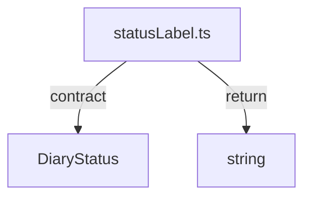

# packages/ui/src

`packages/ui/src` は `DiaryStatus` を表示ラベルへ変換する最小UI helper を保持する。

- パス: `packages/ui/src/README.md`
- 状態: Implemented
- 種別（Profile）: src-module
- 関連:
  - See: `../README.md`
- 注意:
  - UI component は未提供。

<details><summary>目次</summary>

- [役割](#役割)
- [スコープ](#スコープ)
- [ローカル開発](#ローカル開発)
- [ディレクトリ構成](#ディレクトリ構成)
- [公開インタフェース](#公開インタフェース)
- [契約と検証](#契約と検証)
- [設計ノート](#設計ノート)
- [品質](#品質)
- [内部](#内部)

</details>

## 役割

- status label 変換。

<details><summary>根拠（Evidence）</summary>

- [E1] `packages/ui/src/statusLabel.ts:3`
</details>

## スコープ

- 対象（In scope）:
  - `statusLabel.ts`
- 対象外（Non-goals）:
  - UI component
- 委譲（See）:
  - See: `../README.md`
- 互換性:
  - N/A
- 依存方向:
  - 許可:
    - core type
  - 禁止:
    - app source

<details><summary>根拠（Evidence）</summary>

- [E1] `packages/ui/src/statusLabel.ts:1`
</details>

## ローカル開発

- 依存インストール: `make install`
- 環境変数: N/A
- 起動: N/A
- 確認: `bun --cwd packages/ui run typecheck`

<details><summary>根拠（Evidence）</summary>

- [E1] `packages/ui/package.json:7`
</details>

## ディレクトリ構成

```text
.
└── packages/ui/src/
    ├── statusLabel.ts           # label mapping
    ├── index.ts                 # exports
    └── README.md                # この文書
```

## 公開インタフェース

### 提供するもの / 提供しないもの

- 提供:
  - `diaryStatusLabel`
- 非提供:
  - UI component

### エントリポイント / エクスポート（SSOT）

| 公開シンボル       | 種別     | 定義元           | 目的       | 根拠                               |
| ------------------ | -------- | ---------------- | ---------- | ---------------------------------- |
| `diaryStatusLabel` | function | `statusLabel.ts` | ラベル変換 | `packages/ui/src/statusLabel.ts:3` |

### 使い方（必須）

```ts
import { diaryStatusLabel } from "./statusLabel";
```

### 依存ルール

- 許可する import:
  - core type
- 禁止する import:
  - app source

<details><summary>根拠（Evidence）</summary>

- [E1] `packages/ui/src/statusLabel.ts:1`
</details>

## 契約と検証

### 契約 SSOT

- `DiaryStatus` union

### 検証入口（CI / ローカル）

- [E1] `bun --cwd packages/ui run typecheck`

### テスト（根拠として使う場合）

| テストファイル | コマンド                              | 検証内容          | 主要 assertion  | 根拠                                |
| -------------- | ------------------------------------- | ----------------- | --------------- | ----------------------------------- |
| N/A            | `bun --cwd packages/ui run typecheck` | exhaustive switch | compile success | `packages/ui/src/statusLabel.ts:10` |

<details><summary>根拠（Evidence）</summary>

- [E1] `packages/ui/src/statusLabel.ts:10`
</details>

## 設計ノート

- データ形状:
  - status -> label
- 失敗セマンティクス:
  - never exhaustive
- メインフロー:
  - switch
- I/O 境界:
  - なし
- トレードオフ:
  - 小粒 helper



<details><summary>根拠（Evidence）</summary>

- [E1] `packages/ui/src/statusLabel.ts:4`
- [E2] `packages/ui/src/statusLabel.ts:10`
</details>

## 品質

- テスト戦略:
  - typecheck。
- 主なリスクと対策（3〜7）:

| リスク       | 対策（検証入口） | 根拠                                |
| ------------ | ---------------- | ----------------------------------- |
| case追加漏れ | never exhaustive | `packages/ui/src/statusLabel.ts:10` |

<details><summary>根拠（Evidence）</summary>

- [E1] `packages/ui/src/statusLabel.ts:10`
</details>

## 内部

<details><summary>品質（関数型プログラミング観点） / OPEN / ISSUE / SUMMARY</summary>

### 品質（関数型プログラミング観点）

| 項目   | 判定 | 理由             | 根拠                               |
| ------ | ---- | ---------------- | ---------------------------------- |
| 純粋性 | YES  | input-outputのみ | `packages/ui/src/statusLabel.ts:3` |

### [OPEN]

- [OPEN][TODO] helper拡張
  - 背景: 現在1関数のみ
  - 現状: minimal
  - 受入条件:
    - 必要UI helper追加
  - 根拠:
    - `packages/ui/src/statusLabel.ts:3`

### [ISSUE]

- なし。

### [SUMMARY]

- src は status label 変換の単機能。

</details>
