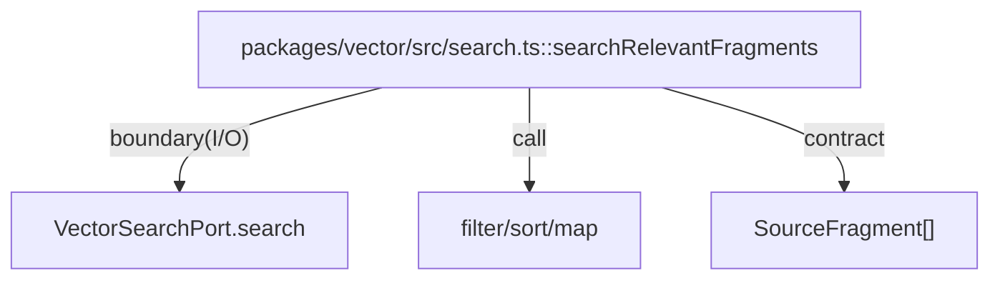

# packages/vector

`packages/vector/src/search.ts` は vector search port を受け取り、検索結果を `SourceFragment` に整形して core が扱える形に変換する。

- パス: `packages/vector/README.md`
- 状態: Implemented
- 種別（Profile）: src-module
- 関連:
  - See: `packages/core/README.md`
- 注意:
  - Cloudflare Vectorize + Workers AI adapter は `packages/vector/src/cloudflare.ts` に実装している（local では Vectorize が未サポートのため注意）。

<details>
<summary>目次</summary>

- [役割](#役割)
- [スコープ](#スコープ)
- [ローカル開発](#ローカル開発)
- [ディレクトリ構成](#ディレクトリ構成)
- [公開インタフェース](#公開インタフェース)
- [契約と検証](#契約と検証)
- [設計ノート](#設計ノート)
- [品質](#品質)
- [内部](#内部)

</details>

## 役割

- vector 検索結果を並び替え/フィルタし、core型へ変換する。
- 検索I/Oを port 抽象に閉じ込める。

<details><summary>根拠（Evidence）</summary>

- [E1] `packages/vector/src/search.ts:16` — `VectorSearchPort`。
- [E2] `packages/vector/src/search.ts:20` — `searchRelevantFragments`。
- [E3] `packages/vector/src/search.ts:27` — 空text除外。
- [E4] `packages/vector/src/search.ts:28` — relevance sort。
</details>

## スコープ

- 対象（In scope）:
  - query request/response 型
  - transform function
  - Cloudflare Vectorize / Workers AI adapter（embedding / query / upsert）
- 対象外（Non-goals）:
  - job orchestration（Queues / Workflows）
- 委譲（See）:
  - See: `apps/jobs/README.md`
- 互換性:
  - N/A
- 依存方向:
  - 許可:
    - vector -> core type
  - 禁止:
    - vector -> api/web

<details><summary>根拠（Evidence）</summary>

- [E1] `packages/vector/src/search.ts:1`
- [E2] `packages/vector/package.json:2`
</details>

## ローカル開発

- 依存インストール: `make install`
- 環境変数: N/A
- 起動: N/A
- 確認: `bun --cwd packages/vector run typecheck`

<details><summary>根拠（Evidence）</summary>

- [E1] `packages/vector/package.json:7`
</details>

## ディレクトリ構成

```text
.
└── packages/vector/
    ├── src/                     # 変換実装 / See: src/README.md
    └── README.md                # この文書
```

## 公開インタフェース

### 提供するもの / 提供しないもの

- 提供:
  - `searchRelevantFragments`
  - `VectorSearchPort`
  - `createWorkersAiVectorizeSearchPort`
  - `upsertVectorizeSearchDocumentsWithWorkersAi`
- 非提供:
  - Queue/Workflow wrapper

### エントリポイント / エクスポート（SSOT）

| 公開シンボル              | 種別      | 定義元          | 目的       | 根拠                               |
| ------------------------- | --------- | --------------- | ---------- | ---------------------------------- |
| `searchRelevantFragments` | function  | `src/search.ts` | result整形 | `packages/vector/src/search.ts:20` |
| `VectorSearchPort`        | interface | `src/search.ts` | I/O抽象    | `packages/vector/src/search.ts:16` |
| `createWorkersAiVectorizeSearchPort` | function | `src/cloudflare.ts` | Vectorize query adapter | `packages/vector/src/cloudflare.ts:87` |
| `upsertVectorizeSearchDocumentsWithWorkersAi` | function | `src/cloudflare.ts` | Vectorize upsert adapter | `packages/vector/src/cloudflare.ts:168` |

### 使い方（必須）

```ts
import {
  createWorkersAiVectorizeSearchPort,
  searchRelevantFragments,
} from "@future-diary/vector";

const port = createWorkersAiVectorizeSearchPort({
  ai: env.AI,
  embeddingModel: "@cf/baai/bge-m3",
  vectorIndex: env.VECTOR_INDEX,
});

const fragments = await searchRelevantFragments(port, {
  userId: "u1",
  query: "朝",
  topK: 5,
  beforeDate: "2026-02-07",
});
```

### 依存ルール

- 許可する import:
  - `@future-diary/core` type
- 禁止する import:
  - infrastructure direct dependency

<details><summary>根拠（Evidence）</summary>

- [E1] `packages/vector/src/search.ts:1`
</details>

## 契約と検証

### 契約 SSOT

- `VectorSearchRequest`
- `VectorSearchResult`
- `VectorSearchPort`

### 検証入口（CI / ローカル）

- [E1] `bun --cwd packages/vector run typecheck`
- [E2] `bun --cwd packages/vector run build`

### テスト（根拠として使う場合）

| テストファイル | コマンド                                  | 検証内容   | 主要 assertion  | 根拠                             |
| -------------- | ----------------------------------------- | ---------- | --------------- | -------------------------------- |
| N/A            | `bun --cwd packages/vector run typecheck` | 型契約整合 | compile success | `packages/vector/package.json:7` |

<details><summary>根拠（Evidence）</summary>

- [E1] `packages/vector/src/search.ts:3`
</details>

## 設計ノート

- データ形状:
  - vector result -> `SourceFragment`
- 失敗セマンティクス:
  - port の例外は上位へ伝播
- メインフロー:
  - call port -> filter -> sort -> map。
- I/O 境界:
  - `port.search`。
- トレードオフ:
  - 最小変換に限定し、検索戦略は上位へ委譲。



<details><summary>根拠（Evidence）</summary>

- [E1] `packages/vector/src/search.ts:24`
- [E2] `packages/vector/src/search.ts:27`
- [E3] `packages/vector/src/search.ts:29`
</details>

## 品質

- テスト戦略:
  - 型チェック中心。
- 主なリスクと対策（3〜7）:

| リスク     | 対策（検証入口） | 根拠                               |
| ---------- | ---------------- | ---------------------------------- |
| 空text混入 | filterで除外     | `packages/vector/src/search.ts:27` |
| 順序不安定 | relevance sort   | `packages/vector/src/search.ts:28` |

<details><summary>根拠（Evidence）</summary>

- [E1] `packages/vector/src/search.ts:28`
</details>

## 内部

<details>
<summary>品質（関数型プログラミング観点） / OPEN / ISSUE / SUMMARY</summary>

### 品質（関数型プログラミング観点）

| 項目         | 判定 | 理由                       | 根拠                               |
| ------------ | ---- | -------------------------- | ---------------------------------- |
| 合成         | YES  | filter/sort/map の関数合成 | `packages/vector/src/search.ts:26` |
| 副作用の隔離 | YES  | I/Oは port に限定          | `packages/vector/src/search.ts:24` |
| 例外より型   | NO   | error型未定義              | `packages/vector/src/search.ts:24` |

### [OPEN]

- [OPEN] Vectorize metadata filter（`date < beforeDate`）を使う場合、対象 metadata key が index 側で metadata index 化されている必要がある
  - 現状: adapter は filter 失敗時に retry し、client-side でも date filter を適用する（正しさは担保、性能は index 設定に依存）。
  - 対応: `wrangler vectorize create-metadata-index <index_name> --propertyName date --type string`
  - 根拠:
    - `packages/vector/src/cloudflare.ts:124`

### [ISSUE]

- なし。

### [SUMMARY]

- vector は検索結果整形の pure transform 層。

</details>
