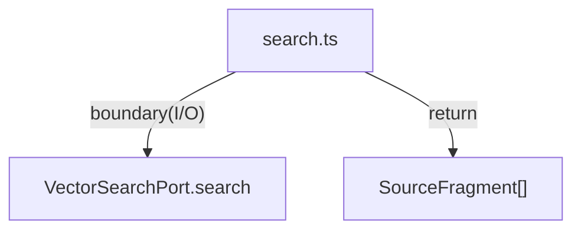

# packages/vector/src

`packages/vector/src` は vector search の request/response 型と整形ロジックを保持する。

- パス: `packages/vector/src/README.md`
- 状態: Implemented
- 種別（Profile）: src-module
- 関連:
  - See: `../README.md`
- 注意:
  - Cloudflare Vectorize + Workers AI adapter は `cloudflare.ts` に実装している。

<details><summary>目次</summary>

- [役割](#役割)
- [スコープ](#スコープ)
- [ローカル開発](#ローカル開発)
- [ディレクトリ構成](#ディレクトリ構成)
- [公開インタフェース](#公開インタフェース)
- [契約と検証](#契約と検証)
- [設計ノート](#設計ノート)
- [品質](#品質)
- [内部](#内部)

</details>

## 役割

- vector検索結果を core向けに変換する。

<details><summary>根拠（Evidence）</summary>

- [E1] `packages/vector/src/search.ts:20`
</details>

## スコープ

- 対象（In scope）:
  - `search.ts`, `cloudflare.ts`, `index.ts`
- 対象外（Non-goals）:
  - Queue/Workflow orchestration
- 委譲（See）:
  - See: `../README.md`
- 互換性:
  - N/A
- 依存方向:
  - 許可:
    - core type
  - 禁止:
    - app import

<details><summary>根拠（Evidence）</summary>

- [E1] `packages/vector/src/search.ts:1`
</details>

## ローカル開発

- 依存インストール: `make install`
- 環境変数: N/A
- 起動: N/A
- 確認: `bun --cwd packages/vector run typecheck`

<details><summary>根拠（Evidence）</summary>

- [E1] `packages/vector/package.json:7`
</details>

## ディレクトリ構成

```text
.
└── packages/vector/src/
    ├── search.ts                # transform logic
    ├── cloudflare.ts            # Cloudflare Vectorize / Workers AI adapter
    ├── index.ts                 # exports
    └── README.md                # この文書
```

## 公開インタフェース

### 提供するもの / 提供しないもの

- 提供:
  - `searchRelevantFragments`
  - `createWorkersAiVectorizeSearchPort`
- 非提供:
  - Queue/Workflow wrapper

### エントリポイント / エクスポート（SSOT）

| 公開シンボル              | 種別     | 定義元      | 目的             | 根拠                               |
| ------------------------- | -------- | ----------- | ---------------- | ---------------------------------- |
| `searchRelevantFragments` | function | `search.ts` | normalize result | `packages/vector/src/search.ts:20` |
| `createWorkersAiVectorizeSearchPort` | function | `cloudflare.ts` | Vectorize query adapter | `packages/vector/src/cloudflare.ts:87` |

### 使い方（必須）

```ts
import { searchRelevantFragments } from "./search";
```

### 依存ルール

- 許可する import:
  - core type
- 禁止する import:
  - app source

<details><summary>根拠（Evidence）</summary>

- [E1] `packages/vector/src/search.ts:1`
</details>

## 契約と検証

### 契約 SSOT

- `VectorSearchRequest`, `VectorSearchResult`, `VectorSearchPort`

### 検証入口（CI / ローカル）

- [E1] `bun --cwd packages/vector run typecheck`

### テスト（根拠として使う場合）

| テストファイル | コマンド                                  | 検証内容     | 主要 assertion  | 根拠                             |
| -------------- | ----------------------------------------- | ------------ | --------------- | -------------------------------- |
| N/A            | `bun --cwd packages/vector run typecheck` | contract整合 | compile success | `packages/vector/package.json:7` |

<details><summary>根拠（Evidence）</summary>

- [E1] `packages/vector/src/search.ts:3`
</details>

## 設計ノート

- データ形状:
  - result array transform
- 失敗セマンティクス:
  - port例外伝播
- メインフロー:
  - search/filter/sort/map
- I/O 境界:
  - `port.search`
- トレードオフ:
  - low abstraction.



<details><summary>根拠（Evidence）</summary>

- [E1] `packages/vector/src/search.ts:24`
- [E2] `packages/vector/src/search.ts:35`
</details>

## 品質

- テスト戦略:
  - typecheck。
- 主なリスクと対策（3〜7）:

| リスク              | 対策（検証入口） | 根拠                               |
| ------------------- | ---------------- | ---------------------------------- |
| relevance順の不整合 | sort明示         | `packages/vector/src/search.ts:28` |

<details><summary>根拠（Evidence）</summary>

- [E1] `packages/vector/src/search.ts:28`
</details>

## 内部

<details><summary>品質（関数型プログラミング観点） / OPEN / ISSUE / SUMMARY</summary>

### 品質（関数型プログラミング観点）

| 項目 | 判定 | 理由            | 根拠                               |
| ---- | ---- | --------------- | ---------------------------------- |
| 合成 | YES  | transform chain | `packages/vector/src/search.ts:26` |

### [OPEN]

- [OPEN] Vectorize metadata filter（`date < beforeDate`）は index 側の metadata index 設定に依存する
  - 現状: adapter は filter 失敗時に retry し、client-side でも date filter を適用する（正しさは担保、性能は index 設定に依存）。
  - 対応: `wrangler vectorize create-metadata-index <index_name> --propertyName date --type string`
  - 根拠:
    - `packages/vector/src/cloudflare.ts:124`

### [ISSUE]

- なし。

### [SUMMARY]

- src は result transform を提供。

</details>
